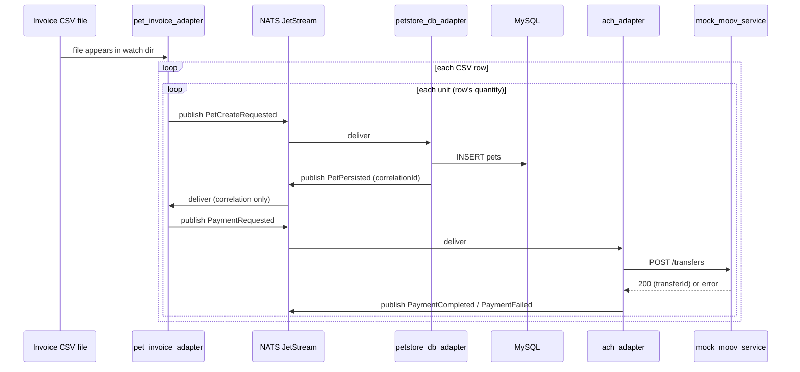
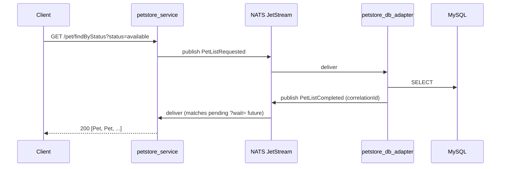

# Petstore Demo — Design

A second, additive demo built on the same `jetcore` bus as the root project's [Design.md](../Design.md) — a real-ish bounded context (Petstore) instead of the placeholder `orders` one, exercising: an OpenAPI-defined HTTP surface, file-triggered ingestion (CSV invoices), database persistence, and an outbound payment integration (mocked). Scoped from [Petstore_Demo.md](Petstore_Demo.md)'s own bullets plus a clarification pass (recorded in §2 below).

**Relationship to the root project**: purely additive. Every existing adapter, the `orders` demo, and everything in the root Design.md's Phases 1-6 keeps working unchanged — this adds new services to the same `docker-compose` stack, new subjects to the same NATS bus, new tables to the same MySQL instance, and a new manifest section in [infra/nats/adapter_identities.yaml](../infra/nats/adapter_identities.yaml). Shared infrastructure (the `jetcore` library, NATS bootstrap, testing conventions, CI) is not duplicated — this document only covers what's new.

**Numbering**: this document restarts its own Decision/Track numbering from scratch (its own §2, its own Track A) rather than continuing the root document's #1-#29/A-N sequences — the two are related but independently scoped, and cross-link by full section reference (e.g. "root Design.md §4") rather than sharing one number space.

---

## 1. Goals

Demonstrate a second, realistic bounded context on the same bus, proving the architecture generalizes beyond the `orders` placeholder:

- A real OpenAPI spec ([resources/openapi.yaml](resources/openapi.yaml)) driving an actual adapter's HTTP surface, not a hand-rolled one.
- File-triggered business logic beyond generic file I/O (a CSV invoice, parsed, driving multiple downstream actions per row) — the root project's File Storage Adapter only detects/reports raw file creation; nothing there parses content today.
- A multi-step, multi-adapter workflow with a real financial side effect (paying a supplier) — not just create-then-reply.
- First real use of LinkML in this project, for the data mappings the CSV → Pet → payment pipeline actually needs.
- First real subject names (`events.petstore.*`) — the root project's Decision #14 deferred this by choice; Petstore is the first genuinely-named bounded context to resolve it.

## 2. Scope Decisions

| # | Decision | Rationale |
|---|---|---|
| 1 | Every new piece is a first-class `jetcore` adapter — `BusClient`, `adapter_identities.yaml` entries, `docker-compose` services, tests against live NATS, the works. | Confirmed with the user — this stays a JetStream demo, not an app that happens to sit next to one. |
| 2 | Trimmed OpenAPI surface: `POST /pet`, `GET /pet/{petId}`, `GET /pet/findByStatus`, plus a new `GET /suppliers` (not in the upstream spec — added per the demo's own bullets). Everything else in `openapi.yaml` (user management, OAuth2 flows, XML bodies, image upload, `/store/*`) is out of scope. | Confirmed with the user. These three Pet operations plus supplier lookup are what the CSV→pet→payment flow and a demonstrable read path actually need. |
| 3 | Moov is mocked — a plain, non-bus-connected FastAPI service (`mock_moov_service`) shaped like enough of Moov's real transfer API to receive a payment call and answer realistically, in-network only. | Confirmed with the user, matching root Decision #14's existing pattern for every other external integration in this project (Webhook Sender/HTTP Adapter/Webhook Listener all point at in-stack placeholders, never real external services). |
| 4 | ACH mechanism: a bus event per pet-unit payment, consumed by a new `ach_adapter`, which calls the mock Moov API directly — no NACHA fixed-width file format is implemented. | Confirmed with the user. "Add entry to ACH file" is satisfied as "queue a payment record," not literal NACHA batch-file generation — a real file format would be a project of its own, disproportionate to what this demo needs to prove. |
| 5 | Petstore data (`pets`, `suppliers`) lives in new tables in the *existing* MySQL instance/`jetcore` database, via a new `petstore_db_adapter` — not `db_adapter_mysql` extended, and not a separate database. | Confirmed with the user for the instance; the *new adapter* (rather than extending `db_adapter_mysql`) is this document's own call — one adapter, one bounded context's tables, matching how `db_adapter_mysql` itself owns exactly one table (`orders`) today. Flagged in §9 if that boundary should be looser. |
| 6 | Bus subjects use real names now: `events.petstore.<EventType>` — not the `events.orders.*`-style placeholder pattern. | Confirmed with the user — first real resolution of root Decision #14's deferred naming question, scoped to just this bounded context; the `orders` placeholder elsewhere is untouched. |
| 7 | CSV ingestion is a new, dedicated adapter (`pet_invoice_adapter`) watching its own directory — not File Storage Adapter extended. | Confirmed with the user. File Storage Adapter's job is generic file I/O + raw creation detection; parsing CSV rows into business actions (pet creation, payment queuing) is a distinct responsibility. |
| 8 | Suppliers are static seed data (`init.sql`-style fixture rows), exposed read-only via `GET /suppliers` — no supplier create/update/delete API. | Confirmed with the user. |
| 9 | Runs alongside the existing `orders`/webhook demo — additive `docker-compose` services, not a replacement. | Confirmed with the user. |
| 10 | Naming follows the existing convention exactly: snake_case Python packages/directories, hyphenated `serviceId`s (`<name>-01`), `jetcore-<name>` PyPI distribution names. | Confirmed with the user ("match existing"). |
| 11 | A CSV row's `quantity` produces that many separate `Pet` records (and that many separate ACH payment entries) — not one record with a quantity field. | This document's own call, not asked separately — Pet (per `openapi.yaml`) has no quantity concept; "for each pet → POST /pet" read literally means N rows-worth of individual pets for a row with `quantity=N`. Flagged in §9 for confirmation. |
| 12 | Every read (`GET /pet/{id}`, `findByStatus`, `GET /suppliers`) is bus-mediated (sync-reply, the same `?wait=` mechanism `rest_api_service` already has for `OrderCreated`/`OrderPersisted`) — `petstore_service` holds no direct MySQL connection of its own. | This document's own call. Preserves the "one adapter, one DB connection" boundary the root project has held throughout (only `db_adapter_mysql` ever touches MySQL directly, Decision #25) — the alternative (a direct read-model connection on `petstore_service`) would be the first adapter in this project to break that. Flagged in §9. |
| 13 | A missing `name` on a CSV row is filled with a freshly-generated random name **per individual pet unit** (not one name reused across a row's whole `quantity`). | Follows from Decision #11 — once a row expands to N distinct `Pet` records, giving them identical names would be a worse demo, not a simpler one. |

## 3. Data Model

### `pets` (new table, `petstore_db_adapter`-owned)

Mirrors `openapi.yaml`'s `Pet` schema for the fields the HTTP surface exposes, plus two columns the demo's own financial flow needs that aren't part of the public Pet API contract — kept on the same row for simplicity at this scale (a dedicated `pet_acquisitions` table would be the real-deployment answer if this ever needed more than one acquisition per pet; out of scope here, one row = one CSV-line-derived pet).

| Column | Type | Notes |
|---|---|---|
| `id` | `VARCHAR(64)` PK | Caller/adapter-generated (UUID), matching `orders.order_id`'s own caller-supplied-key precedent (root Decision #25) — no round trip needed to learn a DB-assigned id first. |
| `name` | `VARCHAR(255)` | From the CSV row, or a generated placeholder (§2 item 13) if blank. |
| `category` | `VARCHAR(255)` | From the CSV row's `category` column. Kept as a plain string (not a normalized `categories` table) — the upstream `Pet.category` is itself just `{id, name}`, and a full category taxonomy is out of scope for this demo. |
| `status` | `ENUM('available','pending','sold')` | Defaults to `available` on creation — matches `openapi.yaml`'s own enum. |
| `photo_url` | `VARCHAR(2048)` NULL | From the CSV row. Singular, not the upstream's `photoUrls[]` array — one photo per invoice line is what the CSV actually carries; the HTTP response still returns it wrapped as a one-element array to stay shape-compatible with `openapi.yaml`'s `Pet.photoUrls`. |
| `description` | `TEXT` NULL | From the CSV row. Not part of upstream `openapi.yaml`'s `Pet` schema — the demo's own extension, since the CSV carries it and dropping it silently would be worse than documenting the deviation (this row belongs in the LinkML mapping, §6, as an explicit CSV→Pet field not present in the upstream schema). |
| `supplier_id` | `VARCHAR(64)` FK → `suppliers.id` | Which supplier this pet was acquired from — needed to know who the ACH payment goes to. |
| `invoice_id` | `VARCHAR(64)` | From the CSV row — which invoice this pet was created from; not a FK (no `invoices` table — the CSV file itself is the invoice, not modeled as its own persisted entity for this demo). |
| `unit_price` | `DECIMAL(10,2)` | From the CSV row — what the supplier is owed for this one pet unit. |
| `created_at` / `updated_at` | `TIMESTAMP` | Same convention as `orders`. |

### `suppliers` (new table, static seed data)

| Column | Type | Notes |
|---|---|---|
| `id` | `VARCHAR(64)` PK | |
| `company_name` | `VARCHAR(255)` | |
| `pet_types_supplied` | `VARCHAR(255)` | Comma-separated categories (e.g. `"Dogs,Cats"`) — matches `AdapterSettings.subjects`'s own comma-separated-string convention (root `jetcore/config.py`) rather than inventing a new list encoding. |
| `bank_routing_number` | `VARCHAR(9)` | Placeholder/demo values only (§9 — real RTN checksum validation is out of scope). |
| `bank_account_number` | `VARCHAR(34)` | Placeholder values, never a real account. |
| `created_at` | `TIMESTAMP` | Seed rows only; no update path exists (§2 item 8). |

Representative placeholder seed data (real reference data doesn't exist, per the user — drafted here, not sourced):

| id | company_name | pet_types_supplied |
|---|---|---|
| `supplier-001` | Golden Gate Kennels | Dogs |
| `supplier-002` | Whiskers & Co. | Cats |
| `supplier-003` | Feathered Friends Aviary | Birds |

### CSV invoice row shape (confirmed with the user)

```
invoiceId,supplierId,category,quantity,description,unitPrice,photoUrl,name
inv-1001,supplier-001,Dogs,3,"Golden Retriever puppy, 8 weeks",450.00,https://example.test/photos/gr1.jpg,
inv-1001,supplier-002,Cats,1,"Tabby kitten, vaccinated",120.00,https://example.test/photos/tabby1.jpg,Whiskers
```

- `supplierId` (added per §9's resolution below) — explicit, unambiguous; must match a row in `suppliers` (§3) or the row is rejected — see Track A's own error-handling step.
- `name` is optional (last column, blank in row 1 above) — a fresh random name is generated per resulting pet unit if omitted.
- One CSV row with `quantity > 1` expands into that many individual `Pet` records (§2 item 11), each independently named if `name` was blank.

### Payment record (in-flight only, not persisted as its own table)

One per created pet unit: `{petId, supplierId, invoiceId, amount, bankRoutingNumber, bankAccountNumber}` — carried on the `events.petstore.PaymentRequested` bus event (§4), consumed once by `ach_adapter`, not stored anywhere else. If a real payment ledger/reconciliation view is ever needed, that's future scope, not this demo's.

## 4. New Adapters & Bus Subjects

| Adapter | `serviceId` | Role |
|---|---|---|
| `petstore_service` | `petstore-service-01` | HTTP front door (FastAPI, mirrors `rest_api_service`'s shape). Implements the trimmed OpenAPI surface (§2 item 2); every operation publishes a bus command and (for reads, and optionally for the write) awaits a correlated reply. |
| `pet_invoice_adapter` | `pet-invoice-adapter-01` | Watches a dedicated directory for new CSV files (`watchfiles`, same library `file_storage_adapter`'s own watch already uses). Parses each row, expands `quantity`, publishes one `PetCreateRequested` + one `PaymentRequested` per resulting pet unit. |
| `petstore_db_adapter` | `petstore-db-adapter-01` | Owns the `pets`/`suppliers` tables. Subscribes to `PetCreateRequested`/`PetReadRequested`/`PetListRequested`/`SupplierListRequested`; publishes the matching `*Completed` replies. Two MySQL identities (write/read-only), mirroring `db_adapter_mysql`'s own least-privilege split (root Decision #25). |
| `ach_adapter` | `ach-adapter-01` | Subscribes to `PaymentRequested`; calls the mock Moov service's transfer endpoint; publishes `PaymentCompleted` (success) or `PaymentFailed` (the mock returned an error, or was unreachable). |
| `mock_moov_service` | *(not a jetcore adapter — no `BusClient`, no bus identity)* | A bare FastAPI service, the same role Webhook Listener already plays as a "real external target" for Webhook Sender/HTTP Adapter (root Decision #14's own pattern) — exposes one endpoint shaped like a real Moov ACH transfer call, answers realistically, never touches the bus. |

### Bus subjects (`events.petstore.*`)

| Subject | Publisher | Subscriber | Payload shape (summary) |
|---|---|---|---|
| `events.petstore.PetCreateRequested` | `pet_invoice_adapter`, `petstore_service` (`POST /pet`) | `petstore_db_adapter` | `{name, category, status, photoUrl, description, supplierId, invoiceId, unitPrice}` |
| `events.petstore.PetPersisted` | `petstore_db_adapter` | `petstore_service` (sync-reply), `pet_invoice_adapter` (correlation only, to learn the new `petId` for `PaymentRequested`) | `{petId, name, category, status, photoUrl}` — `correlationId` = triggering request's `eventId`. |
| `events.petstore.PetReadRequested` | `petstore_service` (`GET /pet/{petId}`) | `petstore_db_adapter` | `{petId}` |
| `events.petstore.PetReadCompleted` | `petstore_db_adapter` | `petstore_service` (sync-reply) | Full `Pet` shape, or... |
| `events.petstore.PetOperationFailed` | `petstore_db_adapter` | `petstore_service` (sync-reply) | `{operation, reason}` — e.g. `reason: "not_found"`, mirroring root `events.files.FileOperationFailed`'s own shared-failure-subject pattern. |
| `events.petstore.PetListRequested` / `PetListCompleted` | `petstore_service` (`GET /pet/findByStatus`) / `petstore_db_adapter` | (reciprocal) | `{status}` in; `{pets: [...]}` out. |
| `events.petstore.SupplierListRequested` / `SupplierListCompleted` | `petstore_service` (`GET /suppliers`) / `petstore_db_adapter` | (reciprocal) | `{}` in; `{suppliers: [...]}` out. |
| `events.petstore.PaymentRequested` | `pet_invoice_adapter` | `ach_adapter` | `{petId, supplierId, invoiceId, amount, bankRoutingNumber, bankAccountNumber}` |
| `events.petstore.PaymentCompleted` / `PaymentFailed` | `ach_adapter` | *(nothing subscribes yet — logged/observable, same "report the outcome" posture as root `events.http.RequestCompleted`)* | `{petId, invoiceId, amount, moovTransferId}` / `{petId, invoiceId, reason}` |

### Workflow (CSV ingestion → pet creation → payment)



### Workflow (a client reading pets/suppliers via `petstore_service`)



## 5. Mock Moov Service

One endpoint, shaped closely enough to Moov's real ACH transfer API to be recognizable, not a faithful full reimplementation:

`POST /transfers` — body `{amount, source: {bankRoutingNumber, bankAccountNumber}, description}`, responds `201 {transferId, status: "pending"}` on success. Always in-network, always answers (matching root Decision #14's own reasoning for every existing placeholder target) — no real ACH network, no real bank validation.

`GET /healthz` — same reasoning as every other FastAPI-based service in this project (no shell in some base images for a Compose-native healthcheck).

## 6. LinkML Mapping Scope

First use of LinkML in this project (not yet in root [Dependencies.md](../Dependencies.md) — added here, cross-referenced there once Track A actually starts). One schema, `Demo/linkml/petstore_mappings.yaml`, covering the chain confirmed with the user:

1. **CSV row → `PetCreateRequested` payload** — the interesting mapping: one CSV row's `quantity` fans out to N separate instances (§2 item 11); a blank `name` is filled by generation, not left null.
2. **`PetCreateRequested` payload → `pets` table row** — mostly 1:1, but `photoUrl` (singular) stored as-is while the HTTP API wraps it into `photoUrls: [photoUrl]` on the way back out (documented as a slot mapping, not silently different shapes in two places).
3. **`pets` table row → `PaymentRequested` payload** — pulls `supplier_id`/`unit_price`/`invoice_id` forward into the payment event, joined against `suppliers` for the bank details.

Must validate against the LinkML meta-schema (`linkml validate` / the `linkml` Python package's own schema-validity check) as part of this track's own verification — "compliant with the standard," not just YAML that happens to look like it, per the user's own stated bar.

## 7. Postman Collection

A real, committed `Demo/postman/petstore_demo.postman_collection.json` (confirmed with the user) — every endpoint built here gets a pre-filled example request:

- `POST /pet`, `GET /pet/{petId}`, `GET /pet/findByStatus` (`petstore_service`)
- `GET /suppliers` (`petstore_service`)
- `POST /transfers`, `GET /healthz` (`mock_moov_service`) — has no OpenAPI spec of its own to import, so the collection is the only structured, runnable reference for it
- A `Petstore Demo` environment (`petstore_service` base URL, `mock_moov_service` base URL) so requests run unmodified against the real `docker-compose` stack

Not auto-generated from OpenAPI import (Postman's own import produces empty-example requests) — hand-filled with the same representative values as §3's seed/sample data, so a fresh collection run demonstrates the real flow, not just valid-shaped requests.

## 8. Repository Layout (proposed)

```
Demo/
  Design.md                  (this file)
  Petstore_Demo.md            (original scope bullets — unchanged)
  resources/
    openapi.yaml               (unchanged — upstream reference; petstore_service's
                                 actual trimmed spec is authored separately, §9 item 5)
  linkml/
    petstore_mappings.yaml
  postman/
    (pending §9 item 4)

adapters/
  petstore_service/            (matches every existing adapter's own layout)
  pet_invoice_adapter/
  petstore_db_adapter/
  ach_adapter/
  mock_moov_service/            (no jetcore dependency — no BusClient)
```

`infra/mysql/init.sql` gains the `pets`/`suppliers` tables + seed rows + two new MySQL users (mirroring `db_adapter_mysql`'s own write/read split). `infra/nats/adapter_identities.yaml` gains four new entries (+ `-test` twins, root Defects.md Defect 1's own established pattern) under a new "Petstore demo identities" section. `docker-compose.yml` gains five new services.

## 9. Open Questions

1. ~~Which supplier does a CSV row's pets come from?~~ **Resolved**: `supplierId` added as an explicit CSV column (§3) — confirmed with the user.
2. **`petstore_db_adapter` as its own adapter vs. extending `db_adapter_mysql`** (§2 item 5) — this document chose "own adapter" for consistency with the existing one-table-per-adapter shape, but flagging since it's this document's own call, not confirmed directly.
3. **Bus-mediated reads vs. a direct read connection on `petstore_service`** (§2 item 12) — likewise this document's own call. The bus-mediated version is slower per read (a full pub→consume→pub→consume round trip for something a direct `SELECT` would do in one hop) — acceptable for a demo proving the architecture, worth flagging if read latency ever becomes a real concern.
4. ~~Postman collection format~~ **Resolved**: a real committed collection (§7) — confirmed with the user.
5. **`petstore_service`'s own OpenAPI spec** — `resources/openapi.yaml` is the *upstream, full* reference spec (kept as-is as a citation, per the bullets' own "implements Petstore example swagger"). The actual trimmed surface this project builds (§2 item 2, plus the non-upstream `GET /suppliers` and the `description` field extension) needs its own spec document — hand-authored as a trimmed derivative, or generated from FastAPI's own OpenAPI export (FastAPI can serve `/openapi.json` directly from the route definitions, which would need reconciling against the bullets' own "update openAPI document" instruction)? Proposed default: hand-maintain a trimmed `Demo/resources/petstore_service.openapi.yaml`, since generating from FastAPI's own introspection risks silently drifting from what "the OpenAPI document" is supposed to mean as a design artifact, not just implementation output — flag if the reverse is preferred. Not blocking Track A's start (Step A2 below authors it early).
6. **RTN/account number realism** — placeholder values only (§3), no checksum/format validation implemented. Confirm this is fine for demo purposes (almost certainly yes, given Decision #14's own precedent, but not separately asked).
7. **A malformed/unknown-supplier CSV row** — §3 now says such a row "is rejected," but the exact behavior isn't designed yet: skip just that row and process the rest (partial success), or reject the whole file? Proposed default: skip-and-log the bad row, process the rest — mirrors the root project's own per-message error posture (a deterministically-bad unit doesn't block its siblings) rather than an all-or-nothing file. Track A Step A6 below implements whichever this resolves to; flag before that step if the file-level behavior is preferred instead.

## 10. Implementation Plan

One track. Every adapter here is new (no existing code modified beyond the three shared files §8 already names — `init.sql`, `adapter_identities.yaml`, `docker-compose.yml`), so — unlike some root-project tracks — there's little cross-step dependency risk; still sequenced so each step has something real to run against before the next one needs it.

**Parameters this breakdown assumes — flag now if any should change:**

| Parameter | Proposed default | Rationale |
|---|---|---|
| `pet_invoice_adapter`'s watch directory | `infra/petstore_invoices/` (new, host bind-mounted, gitignored like `infra/files/`) | Mirrors `file_storage_adapter`'s own `JETCORE_WATCH_DIR` pattern exactly — a dedicated directory, not reusing `infra/files/` (which belongs to a different adapter's own bounded context). |
| Malformed CSV row handling | Skip-and-log the bad row, process the rest of the file (§9 item 7's own proposed default) | See that item — matches this project's existing per-message error posture. |
| `petstore_service` / `mock_moov_service` host ports | `8082` / `8083` | `8080`/`8081` already taken (Webhook Listener/REST API Service) — next free, following the existing sequential pattern. |
| Random pet-name generation | A small fixed word list (adjectives + animal-appropriate nouns), no external dependency | Consistent with this project's "no new runtime dependency without a real need" discipline (root `Dependencies.md`'s own ledger) — a full name-generator package is disproportionate for a demo-scale placeholder. |

### Track A — Petstore Demo

- [ ] **A1. Suppliers + pets schema.** Extend `infra/mysql/init.sql`: `suppliers` table + the 3 seed rows (§3), `pets` table, two new MySQL users (`petstore_write`/`petstore_read`, mirroring `jetcore_write`/`jetcore_cdc`'s own least-privilege split — no CDC path here, so the second identity is read-only DML, not replication). Verify against a real container: `DESCRIBE` both tables, `SHOW GRANTS` both users, confirm seed rows present.
- [ ] **A2. Identities + the trimmed OpenAPI spec.** Add 4 new entries (+ `-test` twins) to `adapter_identities.yaml` under a new "Petstore demo identities" section, matching §4's subject table exactly. Author `Demo/resources/petstore_service.openapi.yaml` (§9 item 5's own proposed default) — the real, trimmed spec this project builds, distinct from the kept-as-citation upstream `resources/openapi.yaml`. Apply via `bootstrap_auth.sh`; verify `.creds` files generated for all 8 new identities.
- [ ] **A3. `petstore_db_adapter`.** `settings.py`, `payloads.py`, handlers for `PetCreateRequested`/`PetReadRequested`/`PetListRequested`/`SupplierListRequested` (one handler class per, `start`/`run_once`/`_handle` shape, root `BUILDING_AN_ADAPTER.md`'s own recipe), `__main__.py`. Tests against real MySQL + NATS, mirroring `db_adapter_mysql`'s own test shape.
- [ ] **A4. `petstore_service`.** FastAPI app (mirrors `rest_api_service/app.py`'s shape): `POST /pet` (fire-and-forget publish, matching Webhook Listener/REST API Service's own default), `GET /pet/{petId}`, `GET /pet/findByStatus`, `GET /suppliers` (all three sync-reply via `PendingReplies`, extended if needed for multiple correlated subjects rather than just `OrderPersisted`'s single one). `GET /healthz`. Tests against real NATS + a live `petstore_db_adapter` (or its own fake-bus unit tests for the HTTP-facing shape, root `webhook_listener`'s own D3-style split, plus one real end-to-end test).
- [ ] **A5. `mock_moov_service`.** Bare FastAPI, `POST /transfers` + `GET /healthz` (§5) — no `jetcore` dependency at all, confirmed by its own `pyproject.toml` having no `jetcore` entry, matching the "external target" role, not an adapter's.
- [ ] **A6. `ach_adapter`.** Subscribes to `PaymentRequested`, calls `mock_moov_service`, publishes `PaymentCompleted`/`PaymentFailed` — same trigger/reply shape as root `http_adapter`'s own `TriggerHandler` (real response received → always reply; genuine connection failure → nak for redelivery).
- [ ] **A7. `pet_invoice_adapter`.** CSV parsing (stdlib `csv`, no new dependency), quantity expansion, per-unit `PetCreateRequested` publish, correlating the resulting `PetPersisted` to then publish `PaymentRequested` (needs the real `petId` — §4's workflow diagram). Implements §9 item 7's resolved malformed-row behavior. Tests against real NATS + `petstore_db_adapter`.
- [ ] **A8. `docker-compose.yml` + full-stack wiring.** All 5 new services (`petstore_service`, `petstore_db_adapter`, `pet_invoice_adapter`, `ach_adapter`, `mock_moov_service`), the new watch-dir bind mount, ports per the parameter table. Bring the whole stack up fresh (`docker compose up -d --build`) alongside the existing 8 services — confirm nothing existing regresses (`./test.sh`, full 235+ root-project suite still clean).
- [ ] **A9. End-to-end proof.** Drop a real, multi-row, multi-supplier, multi-quantity CSV into the watch directory; confirm via real observation (not assumption): the right number of `pets` rows appear, each with the right `supplier_id`/`unit_price`; `mock_moov_service`'s own log shows one `/transfers` call per pet unit; a `GET /pet/findByStatus?status=available` through `petstore_service` returns them all. This is the demo's own version of root Phase 2's "Webhook Listener → File Storage Adapter" vertical-slice proof.
- [ ] **A10. LinkML schema.** `Demo/linkml/petstore_mappings.yaml` (§6), validated against the LinkML meta-schema for real (`linkml validate` or equivalent — not just "the YAML looks like a LinkML schema").
- [ ] **A11. Postman collection.** `Demo/postman/petstore_demo.postman_collection.json` (§7), every request run for real against the live stack at least once, not just shaped correctly.
- [ ] **A12. Docs.** `adapters/petstore_service/README.md` etc. — one per new adapter, matching root `BUILDING_AN_ADAPTER.md`'s own template exactly (the same one this project already committed to for every future adapter). Root `Dependencies.md` gains a `linkml` row. Root `README.md`'s bandit command / `.github/workflows/ci.yml`'s bandit step / `test.sh`'s `ADAPTER_SERVICES` array all gain the 4 new bus-connected adapters (not `mock_moov_service`, which needs bandit coverage too but isn't part of the stop/restart fleet in the same sense — flag at build time whether it should join `ADAPTER_SERVICES` anyway for consistency).

**Exit criteria:** A1-A9 each independently verified for real per their own bullet; the full combined stack (14 `docker-compose` services total) passes `./test.sh` clean; A9's end-to-end CSV drop is the track's own version of a Phase-completion checkpoint, matching how every root-project phase closes on a real, observed, multi-component proof rather than per-adapter tests alone.

---

*This document is a living draft, same convention as the root [Design.md](../Design.md) — update it as these open questions resolve, rather than letting decisions drift into code undocumented.*
