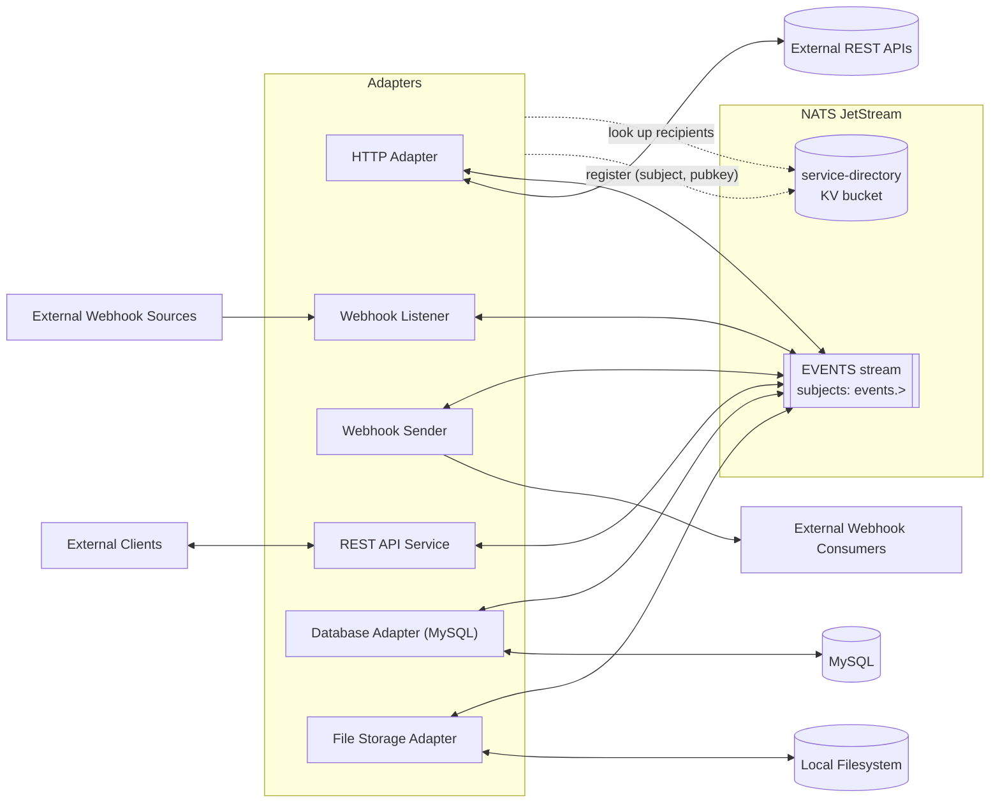
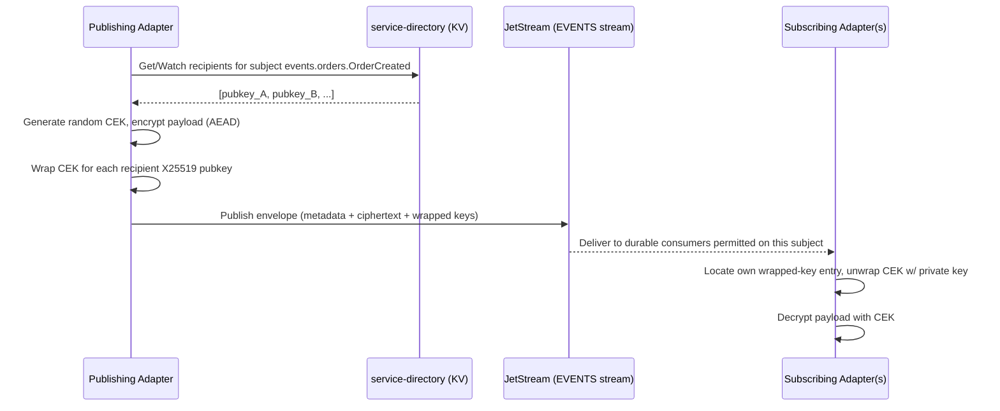
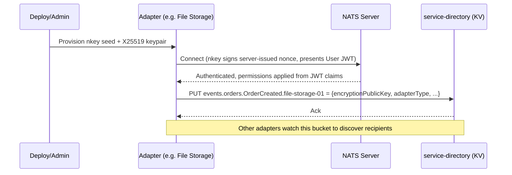

# Title: Jet Core Service Bus — Design Document

Status: Draft v0.2 — companion to [Design_Notes.md](Design_Notes.md)
Date: 2026-08-22
Scope: **Design only.** No implementation yet.

This document expands the original design notes into a concrete architecture, resolves the ambiguous points through the decisions recorded below, and proposes an implementation plan. Sections marked **Open Question** are still unresolved and need a decision before that part of the system can be built with confidence. This document also aims to satisfy [DevelopmentGuidelines.md](DevelopmentGuidelines.md)'s documentation standards as the project proceeds; per-dependency version/provenance/security-vetting detail lives in the companion [Dependencies.md](Dependencies.md) ledger rather than here.

---

## 1. Goals & Non-Goals

**Goals**
- A message bus, built on NATS JetStream, that any authorized service ("adapter") can connect to.
- Connection-level identity via public-key authentication (SSH-like).
- Payload confidentiality via public-key encryption, scoped to the specific recipients entitled to read a given event — independent of who else can technically subscribe to the subject.
- A small, well-documented set of baseline adapters that make the bus useful immediately (HTTP, webhooks, MySQL, file storage).
- A Python codebase organized like a normal, idiomatic Python project, deployable locally via `docker-compose`.

**Non-Goals (for this phase)**
- Multi-region / clustered NATS deployment.
- A UI/admin console (CLI + config files are sufficient for v1).
- Horizontal auto-scaling of adapters.
- Anything resembling a general-purpose ESB (business rules, orchestration, BPM). This is transport + adapters, not a workflow engine.

---

## 2. Key Decisions (resolved during design discussion)

| # | Question | Decision |
|---|----------|----------|
| 1 | How does the bus authenticate a service's identity? | **NATS nkeys** (built-in Ed25519 challenge/response — functionally identical to SSH pubkey auth). No custom auth service for v1. |
| 2 | Where does the "who is allowed to decrypt subject X" directory live? | **JetStream KV bucket** (`service-directory`) — reuses NATS infrastructure, no new datastore. |
| 3 | Is adapter-level "PII encryption" a separate mechanism from payload encryption? | **No — same mechanism.** Whole-payload public-key encryption covers PII; no separate field-level scheme in v1. |
| 4 | Should NATS subscribe permissions be wide open ("any connected adapter sees everything") or restricted per adapter? | **Restricted per adapter.** Each adapter gets an explicit subject allow-list. Encryption remains the confidentiality boundary regardless of what an adapter is permitted to subscribe to; permissions add defense-in-depth and reduce blast radius / noise. This is a deliberate refinement of the original notes' "open bus" framing — see §4.4. |
| 5 | Should events be signed for authenticity independent of transport? | **Yes** — the sender signs a digest of the plaintext with its nkey (Ed25519); the signature travels in the envelope (§4.1, §5). |
| 6 | Static NATS config or decentralized JWT for adapter onboarding? | **Decentralized JWT (`nsc`)** — adapters are provisioned/deprovisioned by issuing/revoking a User JWT, no server config edit or reload needed (§4.2, §4.4). |
| 7 | Registry entry lifecycle? | **TTL/heartbeat** — adapters refresh their own KV entry on a heartbeat; a dead adapter's key ages out automatically (§4.5). |
| 8 | Target Python version? | **3.12** — using the `uuid6` package for UUIDv7 (stdlib support arrives in 3.14) (§7.2). |
| 9 | `EVENTS` stream retention? | **7 days** age limit, plus a size cap as backstop (§6). |
| 10 | Database Adapter directionality? | **Bidirectional in v1** — write path (bus → MySQL) plus a CDC read path (MySQL → bus) via binlog streaming (§8). |
| 11 | File Storage Adapter shape? | **Command-driven CRUD** (list/read/write/delete triggered by bus commands), not a passive archival sink; filesystem-change → bus events deferred (§8). |
| 12 | Webhook Sender delivery guarantee? | **Best-effort** — single attempt, no retry/backoff (§8). |
| 13 | CI platform? | **GitHub Actions** (§7.4, §10). |
| 14 | Subject naming / bounded contexts? | **Placeholder pattern retained** — `events.<context>.<EventType>` with `orders` as a stand-in; real domain names to be supplied later (§5). |
| 15 | CDC approach for the Database Adapter? | **Lightweight** — `python-mysql-replication` tails the binlog in-process; no Debezium/Kafka Connect for now (§8, §9). |
| 16 | Python packaging/dependency-management tool? | **`uv`** — workspace mode handles `jetcore` as a shared local dependency across all 6 adapter packages cleanly (§7.5). |
| 17 | Where does per-dependency version/release-date/source/security-vetting documentation live (per [DevelopmentGuidelines.md](DevelopmentGuidelines.md))? | **New [Dependencies.md](Dependencies.md) ledger** — keeps Design.md focused on architecture; the ledger is updated whenever a dependency is added, pinned, or reviewed (§7.2). |
| 18 | Is the adapter identity manifest (§11 Step A2) keyed per adapter *type* or per *instance*? | **Per instance.** The service-directory KV's `<subject>.<serviceId>` key shape (§4.5) already implies instance-level identity (e.g. `file-storage-01`), so a deployment can run multiple independent instances of the same adapter type — e.g. two HTTP Adapter instances, each wired to a different external API, each with its own NATS identity and permissions. See [infra/nats/adapter_identities.yaml](infra/nats/adapter_identities.yaml). |
| 19 | Does `FileWriteRequested` need a separate `FileCreateRequested` command, and does the File Storage Adapter watch for externally-created files? | **No separate command** — `FileWriteRequested` auto-creates a missing file. It emits `FileCreateCompleted` if the file was new, `FileWriteCompleted` if an existing file was updated. `FileCreateCompleted` is **also** published outside the command flow when the adapter notices a file created by an outside process (e.g. a shared/watched directory) — no preceding command, no `correlationId`. This is a deliberately narrow pull-forward of the folder-watch capability otherwise deferred (§8) — creation-detection only, not update-detection (§9). |
| 20 | How is the sender-authentication gap found in Step B6 closed (§9 item #4)? | **New `service-identity` KV directory** (§4.6) — every adapter registers its own signing key once at connect time (not on a heartbeat, no TTL); a recipient verifies against the *trusted* looked-up key, not the message's own embedded `sourcePublicKey` claim. Accepted as a v1-scoped mechanism, not a full PKI (no revocation beyond overwrite). |
| 21 | How does the Phase 2 Webhook Listener verify an inbound request is legitimate, given no specific real external source is chosen yet (§8's "TBD per integration")? | **Shared-secret header** (`X-Webhook-Secret`, constant-time compared against a per-adapter configured secret) — a generic, source-agnostic placeholder that proves "verify before trusting the bus with it" as a real step, same spirit as Decision #14's placeholder subjects. A real integration's actual scheme (HMAC-SHA256 signature header, etc.) is source-specific and deferred until a real source is picked (§12). |
| 22 | What's the `FileWriteRequested` → HTTP mapping and command payload shape for Phase 2 (§9 item #1, write path only)? | **URL path segment → relative file `path`** (`POST /webhooks/{path:path}`, resolved and validated to stay inside `watch_dir`), **raw request body → `content`** (base64 in the payload). Deliberately generic — no real webhook source is being integrated yet, so this proves the pattern (HTTP in → verified → bus command out) rather than shaping around a specific vendor's schema. `list`/`read`/`delete` command shapes remain deferred to Phase 3 (§9). |
| 23 | File Storage Adapter's `list`/`read`/`delete` command payload shapes, and how a "file not found" outcome is reported (§9 item #1, remainder — Phase 3)? | **New `FileOperationFailed` result event** (`{path, operation, reason}`), published for an *expected* business outcome like "not found" — distinct from a path-traversal/malformed-payload attempt, which stays a silent ack+log (Decision #22's posture, unchanged): a caller legitimately needs to know its target didn't exist; a would-be attacker doesn't get either confirmation or denial of what's really on disk. `list` is **non-recursive** (one directory level, the simpler "ls" semantic) — see §13 for the full request/response shapes. |
| 24 | How does the REST API Service's optional synchronous reply (§8: "waiting on a correlated response subject") actually work? | **Reuses the existing JetStream publish/subscribe machinery** (`BusClient`), not raw NATS core request-reply — an in-memory pending-request map (`correlationId` → a `Future`), resolved by a background durable consumer on the reply subject, with a per-request timeout. Deliberately not core NATS request-reply (the more "natural" fit for one ephemeral synchronous round trip): every event on this bus is encrypted+signed uniformly (Decision #5) — a separate unencrypted reply channel would be a real, security-relevant exception to that, not just an implementation shortcut. The cost is latency (a JetStream round trip, not a bare NATS one); accepted for architectural consistency. Requires `BusClient.publish()` to start **returning the `eventId` it generated** (currently discarded) so a caller has something to correlate against — a small, additive `jetcore` change, not yet built. |
| 25 | Database Adapter's demo schema, given `orders` is still a placeholder bounded context (Decision #14)? | **One demo table**, `orders` (`order_id` **varchar, caller-supplied** primary key — not a DB-assigned autoincrement, so the write path can upsert idempotently without round-tripping an ID back through the bus first; plus a few placeholder business columns and `created_at`/`updated_at`). The write path upserts keyed on `order_id`; the CDC read path tails this same table. Real schemas replace this whenever real bounded contexts do (Decision #14, still deferred). |
| 26 | How does the Database Adapter's write path signal completion back to a waiting REST API Service caller (Decision #24), separately from its own CDC output? | **New `events.orders.OrderPersisted`** event, published by the *write path* immediately after a successful upsert, `correlationId` set to the triggering `OrderCreated`'s `eventId` — distinct from `events.db.orders.RowChanged` (the CDC path's output, which fires for *any* change to the table, bus-originated or not, and carries no `correlationId` since it isn't replying to a specific request). Closes the loop for Decision #24's sync-reply demo without conflating "this specific request finished" with "the table changed." |
| 27 | How do the Webhook Sender and HTTP Adapter know which external endpoint to call? | **One fixed target per instance** (`JETCORE_TARGET_URL` for the Webhook Sender, built in Step G2 — corrected here from this decision's original illustrative `JETCORE_WEBHOOK_TARGET_URL`, since pydantic-settings derives the env var from the field name (`target_url`) automatically and there was no real reason to fight that; the HTTP Adapter's own field/env var name will be settled the same way when Track H is actually built), plus an optional outbound auth header/secret each — the same per-instance-identity pattern Decision #18 already established for horizontal scaling (multiple targets = multiple adapter instances, each its own NATS identity/config, not one adapter dynamically routing by message content). |
| 28 | Adapter package PyPI distribution naming? | **`jetcore-<adapter>` prefix** for every adapter's `[project] name` (not its Python import name, which stays e.g. `webhook_sender`) — found necessary, not just tidy, during Step G5: `webhook-listener`, `webhook-sender`, and (not yet built) `http-adapter` are all names of real, unrelated packages already published on PyPI, which silently made `pip-audit` check the *wrong* project's vulnerability data for ours instead of correctly flagging them as unpublished, the way `jetcore`/`file-storage-adapter`'s genuinely-unique names already do. `jetcore-webhook-listener`/`jetcore-webhook-sender` retroactively renamed; `rest-api-service`/`db-adapter-mysql` don't currently collide but get the prefix too when built, for consistency and against future PyPI squatting. |
| 29 | CI's own test infra — reuse `docker-compose`'s `nats`/`mysql` services, or adopt `testcontainers-python` (§7.4's original placeholder)? | **Reuse `docker-compose`** — `docker compose up -d nats mysql` (never the six adapter *application* containers, per Defects.md Defect 3) plus the existing `infra/nats/up.sh` bootstrap sequence, exactly as every track's own manual verification has already done throughout this project. `testcontainers-python` would mean maintaining a second, parallel definition of "what NATS/MySQL config this project needs" (a testcontainers-based equivalent of `nats-server.conf`/`resolver.conf`/`my.cnf`/`init.sql`) that could silently drift from the real one — a real risk, not adopted for local dev either (Track J, Dependencies.md). Finally closes the "kept in the ledger in case CI wants it" note Dependencies.md recorded when Track J passed on it. |

---

## 3. High-Level Architecture



All adapters share a common library (`jetcore`, §7.1) that implements the bus client, event envelope, crypto, and registry lookups — so each adapter is a thin wrapper around its specific integration logic.

---

## 4. Security Model

### 4.1 Two separate keypairs per service

A service participating in the bus holds **two distinct keypairs**, used for two distinct purposes:

| Keypair | Algorithm | Purpose | Where it's used |
|---|---|---|---|
| **nkey** | Ed25519 (signing) | Prove identity to NATS when connecting | NATS auth handshake only |
| **encryption keypair** | X25519 (encryption) | Encrypt/decrypt event payloads | Application-level crypto, never touches NATS auth |

This mirrors "public key for access similar to SSH" (nkey) plus "payload encrypted for all public keys allowed to receive data" (encryption keypair) as two independent mechanisms — connecting to the bus and being able to *read a given message* are not the same permission.

**Decision:** Yes — every event is signed. The publisher signs a digest of the plaintext payload with its nkey before encrypting; the signature travels in `eventDetails.signature` (§5), so any recipient can verify authenticity/integrity independent of transport trust, even though the payload itself is only readable by entitled recipients.

### 4.2 Connection authentication (nkeys + decentralized JWT)

- Each adapter is provisioned an nkey seed (Ed25519 keypair) at deploy time (analogous to an SSH key pair).
- Rather than listing keys statically in `nats-server.conf`, the bus uses NATS's **decentralized JWT auth**, managed via the `nsc` CLI:
  - An **Operator** identity represents the bus itself.
  - An **Account** groups related adapters (a single `JETCORE` account is enough for v1 — subject permissions are still applied per-user within it).
  - Each adapter gets its own **User JWT**, signed by the account, embedding its nkey identity *and* its subject permissions (publish/subscribe allow-list, per Decision #4).
  - The NATS server is configured with a JWT **resolver** (a directory of issued JWTs, or a small resolver service) instead of a static authorization block.
- On connect, NATS sends a nonce; the adapter signs it with its private nkey and presents its User JWT; the server verifies the signature and reads permissions straight out of the JWT claims. No secret ever crosses the wire.
- Provisioning/deprovisioning an adapter is now an `nsc` operation (issue or revoke a User JWT) — **no server config edit or reload needed**, which is the point of choosing this over static config.
- Still 100% built into NATS tooling — no custom auth service to build.

### 4.3 Payload confidentiality (hybrid / envelope encryption)

Standard hybrid-encryption pattern, so we don't hand-roll multi-recipient crypto from scratch:

1. Publisher generates a random **Content Encryption Key (CEK)** per message.
2. Payload is encrypted with the CEK using an AEAD cipher (e.g. XChaCha20-Poly1305).
3. The CEK itself is encrypted ("wrapped") once per recipient, using each recipient's X25519 public key.
4. The envelope carries the ciphertext plus one wrapped-CEK entry per recipient. Any recipient with the matching private key unwraps the CEK and decrypts the payload; nobody else can.

This is exactly what the **[age](https://age-encryption.org)** format does natively (it's designed for "encrypt to multiple recipients"), so we don't need to implement the envelope construction ourselves — see §7.2.



### 4.4 Subject-level authorization (NATS permissions)

Per Decision #4, each adapter's NATS identity is granted an explicit `subscribe`/`publish` subject allow-list rather than a blanket wildcard. Two independent layers now exist:

- **Transport layer (NATS permissions):** can this adapter even receive traffic on this subject at all?
- **Application layer (encryption):** even if it receives the message, can it actually read the payload?

A message an adapter is permitted to subscribe to but not entitled to decrypt is still meaningless noise to it — metadata only. This satisfies the spirit of the original "open bus, encrypted payload" framing while adding least-privilege at the transport layer too.

**Decision:** Permission assignment happens via the decentralized JWT mechanism in §4.2 — each adapter's User JWT embeds its subject allow-list directly, so onboarding and permission changes don't require a NATS server restart or config reload.

### 4.5 Registry / recipient directory (JetStream KV)

- Bucket: `service-directory`.
- Key shape: `<subject>.<serviceId>` — e.g. `events.orders.OrderCreated.file-storage-01`.
- Value: JSON — `{ "serviceId", "adapterType", "encryptionPublicKey", "registeredAt" }`.
- **Write access:** an adapter may only `PUT` keys under its own `serviceId` namespace (enforced via NATS permission on the underlying `$KV.service-directory.*.<serviceId>` subject).
- **Read access:** all adapters can read/watch the bucket to discover current recipients for a subject.
- Publishers cache the recipient list in memory and keep it fresh via a JetStream KV **watch** (not a `GET` per publish) for performance.



**Decision:** Registry entries use JetStream KV's native per-key TTL. Each adapter refreshes its own entry on a heartbeat interval (shorter than the TTL); if the adapter stops heartbeating, its entry expires and it silently drops out of the recipient list for new messages — no manual deregistration step needed for the common "adapter died" case. Explicit deregistration via the `tools/` CLI remains available for deliberate decommissioning.

### 4.6 Identity / sender-authentication directory (JetStream KV) — Decision #20

Added after Step B6's integration testing surfaced a real gap: `EventDetails.sourcePublicKey` (§4.1, §5) proves a signature is *self-consistent* with the key embedded in the message — it does **not** prove that key genuinely belongs to the claimed `sourceServiceId`. A message can embed any self-consistent (key, signature) pair and claim to be from anyone; nothing independently bound a serviceId to its authorized signing key. Confirmed by writing a test that (correctly) *passed* verification while impersonating a real adapter, before the mistake in the test itself — not in the code — pointed at the real hole underneath.

- **Bucket:** `service-identity`, separate from `service-directory` — a genuinely different concept. `service-directory` answers "who currently wants to receive subject X" (liveness-scoped, 60s TTL, keyed by `<subject>.<serviceId>`). `service-identity` answers "what is serviceId X's real signing key" (a much more durable fact, not tied to any one subject) — keyed by `<serviceId>` alone, **no TTL**. A decommissioned adapter's stale identity entry is harmless (an attacker would still need that old service's real private key to exploit it); a *missing* entry for a still-live service would wrongly reject legitimate messages, which is the failure mode to avoid.
- **Value shape:** `{ "serviceId", "adapterType", "signingPublicKey", "registeredAt" }` — parallel to `service-directory`'s value shape, but for the trust directory.
- **Registration:** every adapter — publisher or subscriber — registers its own entry **once, at connect time**, not on a repeating heartbeat. This matters: a pure publisher (e.g. Webhook Listener, which never subscribes to anything) never touches `service-directory` under the existing model, but it still needs an identity entry so recipients can verify messages it sends. Registration isn't scoped to "subjects subscribed to" the way recipient registration is.
- **Verification:** a recipient looks up the *trusted* key for `sourceServiceId` from this directory and verifies against **that** — not against the message's own embedded `sourcePublicKey`. The embedded field is still carried (useful for offline/audit tooling without live directory access) and cross-checked against the trusted lookup as a secondary, non-fatal signal (a mismatch is logged — it means the message's own claim disagrees with the directory, worth knowing even though the trusted-key check is what actually decides accept/reject). A `sourceServiceId` with no registered identity is rejected as unverifiable, not accepted by default.
- **Permissions:** every adapter gets broad `$KV.service-identity.>` read (needed to verify *any* claimed sender) and write scoped to its own `$KV.service-identity.<own-serviceId>` namespace only (Step A3) — the same read-broad/write-narrow shape as `service-directory`.

This closes the gap for the common case (verifying against a service that has connected and registered at least once) but is still a **v1-scoped mechanism**, not a full PKI: it trusts whatever registered first for a given serviceId, with no revocation beyond overwriting the entry, and no protection against a compromised identity re-registering a new key. Noted as an accepted v1 limitation, not a currently-open question — see §9 for what's still genuinely unresolved.

---

## 5. Event Envelope

Baseline schema (extends the shape from the design notes):

```json
{
  "event": {
    "eventDetails": {
      "eventId": "uuid7",
      "eventCreated": "2026-08-22T18:04:00Z",
      "eventType": "OrderCreated",
      "eventSchemaVersion": "1.0.0",
      "sourceServiceId": "rest-api-service-01",
      "correlationId": "uuid7 (optional, for request/reply chains)",
      "signature": "base64 — Ed25519 signature of the plaintext digest, signed with the sender's nkey (see §4.1)",
      "sourcePublicKey": "the sender's nkey public key — a recipient needs this to verify `signature`; added in Step B6 once end-to-end verification actually needed a way to find it. Not secret, so carrying it in the envelope is simplest — no separate serviceId-to-key directory needed."
    },
    "encryption": {
      "algorithm": "age-v1 (X25519 + XChaCha20-Poly1305)",
      "recipients": ["<recipient age public key, e.g. age1...>"]
    },
    "eventPayload": "<base64 ciphertext>"
  }
}
```

Notes / assumptions baked into this:
- **`subject` = one unique subject per `eventType`** (not per message instance) — e.g. `events.orders.OrderCreated` is the permanent home for that event type, and its payload schema is documented once, referenced by that subject.
- Subject naming convention: `events.<boundedContext>.<EventType>` — kept as a **placeholder pattern** for now (`orders` is a stand-in bounded context). Real bounded-context names will replace the placeholder once they're known; nothing else in the design depends on the specific names chosen.
- Schemas for `eventPayload` (pre-encryption, logical shape) are documented as versioned JSON Schema files, one per subject, checked into `schemas/` in the repo (see §7). `eventSchemaVersion` lets consumers detect breaking changes.
- `encryption.recipients` is a flat list of recipient public-key strings, not `{keyId, wrappedKey}` pairs — corrected during Step B3 once real `pyrage`/age encryption was implemented and confirmed to bundle per-recipient key-wrapping inside its single ciphertext, with nothing separable to expose per recipient at the application level. See §11 Step B3 for the full finding.

---

## 6. NATS JetStream Layout

- **Stream:** single stream `EVENTS`, subject filter `events.>` (one stream is simplest to operate; can be split by bounded context later if retention/ops needs diverge).
- **Retention:** durable, limits-based retention — **7 days** age limit, plus a size cap as a backstop — not work-queue, since multiple adapters need independent delivery of the same message. Long enough to recover from adapter downtime/redeploys without replaying stale data; revisit if audit requirements later call for a longer window.
- **Consumers:** one durable, filtered consumer per adapter (`filter_subject` scoped to what that adapter is permitted/configured to handle), so each adapter tracks its own delivery cursor independently and can restart without replaying everything.
- **KV buckets:** `service-directory` (§4.5, 60s TTL) and `service-identity` (§4.6, no TTL).

---

## 7. Python Project

### 7.1 Repository layout

```
JetCoreServiceBus/
  Design.md
  Design_Notes.md
  Dependencies.md               # dependency ledger: version, release date, source, security vetting
  DevelopmentGuidelines.md
  pyproject.toml                 # uv workspace root — members: libs/*, adapters/*
  .python-version                # pins 3.12 for uv
  docker-compose.yml            # infra + all adapters (built later)
  schemas/                      # versioned JSON Schema per subject/eventType
  libs/
    jetcore/                   # shared library used by every adapter
      pyproject.toml
      jetcore/
        envelope.py             # EventEnvelope pydantic model, (de)serialization
        crypto.py               # encrypt_for_recipients(), decrypt(), signing helpers
        bus_client.py           # thin wrapper over nats-py + JetStream
        registry.py             # KV read/write + in-memory watch cache
        config.py               # pydantic-settings based adapter config loader
      tests/
  adapters/
    http_adapter/
    rest_api_service/
    webhook_sender/
    webhook_listener/
      pyproject.toml
      webhook_listener/       # importable package — see §12 note below
      tests/
      Dockerfile
    db_adapter_mysql/
    file_storage_adapter/
      pyproject.toml
      file_storage_adapter/   # importable package
      tests/
      Dockerfile
  infra/
    nats/
      nats-server.conf        # JetStream + JWT resolver config (no static authorization block)
      operator/                # nsc-managed Operator/Account/User JWTs + nkeys (secrets git-ignored)
    mysql/
      init.sql
      # my.cnf snippet enabling binlog (log_bin, binlog_format=ROW, server-id) for CDC
  tools/                         # key-generation CLI, registry admin CLI
```

Each adapter is its own installable Python package with its own `Dockerfile`, depending on `jetcore` as a local/editable dependency (or a private index later). This keeps adapters independently deployable while sharing the crypto/envelope/bus logic in one audited place.

**Correction (found during Phase 2 scoping, §12):** the tree above originally sketched a generic `app/` package per adapter. That doesn't work under `uv`'s single shared workspace venv (§7.5) — two adapters both installing a top-level `app` module would collide in one `site-packages`. Each adapter's importable package is named after the adapter itself instead (`webhook_listener`, `file_storage_adapter`, ...), matching the `jetcore` convention already in place. Caught by reasoning about the workspace model before building, not by hitting the collision — worth recording anyway since it contradicts what was written here originally.

### 7.2 Libraries (proposed)

Architectural rationale for each choice is below; **version pins, release dates, sources, and security-vetting notes live in [Dependencies.md](Dependencies.md)**, updated as each dependency is actually added via `uv add`.

| Concern | Library | Notes |
|---|---|---|
| NATS/JetStream client | `nats-py` | Official async client; supports JetStream + KV. |
| Data modeling / validation | `pydantic` v2 | Event envelope, config models, adapter-specific payload schemas. |
| Config | `pydantic-settings` | Env-var/`.env`-driven adapter configuration. |
| Payload encryption | `pyrage` (age bindings) | Native multi-recipient encryption — matches §4.3 exactly. Fallback: `PyNaCl` (libsodium) if `age` integration proves awkward, at the cost of hand-rolling the envelope. |
| Signing (nkey / Ed25519) | `nats-py`'s built-in nkey support (`nkeys` lib) | Reused for the payload signing that's part of every event (§4.1). |
| REST API Service / Webhook Listener | `fastapi` + `uvicorn` | ASGI HTTP surface for inbound adapters. |
| Outbound HTTP (HTTP Adapter, Webhook Sender) | `httpx` (async) | |
| Retry/backoff | `tenacity` | Database Adapter writes (not the Webhook Sender, which is best-effort per §8). |
| MySQL adapter (write path) | `SQLAlchemy` 2.0 (async) + `asyncmy` | |
| MySQL adapter (CDC read path) | `python-mysql-replication` | Tails the MySQL binlog directly (row-based) and turns row changes into bus events — avoids standing up a full Debezium/Kafka Connect stack for a single-adapter use case. Confirmed choice for v1 (Decision #15). |
| File storage adapter | `aiofiles` | Backs the list/read/write/delete command handlers (§8). |
| File storage adapter — external-creation detection | `watchfiles` | Watches the managed directory to detect files created by outside processes, so `FileCreateCompleted` can be emitted without a preceding command (Decision #19). Async-native, fits the existing async stack; same author/ecosystem as `pydantic`. |
| UUIDv7 | `uuid6` (PyPI) | Stdlib `uuid` doesn't have `uuid7()` until Python 3.14; project targets Python 3.12, so this stays a dependency. |
| Structured logging | `structlog` | JSON logs correlated by `eventId`/`correlationId`. |
| CLI tooling | `typer` | Key generation, registry admin, local dev utilities. |

### 7.3 Required services (for `docker-compose`, described — not written yet)

- `nats` — NATS server with JetStream + KV enabled.
- `mysql` — for the Database Adapter; configured with binlog enabled (`log_bin`, `binlog_format=ROW`, unique `server-id`) to support the CDC read path (§8).
- One container per adapter (6 total for v1).
- Optional: `adminer` (DB inspection, dev convenience).

### 7.4 Development tooling

| Purpose | Tool |
|---|---|
| Testing | `pytest`, `pytest-asyncio`, `pytest-cov` |
| Integration testing | `testcontainers-python` (spin up real NATS+JetStream and MySQL for tests) |
| Lint/format | `ruff` |
| Type checking | `mypy` |
| Security static analysis | `bandit` |
| Dependency vulnerability scanning | `pip-audit` |
| Git hook orchestration | `pre-commit` (ties the above together) |
| Containerization | `docker`, `docker-compose` |

**Decision:** GitHub Actions runs the above (lint, type-check, test, security scans) on every push/PR.

### 7.5 Development environment setup

- **Packaging/dependency management:** [`uv`](https://docs.astral.sh/uv/) (Decision #16). The repo root `pyproject.toml` declares a **uv workspace** with members `libs/*` and `adapters/*` — `jetcore` is consumed by every adapter as an in-workspace path dependency (no publishing to an index needed), and `uv sync` at the root resolves/installs the whole project's dependency graph in one lockfile (`uv.lock`).
- **Python version:** pinned via a root `.python-version` file (3.12, Decision #8); `uv` provisions/uses that interpreter automatically.
- **Per-package env:** `uv` manages a single shared virtual environment for the workspace by default (`.venv/` at the repo root) — no per-adapter venv juggling.
- **Local paths / system paths:** nothing outside the repo tree is required beyond `uv` itself and Docker; `nsc`'s store is repo-local and git-ignored (§11, Track A parameters).

### 7.6 Environment properties (docker-compose)

Full documentation of each service's ports/volumes/env vars happens when `docker-compose.yml` is actually authored (§10 Phase 5), but the anticipated shape, per [DevelopmentGuidelines.md](DevelopmentGuidelines.md)'s "document environment properties" requirement:

| Service | Anticipated env vars | Ports | Volumes |
|---|---|---|---|
| `nats` | — (config-file driven) | `4222` (client), `8222` (monitoring) | JetStream store dir; `infra/nats/` config + resolver |
| `mysql` | `MYSQL_ROOT_PASSWORD`, `MYSQL_DATABASE`, binlog settings via `my.cnf` mount | `3306` | data dir; `infra/mysql/init.sql` |
| each adapter | `JETCORE_SERVICE_ID`, `JETCORE_NATS_CREDS_PATH`, `JETCORE_NATS_URL`, `JETCORE_SUBJECTS`, `JETCORE_LOG_LEVEL` (via `config.py`, §7.1) | adapter-specific (e.g. `8080` for REST API Service / Webhook Listener) | none by default; File Storage Adapter additionally mounts a data volume |

This table is a preview, not a commitment — it will be corrected/expanded against the real compose file once written.

---

## 8. Initial Adapters

| Adapter | Direction | Role | Assumption to confirm |
|---|---|---|---|
| **HTTP Adapter** | Bus → external, external → Bus | On event, calls a configured external REST API; may publish the response back as a correlated event. | "Emit and receive" read as: outbound call triggered by a bus event, response optionally re-published. |
| **REST API Service** | External → Bus (+ optional sync reply) | Exposes a REST API for external clients; translates calls into bus events. Can do request/reply by publishing then waiting on a correlated response subject. | This is the "front door" for external HTTP clients — confirm that's the intent vs. something else. |
| **Webhook Sender** | Bus → external | Subscribes to configured subjects; POSTs decrypted payload (or a projection) to a registered external webhook URL — **single attempt, best-effort, no retry/backoff**. | A downstream outage can silently drop a delivery at this boundary; acceptable per current requirements. If this changes later, add `tenacity`-based retry + `eventId` dedupe guidance for the receiver. |
| **Webhook Listener** | External → Bus | Exposes an HTTP endpoint for inbound third-party webhooks; verifies source, converts to the event envelope, encrypts, publishes. | Source verification mechanism (shared secret, HMAC header) is source-specific — TBD per integration. |
| **Database Adapter (MySQL)** | Bidirectional | **Write path:** subscribes to subjects and persists decrypted event data into MySQL. **Read path (CDC):** tails the MySQL binlog via `python-mysql-replication` and publishes row-level changes as bus events. Both in scope for v1. | Bidirectional scope makes this adapter meaningfully bigger than originally sketched, but the CDC mechanism itself is settled (Decision #15). **Write-path input and CDC-path output must use different subjects** (e.g. `events.orders.OrderCreated` in vs. `events.db.orders.RowChanged` out) — otherwise the adapter could subscribe to its own CDC output as a write-path trigger. Reflected in [infra/nats/adapter_identities.yaml](infra/nats/adapter_identities.yaml). |
| **File Storage Adapter (local)** | Command-driven (bus → adapter → bus), plus narrow watch → bus | Not a passive archival sink — a **file operations service** invoked via bus commands: `list`, `read`, `write`, `delete` against local files. `FileWriteRequested` auto-creates a missing file; the adapter reports `FileCreateCompleted` (new file) or `FileWriteCompleted` (existing file updated) accordingly (Decision #19). `FileCreateCompleted` is **also** emitted when the adapter notices a file created by an outside process (no preceding command). Full folder-watch (arbitrary external changes, including updates) remains **deferred**. | Exact reply/result-subject scoping (e.g. per-requester) still TBD when this adapter is built (Phase 3); externally-triggered *update* detection is an open question (§9). |

All adapters are built on `jetcore`, so "build a new adapter" mostly means writing the integration-specific glue (HTTP call, file write, SQL write) around a shared `BusClient`.

---

## 9. Open Questions Summary

Architectural questions have been resolved and folded into §2–§8 above (Decisions #1–#27). What's left is deliberately deferred, not blocking:

1. **File Storage Adapter command/response schema** — exact subject names and payload shape for the `list`/`read`/`write`/`delete` commands are TBD. **Fully resolved as of Phase 3 scoping**: the write path was already settled in §12 (Decision #22); `list`/`read`/`delete` plus the "not found" failure case are now settled too (§13, Decision #23). No longer an open item — struck out below the list, kept only as a numbering anchor for item #2 onward.
2. **Subject naming** — real bounded-context names are deferred by choice; `events.<context>.<EventType>` stays a placeholder pattern (`orders` as stand-in) until real domains are known. Nothing else in the design depends on the specific names chosen — Phase 3 builds four more real adapters against the same placeholder rather than force-resolving this early. Reconfirmed still deferred, not blocking.
3. **Externally-triggered file *updates*** — Decision #19 has the File Storage Adapter detect externally-created files (→ `FileCreateCompleted`), but not externally-triggered updates to existing files. **Reconfirmed still deferred past Phase 3 too** — Phase 3's File Storage Adapter scope (§13 Track F) is specifically the `list`/`read`/`delete` commands (item #1 above), not folder-watch expansion; the real usage pattern this needs to be clearer still isn't.
4. **Encryption keypair persistence across restarts** — found while building Step C6. The *signing* identity is now stable across restarts (`BusClient.connect_as_adapter()`, derived from the adapter's own `.creds` file). The *encryption* keypair still isn't — generated fresh every process start, since Design.md has no answer yet for where a second, independent secret would live. Consequence: a message encrypted for this adapter and still unconsumed across a restart becomes permanently undecryptable. Low-stakes for Phase 2's command/response flow (a lost `FileWriteRequested` is retriable by its sender); deliberately not solved by deriving it from the signing seed (considered and rejected — undermines §4.1's "two independent keypairs" rationale). **Still relevant for Phase 3**: every new adapter that both publishes and subscribes (Database Adapter, REST API Service) inherits the same gap. Worth resolving before any real production deployment; deferred, not blocking Phase 3 either.
5. **Test-suite flakiness — root cause was a test/production identity collision, now fixed.** First symptom at Step E4 (`pyrage.DecryptError`/`SignatureVerificationError` in an unrelated test), initially misdiagnosed as generic NATS server strain through Steps H5/I7, root cause actually isolated at Step J7 (reproduces standalone, disproving the "cross-test churn" theory), confirmed at full 6-adapter scale at Step K2 (5 simultaneous entrypoint-test failures across 4 adapters in one run, vs. 230/230 clean with the adapter containers stopped), and **fixed**: tests now connect under a dedicated `<adapter>-01-test` identity distinct from the real, live `docker-compose` container's own `serviceId`, verified 5-for-5 clean full-suite runs with the entire fleet running throughout. **Full mechanism, evidence, and applied fix: [Defects.md#defect-1-testproduction-identity-collision](Defects.md#defect-1-testproduction-identity-collision).**
6. **Database Adapter CDC read position isn't persisted across restarts** — found while building Step J5. `python-mysql-replication`'s `BinLogStreamReader`, given no explicit `log_file`/`log_pos`, starts from the earliest binlog MySQL still retains, not "now" — confirmed by testing, not assumed. Consequence: every restart replays the adapter's entire available binlog history as a fresh burst of `RowChanged` publishes (bounded by MySQL's own binlog retention, not unbounded). Acceptable for this phase's single-demo-instance scope (a full resync is a defensible restart behavior for a CDC reader, arguably even correct for some consumers); a real deployment would need to persist and resume from the last-seen `log_file`/`log_pos`, the same "not yet solved for real production use" caveat already recorded for item #4's encryption-keypair gap. Deferred, not blocking.
7. **Ambient test traffic occasionally undecryptable by the real adapter containers — a distinct issue from item #5, now fixed.** With item #5 fixed (identity collision, no longer in play), the real containers' own logs still showed `pyrage.DecryptError`/`SignatureVerificationError` from ordinary test-generated traffic on subjects they legitimately subscribe to. Root cause, reproduced directly (polling a real container's `service-directory` KV entry once per second during a normal pytest run, bypassing any client-side cache): eight different `conftest.py` files' `_clean_state` fixtures blanket-deleted *every* KV entry under a shared subject prefix before every test — including the real containers' own registrations, not just test identities — and a deleted entry doesn't come back until that container's next 20s heartbeat. Confirmed absences of 8-59 consecutive seconds, correlated directly against real `DecryptError`/`SignatureVerificationError` log entries in that same window. **Fixed**: those fixtures now only delete keys belonging to test-only identities, plus a `max_deliver` cap added to `_consumer_config()` as a backstop. Verified: a real container's KV entry survived a full 26-test suite run with its `registeredAt` timestamp unchanged. **Full mechanism and applied fix: [Defects.md#defect-2-ambient-test-traffic-undecryptable-by-real-containers](Defects.md#defect-2-ambient-test-traffic-undecryptable-by-real-containers).**
8. **Real adapters react to shared-subject test traffic — surfaced by fixing item #7, now fixed.** Once items #5/#7's fixes made the real adapter fleet reliably live and registered (rather than intermittently disabled by either bug), a structural issue that both bugs had been partially masking became fully visible: `-test` identities were deliberately given identical permissions to their real counterparts (item #5's own design), so a real adapter and its `-test` twin are both legitimate, simultaneous subscribers to the same "placeholder" subject — meaning a test's own published trigger also reliably triggered the real container's real behavior, racing the test's own assertions or invalidating a test's stated precondition (e.g. "no recipients registered yet," no longer true once a real container is always registered). Caused 8 real pytest failures in the very next full-suite run after items #5/#7 were fixed. **Fixed**: [test.sh](test.sh) stops the six adapter containers (leaving `nats`/`mysql` up) before running pytest, restarting them afterward regardless of outcome — removes the whole class of problem rather than patching the 8 tests that happened to surface it first. Verified: 3 consecutive `./test.sh` runs, 230/230 passing each time. **Full mechanism and applied fix: [Defects.md#defect-3-real-adapters-react-to-shared-subject-test-traffic](Defects.md#defect-3-real-adapters-react-to-shared-subject-test-traffic).**

Item #4 in the original numbering here (the sender-authentication gap found in Step B6) is **resolved** — see Decision #20 and §4.6. It's noted there as a v1-scoped mechanism (trusts whoever registers first for a serviceId, no revocation beyond overwrite), not a fully solved problem for all time, but it's no longer an open design question — it's a documented, implemented, tested decision. (Renumbered above to avoid two different "item #4"s in this document — the encryption-keypair item is the new one.)

---

## 10. Proposed Implementation Plan (high-level, no code yet)

1. **Phase 0** — Resolve remaining §9 items as they come up; finalize this document.
2. **Phase 1** — Core infra: `nsc`-issued Operator/Account/User JWTs, NATS JetStream config (JWT resolver, `EVENTS` stream, `service-directory` KV bucket); `jetcore` library (envelope, signing, crypto, bus client, registry client) with unit tests, no adapters yet.
3. **Phase 2** — One vertical slice end-to-end to prove the pattern: **Webhook Listener → File Storage Adapter** (inbound HTTP → encrypted+signed publish of a `FileWriteRequested` command → File Storage Adapter decrypts, verifies signature, writes the file, publishes a result event). Wire into `docker-compose`.
4. **Phase 3** — Remaining adapters (HTTP Adapter, REST API Service, Webhook Sender, Database Adapter — including its CDC read path per Decision #10; nail down the File Storage Adapter's full command/response schema).
5. **Phase 4** — Hardening: GitHub Actions CI (ruff, mypy, pytest, bandit, pip-audit). Schema population and an integration-test infra decision were also originally scoped here — both turned out to already be settled by the time Phase 3 finished (§14's own intro explains what changed and why); Phase 4 is narrower in practice than planned here, not larger.
6. **Phase 5** — Finalize `docker-compose.yml` as the complete local demo environment.

---

## 11. Phase 1 — Detailed Breakdown

Phase 1 (§10) splits into two tracks that can largely proceed in parallel, converging at the end for an integration proof. Nothing here is built yet — this is the step-by-step scope for when implementation starts.

**A few parameters this breakdown assumes — flag now if any should change, otherwise treated as settled for Phase 1:**

| Parameter | Proposed default | Rationale |
|---|---|---|
| `service-directory` KV entry TTL | 60s | Short enough that a dead adapter drops out quickly; long enough to tolerate a missed heartbeat or two. |
| Heartbeat interval (re-`PUT` own entry) | 20s | 3x safety margin under the TTL. |
| JWT resolver type | NATS **memory resolver** (JWTs embedded directly in `nats-server.conf`, generated by the bootstrap step) | Simplest option for a handful of adapters; swappable for a directory/`full` resolver later without touching anything else if the adapter count grows. |
| nsc store / key material | **Not committed.** `infra/nats/operator/` is git-ignored; a bootstrap step regenerates the Operator/Account/User JWTs and nkeys locally (and in CI) on demand. | Standard practice — private key material never belongs in git, and regeneration is cheap since nothing depends on the JWTs' specific content, only their claims. |

### Track A — NATS / JetStream Infrastructure

- [x] **A1. Toolchain pin** — `nats-server` 2.14.5 and `nats-box` 0.19.7-nonroot (bundles `nsc` + `nats` CLI), both Docker images only — nothing installed natively on the host; persistent `nsc` state is a volume-mapped local path. Documented in [infra/nats/README.md](infra/nats/README.md); pins also recorded in [Dependencies.md](Dependencies.md).
- [x] **A2. Adapter identity manifest** — [infra/nats/adapter_identities.yaml](infra/nats/adapter_identities.yaml): one entry per adapter *instance* (Decision #18), with `serviceId`, `adapterType`, and a publish/subscribe subject allow-list. Populated with the Phase 2 pair (`webhook-listener-01`, `file-storage-01`) plus one placeholder instance for each of the other 4 adapter types. KV read/write permissions are derived from the subscribe list by the bootstrap script (A3), not hand-authored per entry. **Updated during Phase 2 (§12 Step C4)** to add a `test-observer-01` identity under a new "Test/CI tooling" section — read-only, subscribes to `events.files.FileWriteRequested`/`FileCreateCompleted`/`FileWriteCompleted`, publishes nothing. Needed because no real adapter is allowed to watch its own published result events (same reasoning as the DB Adapter's write/CDC subject split), so an integration test confirming what actually lands on the bus had no permitted identity to use.
- [x] **A3. Bootstrap script (auth)** — [infra/nats/bootstrap_auth.sh](infra/nats/bootstrap_auth.sh): idempotent, containerized (`nsc` via `natsio/nats-box`, manifest parsed via `mikefarah/yq`), creates the Operator, `JETCORE` Account, and one User per A2 manifest entry, applies its permissions plus a derived KV-write grant and a v1 baseline (`$JS.API.>`, `_INBOX.>`, KV-read-all — not scoped down further in v1, a candidate for later tightening), generates a `.creds` file per adapter, and emits the memory-resolver config block. **Executed and verified end-to-end** (Docker access resolved — host user added to the `docker` group) across 3 consecutive runs, confirming true idempotency (no duplicate permission entries on repeat `edit user` calls). Four real bugs surfaced only by running it, not by reading docs — worth remembering: (1) `nsc list ... --json` writes to **stderr**, not stdout — a `2>/dev/null` silently broke every existence check; (2) `nsc`'s table output carries ANSI color codes even without a TTY, breaking `grep -w` matching — switched existence checks to `--json` throughout; (3) `jq` wasn't actually present on the host despite being assumed — dropped entirely in favor of `yq` alone; (4) JetStream refuses to start under decentralized JWT auth without a **System Account** — only surfaced when Step A4 actually started the server, fixed by adding `--sys` to the operator-creation call, after which `nsc generate config --mem-resolver` emits the needed `system_account:` directive automatically; (5) **JetStream is separately disabled per-account by default**, independent of both the system-account fix and the server's global `jetstream{}` block — surfaced while testing Step A5, fixed by adding `nsc edit account --js-mem-storage 256M --js-disk-storage 2G` (kept in step with `nats-server.conf`'s own caps). Also added a dedicated **`jetcore-admin`** identity (`$JS.API.>` + `$KV.service-directory.>` + `_INBOX.>`, full pub+sub) — provisioning shared JetStream infrastructure isn't any particular adapter's job, so Step A5 uses this rather than repurposing one adapter's creds. Also settled: client connection uses a single `.creds` file (JWT+nkey bundled, `nsc generate creds`), not separate nkey-seed/JWT paths — §7.6 and B4 updated accordingly. **Updated post-B6** to grant every identity `$KV.service-identity.>` (broad read + own-namespace write) alongside the existing `service-directory` grant, resolving Decision #20/§4.6 — re-applied idempotently against the live stack with no server restart needed (permission changes live in each User's own JWT, not the server's static config).

**Updated during Phase 2 (§12 Step C4)** with a 6th real finding, more consequential than the original five and present since Phase 1 without ever being caught: every identity was missing publish permission for **JetStream ack replies**. `msg.ack()` (nats-py) publishes to the delivered message's own dynamically-generated reply-to subject (`$JS.ACK.<stream>.<consumer>...`), which the baseline permission set never granted — acks were silently failing server-side project-wide. Because `ack()` doesn't await a response, the failure surfaced only via the connection's async error log, not as an exception on the call itself, so no Phase 1 test (none of which specifically re-checked "does a second fetch confirm no redelivery") ever noticed. Fixed with `nsc`'s purpose-built `--allow-pub-response` (dynamically permits one reply per message actually received — more precise than a blanket `$JS.ACK.>` grant), applied to every identity including `jetcore-admin`. Re-applied idempotently, no server restart needed. See [infra/nats/README.md](infra/nats/README.md) for the full writeup.
- [x] **A5. Bootstrap script (JetStream objects)** — [infra/nats/bootstrap_jetstream.sh](infra/nats/bootstrap_jetstream.sh): idempotent, containerized, using the `jetcore-admin` identity from A3. Creates the `EVENTS` stream (`events.>`, file storage, limits retention, discard-old, 7-day max-age, 1G max-bytes backstop) and the `service-directory` KV bucket (file storage, 60s max-age applied uniformly per key's last-write time — see terminology note below). **Executed and verified end-to-end**: both objects created successfully against the live A4 server; then empirically verified the actual TTL/heartbeat *mechanism* itself (not just that the bucket was created with some TTL value) by writing two keys, refreshing only one at t=30s, and checking both at t=65s — the refreshed key was still present (revision 3), the unrefreshed one had genuinely expired (`key not found`). This is the concrete behavior Decision #7's heartbeat/TTL design depends on, now confirmed rather than assumed. **Terminology note**: NATS's `nats kv add --ttl` sets a bucket-wide max-age applied per key's last-write timestamp — not the same mechanism as NATS's separate opt-in "Per-Key TTL" feature (`--marker-ttl`, for *different* TTL values per key). Since every registry entry uses the *same* fixed TTL in our design, the simpler bucket-wide setting is sufficient and was used; "per-key TTL" language elsewhere in this doc (§4.5) refers to the functional behavior (each key's own expiry clock resets on its own writes), not literally NATS's `--marker-ttl` feature. **Updated post-B6** to also create the `service-identity` bucket (§4.6, Decision #20) — no `--ttl` flag this time, deliberately (see §4.6 for why identity entries shouldn't expire the way liveness entries do).
- [x] **A4. `nats-server.conf`** — [infra/nats/nats-server.conf](infra/nats/nats-server.conf): client listener (`0.0.0.0:4222`), monitoring (`8222`), `jetstream {}` block (dev-sized: 256M mem / 2G file, store dir matching Step A6's planned volume mount), and `include resolver.conf` for auth. **Executed and verified**: started the pinned `nats:2.14.5` image against this config — clean startup ("Server is ready", JetStream initialized, no warnings) after the A3 system-account fix. Further confirmed with real traffic: published successfully using `webhook-listener-01`'s `.creds` on its allowed subject, and confirmed `webhook-sender-01` is hard-rejected ("Permissions Violation for Publish") publishing outside its allow-list — the per-adapter subject restriction from Decision #4 is genuinely enforced by the server, not just declared.
- [x] **A6. `docker-compose` (infra-only)** — [docker-compose.yml](docker-compose.yml): just the `nats` service (adapters come in Phase 3). **Deviated from the original "one-shot init container" framing**, and flagging it rather than letting it slide: the two bootstrap scripts already shell out to `docker run` themselves (Design.md's "no native install" decision), so running them *as Compose services too* would mean Docker-outside-of-Docker — mounting the host's `docker.sock` into a container just to spawn sibling containers — for scripts that already work well as host-level tooling. Used [infra/nats/up.sh](infra/nats/up.sh) instead: a host-level wrapper sequencing A3 (must run *before* `nats` starts — `nats-server.conf` `include`s the resolver.conf it generates) → `docker compose up -d nats` → an external readiness check (the `nats:2.14.5` image has **no shell at all**, confirmed by testing — `sh` isn't found — so a Compose-native `HEALTHCHECK` wasn't viable) → A5 (needs the live server). Also fixed a real dependency gap this surfaced: `bootstrap_jetstream.sh`'s default `nats://nats:4222` only resolves inside the Compose network, so it now accepts a `DOCKER_NETWORK` override, which `up.sh` sets to the project's fixed network name (`jetcore_default`, pinned via `name: jetcore` in the compose file so it doesn't depend on the checkout directory's name). **Executed and verified end-to-end, twice**, from a fully clean state (no operator/account/users/stream/bucket/containers): full run succeeds (auth → server up → stream/KV created), and a second full run correctly no-ops everything that already exists while still confirming server readiness — genuine idempotency of the *entire* Phase 1 Track A pipeline, not just individual scripts in isolation.
- [x] **A7. Manual smoke test** — ran the full sequence against the live A6 stack: (1) published as `webhook-listener-01` to `events.files.FileWriteRequested`, confirmed it landed in the `EVENTS` stream; (2) created a **durable pull consumer** as `file-storage-01` (`--filter events.files.FileWriteRequested --ack explicit`) — the actual mechanism adapters use per §6, not yet exercised by any earlier step — and pulled the message through it, payload intact, acknowledged; (3) confirmed `webhook-sender-01` still hard-denied publishing outside its allow-list; (4) confirmed `file-storage-01` can KV-write its own registration key but is denied writing another adapter's; (5) confirmed the denial in (4) is real permissions enforcement, not a syntax slip, by successfully writing the identical key as `jetcore-admin`. **New finding from this step**: KV write permission violations manifest as a **timeout** (`context deadline exceeded`), not an explicit rejection message the way plain pub/sub denials are — worth remembering when `jetcore`'s `registry.py` (Track B, B5) handles KV writes, since a hang there is more likely a permissions problem than a network issue. All test messages/consumers/keys cleaned up afterward (stream purged back to 0 messages, test KV keys deleted) — the running stack itself was left up. **Track A (A1–A7) is now fully complete and empirically verified**, not just written.

### Track B — `jetcore` Library

- [x] **B1. Package scaffold** — root [pyproject.toml](pyproject.toml) (virtual `uv` workspace, `members = ["libs/*", "adapters/*"]`, shared dev dependency group, ruff/mypy/pytest config), [.python-version](.python-version) (3.12), [libs/jetcore/pyproject.toml](libs/jetcore/pyproject.toml) + minimal `jetcore` package + a scaffold test, [.pre-commit-config.yaml](.pre-commit-config.yaml), and a root [README.md](README.md) covering dev setup. **Executed and verified**: `uv sync`, `pytest`, `ruff check`/`format`, `mypy`, `bandit`, `pip-audit`, and `pre-commit run --all-files` all actually run clean against the scaffold — not just configured. `uv` itself installed and pinned (0.12.5) via its official no-sudo user-space installer. Two real gaps found only by running this, both documented in [README.md](README.md) and [Dependencies.md](Dependencies.md): (1) plain `uv sync` in a virtual-root workspace **silently installs nothing** from `libs/`/`adapters/` when nothing depends on them — no error, just a misleadingly successful-looking resolve of the dev group alone; `--all-packages` is required, now the documented standard command. (2) `mypy` hard-errors on a missing path argument (unlike `pytest`, which tolerates an absent `testpaths` entry) — broke the pre-commit config until `adapters/` (which doesn't exist until Phase 3) was dropped from its invocation. No NATS/pydantic/crypto dependencies added yet, as scoped — those arrive with B2 onward.
- [x] **B2. `envelope.py`** — [libs/jetcore/jetcore/envelope.py](libs/jetcore/jetcore/envelope.py): pydantic v2 models matching §5's wire schema exactly (`Event` → `EventEnvelope` → `EventDetails`/`EncryptionMetadata`/`RecipientKey`), frozen, with `to_wire()`/`from_wire()` (de)serialization and a `new_event_id()` (UUIDv7) + `utc_now()` default-factory pair so a caller doesn't have to remember to fill in `eventId`/`eventCreated` by hand. No NATS/crypto dependency — `signature` is `Optional[str]` on purpose, since B3 is what actually signs. **Executed and verified**: 10 tests (round-trip, exact wire-shape assertion against §5's key names, UUIDv7 defaulting/ordering, frozen-model immutability, `populate_by_name` construction) all pass, plus clean `ruff`/`mypy`/`bandit`/`pip-audit`/`pre-commit`. Two real findings, not just guesses: (1) empirically confirmed pydantic serializes an aware UTC `datetime` with a `Z` suffix (`2026-08-24T22:09:17.515177Z`), matching §5's example format rather than diverging into `+00:00`; (2) pydantic's mypy plugin **does not understand `populate_by_name=True`** — it still expects camelCase aliases in the synthesized `__init__`, a known plugin limitation confirmed by actually enabling the plugin and watching it still fail, not assumed — documented with a `type: ignore[call-arg]` at the one call site that exercises snake_case construction, rather than silently suppressing it project-wide.
- [x] **B3. `crypto.py`** — [libs/jetcore/jetcore/crypto.py](libs/jetcore/jetcore/crypto.py): encryption via `pyrage` (`encrypt_for_recipients`/`decrypt`, plus a `generate_encryption_keypair` test/tooling helper) and Ed25519 signing via `nkeys` (`sign`/`verify`, `generate_signing_keypair`), both digest-based per Decision #5 (`_digest()` = SHA-256 of the plaintext, centralized so signing and verification can never disagree about what "the digest" means). **Executed and verified**: 20 tests total (10 new), all passing, plus clean `ruff`/`mypy`/`bandit`/`pip-audit`/`pre-commit`. Two significant findings, both from actually running the libraries against each other, not from their docs:
  1. **Corrected the B2 envelope schema.** `age` (via `pyrage`) bundles all per-recipient key-wrapping *inside* its single ciphertext blob — confirmed by encrypting for two recipients and inspecting the output, there's no separate "wrapped key" exposed per recipient the way `EncryptionMetadata.recipients: list[{keyId, wrappedKey}]` assumed. Changed to `recipients: list[str]` (just the recipient key strings, informational metadata for registry-matching) — `envelope.py` and its tests updated accordingly. This is exactly the kind of mismatch pure schema design (B2) can't catch on its own; it only surfaced once real encryption (B3) had to conform to the schema.
  2. **Found and worked around a real bug in `nkeys.py` 0.2.1.** `KeyPair.verify()` only works if you already hold the *private* signing key (it internally derives `verify_key` from `self._keys`, a `SigningKey` — confirmed by reading the library's source, not guessing) — there's no working way to verify a signature using just someone else's public key, which is the entire point of asymmetric signatures and exactly the scenario Decision #5 depends on (a recipient verifying a sender they never held private key material for). Worked around with a small, tested, from-scratch decode of nkey's public-key encoding (base32 + 1-byte prefix + 2-byte CRC16, mirroring `KeyPair.public_key`'s encode logic in reverse, confirmed byte-for-byte against real generated keys) feeding a `nacl.signing.VerifyKey` directly, bypassing the broken method. A dedicated test (`test_verify_works_with_only_the_public_key_no_private_material`) keeps only the public key in scope, deliberately separate from the round-trip test, so a regression here can't hide behind a test that still happens to have the seed available.
- [x] **B4. `config.py`** — [libs/jetcore/jetcore/config.py](libs/jetcore/jetcore/config.py): `AdapterSettings(BaseSettings)`, `JETCORE_`-prefixed env vars matching §7.6 exactly (`JETCORE_SERVICE_ID`, `JETCORE_NATS_URL`, `JETCORE_NATS_CREDS_PATH`, `JETCORE_SUBJECTS`, `JETCORE_LOG_LEVEL`), meant to be subclassed per adapter for adapter-specific settings. `nats_creds_path` uses pydantic's `FilePath` type — fails fast at config-load time if the `.creds` file (Step A3's output) doesn't exist, rather than surfacing as a confusing connection error later (B6). **Clarified `JETCORE_SUBJECTS`'s meaning**, since §7.6 only sketched the env var name: it's the subjects this instance *subscribes to* / registers itself as a recipient for (§4.5) — not publish subjects, which stay inherent to an adapter's own code (what it publishes in reply to what isn't really a runtime knob you'd change without also changing logic). **Executed and verified**: 9 new tests (29 total), clean `ruff`/`mypy`/`bandit`/`pip-audit`/`pre-commit`. One real finding from actually running it: **`pydantic-settings` attempts its own JSON-decode of list-typed fields at the settings-source layer, before any `field_validator` ever runs** — a plain comma-separated `JETCORE_SUBJECTS` value failed with a low-level `SettingsError` despite a `mode="before"` validator specifically written to handle it, because that validator never got the chance to run. Fixed with `Annotated[list[str], NoDecode]`, which defers entirely to the validator instead — confirmed by testing both comma-separated and JSON-array input afterward. (Comma-separated is supported deliberately: far more natural to hand-write in a `docker-compose.yml` `environment:` block or `.env` file than JSON, which needs careful shell-quoting to avoid breaking on special characters.)
- [x] **B5. `registry.py`** — [libs/jetcore/jetcore/registry.py](libs/jetcore/jetcore/registry.py): `RegistryClient` (register/heartbeat/deregister own entries, one-shot `lookup_recipients`) and `RecipientCache` (a live watch-updated view — Design.md §4.5's "a JetStream KV watch, not a GET per publish"). First Track B module needing a live NATS — built and tested against the real A6 stack, not a mock. **Executed and verified**: 11 new tests (40 total), clean `ruff`/`mypy`/`bandit`/`pip-audit`/`pre-commit`. `mypy` needed `asyncio_mode = "auto"` added to `pyproject.toml` (async tests are now the norm going forward, not worth annotating every one individually) and a narrowly-scoped `type: ignore[no-untyped-call]` for `nats-py`'s partially-typed `KeyWatcher.updates` (it ships a `py.typed` marker — unlike `nkeys`/`pyrage`, which have none at all — but that specific method itself lacks annotations, a distinct situation from a blanket missing-stubs case).

  **Updated during Phase 2 (§12 Step E4)**: `heartbeat()` was changed from synchronous (returns a `Task` immediately, its first registration firing inside the background loop) to `async` (awaits that first registration itself, *then* starts the background loop for subsequent ones) — see Step E4 for the intermittent cross-test failure that surfaced this and the full reasoning.
  Several confirmed-by-testing findings, none of them guessable from the API alone:
  1. **`KeyValue.keys(filters=...)` is not a NATS wildcard filter, despite its name and despite accepting subject-shaped strings.** Reading nats-py's source shows it's a plain Python substring check (`any(f in key.key for f in filters)`) applied client-side, after an unfiltered `>` watch fetches *everything*. A literal `*`/`>` there can never match anything, since real keys never contain those characters — confirmed by watching every wildcard variant fail with `NoKeysError` while a literal prefix string (e.g. `"events.files.Foo."`) worked correctly, precisely because it's a genuine substring of the matching keys.
  2. **`KeyValue.watch(keys=...)`, by contrast, uses its argument as a real NATS subject** (`f"{self._pre}{keys}"`, driving an actual consumer filter) — confirmed correct by watching a wildcard pattern and verifying a concurrent put to an unrelated key never arrived at the watcher.
  3. **A watch's first delivered item — and every subsequent "caught up to live data" point — is `None`**, not a real entry; nats-py's own `keys()` implementation relies on this same signal internally.
  4. **`KeyWatcher.updates(timeout=...)` raises `nats.errors.TimeoutError` on an idle timeout** rather than returning `None` (that's reserved for the caught-up marker above) — the background consume loop needed to catch and continue on this, not treat it as fatal.
  5. **TTL-based expiry (the 60s bucket TTL from A5) arrives at a watcher as `operation == KV_PURGE`** (nats-server 2.11+'s `Nats-Marker-Reason: MaxAge`), distinct from an explicit `KV_DEL` from `deregister()` — both had to be handled as "remove from cache" for `RecipientCache` to self-heal when an adapter stops heartbeating, exactly the behavior Decision #7 depends on. Verified directly: registered a recipient, confirmed the cache picked it up, deregistered it, confirmed the cache emptied out again via the watch (not a re-poll).
- [x] **B6. `bus_client.py`** — [libs/jetcore/jetcore/bus_client.py](libs/jetcore/jetcore/bus_client.py): `BusClient.publish()` (look up recipients via a cached `RecipientCache` → encrypt → sign → build envelope → JetStream publish) and `.subscribe()`/`.fetch()` (register + heartbeat as a recipient → durable filtered pull consumer → decrypt → verify → hand back a `ReceivedEvent` for explicit ack/nak). Ties together B2/B3/B5 into the first fully end-to-end capstone of Track B. **Executed and verified**: 5 integration tests against the real Phase 2 pair (`webhook-listener-01` → `file-storage-01`) on their real subject, run twice for stability (45 tests total), clean `ruff`/`mypy`/`bandit`/`pip-audit`/`pre-commit`.

  **Follow-up, same step's scope in spirit:** the sender-authentication gap this step found (below) was closed immediately after, not left as a dangling TODO — `BusClient.connect()` now registers this adapter's identity once via the new `service-identity` directory (§4.6, Decision #20), and `_process()`'s verification looks up the *trusted* key for `sourceServiceId` instead of trusting the message's own embedded `sourcePublicKey`. Three new tests prove this concretely: `test_impersonation_with_self_consistent_key_is_rejected` reproduces the *exact* scenario that exposed the gap and confirms it's now rejected; `test_message_from_unregistered_sender_is_rejected` covers the "never registered" case; `test_signature_not_matching_claimed_key_is_rejected`'s docstring was updated to explain what changed. registry.py gained `register_identity`/`lookup_signing_key` plus 3 new tests; A3/A5 (bootstrap scripts) updated to provision the new bucket and permissions, re-applied against the live stack with no server restart needed. 50 tests total, all passing, run three times for stability; full toolchain clean.

  This step surfaced the most significant findings of Track B so far — one design gap, one real security-property clarification, and one test-isolation bug, none of them visible until the pieces actually had to work together:

  1. **Fixed a real gap in the envelope (B2) that only appeared once verification had to actually work end-to-end**: a recipient verifying `signature` needs the sender's Ed25519 *public* key, and nothing carried it — `sourceServiceId` is just an opaque string, and no directory maps it to a signing key. Added `EventDetails.sourcePublicKey` (not secret, so carrying it directly in the envelope is the simplest fix) — see envelope.py's docstring and §5's updated example.
  2. **A genuine, currently-unaddressed trust gap, found by writing a "forged signature" test that turned out to be wrong, not the code**: an attempt to simulate "an impostor claims to be webhook-listener-01" by signing with a different keypair and embedding *that same* keypair's public key **correctly passed verification** — because it's self-consistent (the embedded key genuinely produced the signature). This proved `verify()`/`sourcePublicKey` only guarantee **tamper-evidence** (the signature and the embedded key are consistent with each other) — not **sender authentication** (that the embedded key legitimately belongs to the claimed `sourceServiceId`). Nothing today independently binds a serviceId to its authorized signing key. **This is a real, open item — see §9** — not something to quietly work around; the test was rewritten to check the property that's actually guaranteed (a signature that doesn't match its own claimed key is rejected), and the misleading version's failure is documented in the surviving test so no one re-introduces it as "proof" of something it doesn't prove.
  3. **A test-isolation bug that looked like a `caplog`/asyncio quirk and wasn't.** `test_publish_with_no_recipients_does_not_crash` failed intermittently depending on what ran before it — traced (with an isolated probe, not a guess) to `subscribe()` in an earlier test starting a real heartbeat that `close()` cancels but never deregisters, leaving a live service-directory KV entry until its 60s TTL naturally expires. The cleanup fixture purged the *stream* between tests but never touched the *registry* — a "no recipients" test genuinely had one, left over from a prior test. Fixed at the root (clean both), not by working around a symptom that was never really about logging.

- [x] **B7. End-to-end proof** — [libs/jetcore/tests/test_end_to_end.py](libs/jetcore/tests/test_end_to_end.py): `FakePublisherAdapter`/`FakeConsumerAdapter`, small classes modeling the actual shape real adapters will take (connect once at startup, then run an ongoing loop) rather than a linear script calling `BusClient` methods directly. Two tests: one event end-to-end, and a sequence of three. As anticipated, B6's own integration tests already proved correctness (round-trip, tampering, signature verification, impersonation, unregistered senders) — B7's distinct contribution is proving the pieces hold together when structured as two independent, **concurrently running** (`asyncio.gather`, not sequential awaits) adapter-shaped objects, the pattern Phase 2's real adapters will follow. Refactored `test_bus_client.py`'s shared setup into `_helpers.py` (plain support module) + `conftest.py` (fixtures) along the way, so both test files draw from one source of truth instead of duplicating it.

  **One more real finding, caught building the multi-event test**: an early version used three separate `FakePublisherAdapter("webhook-listener-01")` instances running concurrently, each connecting independently — 2 of 3 messages failed signature verification. Not a bug: the test helper's `connect()` generates a fresh *random* signing key every call for convenience, and since service-identity registration is last-writer-wins per `serviceId` (§4.6), three concurrent connections sharing one `serviceId` kept invalidating each other's registered key. A real adapter never does this — one `serviceId` means one persistent nkey loaded from one `.creds` file (Step A3), not a fresh key per connection — and the design's actual answer to horizontal scaling is giving each replica its own distinct `serviceId` (Decision #18), not sharing one. Fixed by having the test use one publisher connection for the whole sequence (also the more realistic shape anyway) — documented in `run_many()`'s docstring so the reasoning isn't lost.

  **Verified end-to-end, including the full pipeline from true scratch**: complete teardown (`docker compose down -v`, wiped all generated auth state) and rebuild via `up.sh`, then the entire test suite — 52 tests across all of Track A and B — run against the genuinely fresh infra, all passing. That's Phase 1's actual completion checkpoint: not just "the last step passed," but the whole thing rebuilt from nothing and verified end to end.

**Phase 1 (Design.md §11) is complete** — Track A (A1–A7: toolchain, auth, server config, JetStream objects, `docker-compose`, smoke test) and Track B (B1–B7: package scaffold, envelope, crypto, config, registry, bus client, end-to-end proof) both done and empirically verified, not just written. Every step in both tracks was tested against real infrastructure — real Docker, real NATS, real encryption/signing — and several genuine bugs and design gaps were found and fixed along the way (see the per-step notes above), not glossed over. Next: §10 Phase 2 — the Webhook Listener → File Storage Adapter vertical slice, the first real adapters built on this foundation.

### Suggested sequencing

B1–B4 have no infrastructure dependency and can start immediately / in parallel with Track A. B5–B7 need A6 (a running, bootstrapped NATS) to exist first. A7 and B7 both serve as the exit criteria for Phase 1 — once both pass, Phase 2's vertical slice (§10) can begin.

---

## 12. Phase 2 — Detailed Breakdown

Phase 2 (§10) builds the first real adapters on top of Phase 1's foundation: **Webhook Listener → File Storage Adapter**, the write-only vertical slice already scoped in §8 and §9/Decision #19, and already provisioned in the identity manifest ([infra/nats/adapter_identities.yaml](infra/nats/adapter_identities.yaml)). Nothing here is built yet — this is the step-by-step scope for when implementation starts, same spirit as §11.

Unlike Phase 1's two independent tracks, Phase 2 is one slice with a natural dependency order: the File Storage Adapter (the consumer/writer) needs to exist and work before there's anything meaningful for the Webhook Listener (the producer) to prove end-to-end against — so Track C is built and verified first, Track D second, and Track E wires them together.

**Parameters this breakdown settles — flag now if any should change, otherwise treated as settled for Phase 2:**

| Parameter | Decision | Rationale |
|---|---|---|
| Adapter package naming | `webhook_listener`, `file_storage_adapter` (not the `app/` placeholder originally sketched in §7.1) | Both packages install into one shared workspace venv (§7.5) — a literal `app` module name would collide between them. Matches the `jetcore` convention. |
| `FileWriteRequested` payload shape | `{"path": "<relative path>", "content": "<base64>"}` | Minimal, generic — a file's identity (path) and bytes (content), nothing source-specific baked in. |
| Completion event payload shape (`FileCreateCompleted`/`FileWriteCompleted`) | `{"path": "...", "sizeBytes": N, "occurredAt": "<ISO8601>"}` | `correlationId` (if the request carried one) already lives in `eventDetails` (§5) — not duplicated in the payload. |
| Path handling | `path` is resolved against the adapter's `watch_dir` and **must stay inside it** — reject anything that resolves outside (`..` traversal, absolute paths, symlink escape) | A command-driven adapter that writes wherever a message tells it to is a real path-traversal risk; the trust boundary is `watch_dir`, not "wherever the OS lets us write." |
| Webhook → command mapping (Decision #22) | `POST /webhooks/{path:path}` — the URL path segment becomes the relative file `path`; the raw request body becomes `content` | No real external webhook source is being integrated yet (§8) — stays deliberately generic, proving "HTTP in → verified → bus command out," not a specific vendor's payload shape. |
| Webhook source verification (Decision #21) | Shared-secret header (`X-Webhook-Secret`), constant-time compared against a configured per-adapter secret (`JETCORE_WEBHOOK_SECRET`, via a subclassed `AdapterSettings` — the exact pattern Step B4's `test_subclassing_adds_adapter_specific_settings` already proved) | Generic placeholder, same spirit as Decision #14's placeholder subjects — a real integration would swap in that source's actual scheme (HMAC header, etc.) without touching anything downstream of "request accepted." |
| File Storage Adapter data volume | `watch_dir` bind-mounted into the container (`infra/files/` on the host, git-ignored) | Needs to actually persist/be inspectable on the host for smoke testing, same reasoning as `nats-data` in §7.6. |
| Webhook Listener HTTP port | `8080`, published in `docker-compose.yml` (§7.6's anticipated shape) | No conflict with `4222`/`8222` (NATS) or `3306` (MySQL, unused this phase). |

### Track C — File Storage Adapter

- [x] **C1. Package scaffold** — [adapters/file_storage_adapter/pyproject.toml](adapters/file_storage_adapter/pyproject.toml) (depends on `jetcore` via `[tool.uv.sources] jetcore = { workspace = true }`), [file_storage_adapter/](adapters/file_storage_adapter/file_storage_adapter/__init__.py) package dir, `tests/` with a scaffold test. `aiofiles`/`watchfiles` deliberately **not** added yet — same incremental-dependency discipline Track B followed (B1's note: "No NATS/pydantic/crypto dependencies added yet, as scoped"); they land with C4/C5 respectively. `Dockerfile` deferred to Step E2, where it's actually built and verified, not just scaffolded. **Executed and verified**: `uv sync --all-packages` correctly resolves `file-storage-adapter` and its in-workspace `jetcore` dependency; 53 tests total (1 new), clean `ruff`/`mypy`/`bandit`/`pip-audit`.
  One real bug, found immediately by running it, not by inspection: pytest and mypy both **collided on two files named `test_scaffold.py`** in different workspace members (`libs/jetcore/tests/` and the new `adapters/file_storage_adapter/tests/`) — confirmed via a literal `import file mismatch` error. Root cause: neither `tests/` directory has an `__init__.py`, so pytest's default collection imports each by bare filename alone, and two different directories both producing a top-level module named `test_scaffold` collide. Tried the textbook fix (`--import-mode=importlib`, pytest's own documented answer for this) first — rejected after testing it broke `libs/jetcore/tests/conftest.py`'s existing bare `from _helpers import ...` import, which relies on the default mode's sys.path-prepending behavior. Fixed by renaming the new file to `test_file_storage_adapter_scaffold.py` instead — every future adapter's scaffold test needs an equally unique name for the same reason, noted in the file's own docstring so it isn't lost. `.pre-commit-config.yaml`'s `mypy` hook, `README.md`'s command list, and the root `pyproject.toml`'s workspace comment were also updated — all three still said "adapters/ doesn't exist until Phase 3," which is no longer true now that Phase 2 has actually populated it.
- [x] **C2. `settings.py`** — [adapters/file_storage_adapter/file_storage_adapter/settings.py](adapters/file_storage_adapter/file_storage_adapter/settings.py): `FileStorageSettings(AdapterSettings)` adding `watch_dir: DirectoryPath` (`JETCORE_WATCH_DIR`) — the exact subclassing pattern Step B4's `test_subclassing_adds_adapter_specific_settings` already proved, now used for real. Used pydantic's built-in `DirectoryPath` (must-exist-and-be-a-directory) rather than a plain `Path`, mirroring `nats_creds_path`'s `FilePath` — fails fast at config-load time. **Executed and verified**: 4 new tests (57 total) covering load-from-env, a nonexistent path, a path that's a file instead of a directory, and a missing env var — all raising `ValidationError` where expected; clean `ruff`/`mypy`/`bandit`/`pip-audit`.
- [x] **C3. `schemas/` files** — [schemas/events.files.FileWriteRequested.v1.json](schemas/events.files.FileWriteRequested.v1.json), [...FileCreateCompleted.v1.json](schemas/events.files.FileCreateCompleted.v1.json), [...FileWriteCompleted.v1.json](schemas/events.files.FileWriteCompleted.v1.json) — Draft 2020-12 JSON Schema matching this section's payload-shape parameters exactly, `additionalProperties: false` on all three so drift from the documented shape fails loudly rather than being silently accepted. Written before the handler code that has to conform to them, the order Phase 1 mostly followed (schema/model first, implementation second). Filenames use a coarse `v1` (not the envelope's finer-grained `eventSchemaVersion` semver) — the schema bumps on breaking shape changes, `eventSchemaVersion` is free to patch/minor-bump independently. **Executed and verified**: added `jsonschema` (+ `types-jsonschema` for `mypy --strict`) as a shared dev dependency, then 9 new tests (66 total) — each schema file checked against `Draft202012Validator.check_schema` (proves it's well-formed JSON Schema, not just valid JSON), plus example-payload validation for all three subjects, a missing-required-field rejection, an unknown-field rejection (`additionalProperties: false` actually enforced), and a negative-`sizeBytes` rejection. Clean `ruff`/`mypy`/`bandit`/`pip-audit`. Both new dependencies recorded in [Dependencies.md](Dependencies.md).
- [x] **C4. Command handler — write path** — [write_handler.py](adapters/file_storage_adapter/file_storage_adapter/write_handler.py) (`WriteCommandHandler`), backed by two pure, independently-tested modules: [paths.py](adapters/file_storage_adapter/file_storage_adapter/paths.py) (`resolve_within` — the path-traversal boundary) and [payloads.py](adapters/file_storage_adapter/file_storage_adapter/payloads.py) (JSON (de)serialization matching Step C3's schemas exactly). Subscribes to `events.files.FileWriteRequested`, checks existence *before* writing to determine create-vs-update, writes via `aiofiles`, publishes `FileCreateCompleted` or `FileWriteCompleted` accordingly (Decision #19) with `correlationId` set to the request's `eventId`, then acks. A malformed payload or a path-traversal attempt is logged and **acked, not nak'd** — deterministically bad, redelivery would never fix either — while a genuine I/O error naks for a retry; documented explicitly in the module docstring so the distinction isn't accidental. `aiofiles` added as a real dependency here (deferred from C1 as scoped). Modeled directly on `FakeConsumerAdapter`'s shape from Step B7 — this is that pattern's first real use.

  Added a new `test-observer-01` identity (A2/A3, above) since no real adapter is permitted to watch its own published output. **Executed and verified**: 5 new unit tests for `paths.py` (relative/`..`/absolute/symlink-escape/degenerate-`.` cases — a symlink escape included, not just string-based traversal), 8 for `payloads.py`, 4 live-NATS integration tests (create, update, malformed-payload-acked, path-traversal-rejected) — 86 tests total, run 3× for stability, plus clean `ruff`/`mypy`/`bandit`/`pip-audit`.

  This step surfaced more real, non-cosmetic findings than any single step since B6 — all found by actually running things, none guessable in advance:

  1. **A project-wide JetStream ack permission gap, present since Phase 1** — see the A3 entry above and [infra/nats/README.md](infra/nats/README.md) for the full writeup. The single most consequential finding of Track C so far: every `ack()` call in every adapter, including Phase 1's own B6/B7 tests, was silently failing server-side the whole time. Fixed in `bootstrap_auth.sh` with `nsc`'s `--allow-pub-response`.
  2. **`BusClient.fetch()` raised `nats.errors.TimeoutError` instead of returning `[]` when nothing was pending** — the same "raises on idle rather than returning an empty/None result" shape B5 already found in `KeyWatcher.updates()`, just never noticed for `fetch()` because no Phase 1 test had ever called it expecting truly nothing to be there. A consumer's main loop (any real adapter, or a test confirming "no redelivery") shouldn't have to wrap every poll in its own try/except for this — fixed at the `jetcore.bus_client` layer so every current and future consumer benefits, not worked around locally in this one adapter. **Incomplete on the first pass** — see Step C7 for the second, intermittent failure this same fix needed once exercised harder.
  3. **The Step C1 test-module-naming collision recurred twice more, in two different shapes**, confirming it's a systemic pattern, not a one-off: a second file named `_helpers.py` (a plain support module, not even a `test_*.py` file) collided with `libs/jetcore/tests/_helpers.py` the same way `test_scaffold.py` did — fixed by renaming to `_file_storage_helpers.py`, with the earlier fix's own docstring updated to admit it hadn't gone far enough. Then **`conftest.py` hit the same collision in `mypy`** (not `pytest`, which loads `conftest.py` specially per-directory and was unaffected) — but `conftest.py`'s name is fixed by pytest, so renaming wasn't an option this time; fixed instead by excluding `tests/conftest.py` files from `mypy`'s file walk in root `pyproject.toml`, `mypy`'s own documented resolution for this exact error.
  4. **Absolute paths silently bypass a naive `root / relative` join** — `Path("/a") / "/etc/passwd"` evaluates to `Path("/etc/passwd")`, discarding `root` entirely, confirmed by testing rather than assumed from pathlib's docs. `resolve_within` rejects an absolute `relative` explicitly before ever touching the filesystem, rather than relying solely on the post-`resolve()` containment check to catch it (which also would have, just less obviously).
- [x] **C5. External-creation watch** — [create_watch.py](adapters/file_storage_adapter/file_storage_adapter/create_watch.py) (`ExternalCreationWatch`, `wait_until_settled`) + [recent_writes.py](adapters/file_storage_adapter/file_storage_adapter/recent_writes.py) (`RecentWrites`). Watches `watch_dir` via `watchfiles.awatch()`, filters to `Change.added` on real files (a `mkdir` for a nested path also fires "added" — excluded via `path.is_file()`), publishes `FileCreateCompleted` with no `correlationId` for anything not recently written by this adapter's own write-path handler (Decision #19's narrow pull-forward).

  **A real design gap, found before any code was written, not during testing**: running C4 and C5 concurrently on the same `watch_dir` means C4's own command-triggered creations would *also* trip C5's raw filesystem watch — a second, spurious, uncorrelated `FileCreateCompleted` for every ordinary write. `RecentWrites` is the fix: `WriteCommandHandler` (C4, now takes an optional `recent_writes` param) marks a path the moment it finishes writing it; `ExternalCreationWatch` skips any "added" path marked within the last few seconds. A short TTL (5s default), not a permanent record — it only needs to bridge the gap to `watchfiles`' own debounce window (confirmed via `awatch`'s signature: `debounce=1600ms` default), not track write history generally.

  **Settle behavior confirmed empirically, exactly the concern flagged when this step was scoped**: `watchfiles`' "added" event fires when a file is first created, not once a slow write finishes — proven with a test that writes a file in three chunks 0.5s apart and confirms `wait_until_settled` doesn't return until all three have landed (asserting on elapsed time, not just the final size, so a premature-but-coincidentally-correct result can't pass). Polls `st_size` until unchanged across 3 consecutive reads (0.2s apart) before treating a file as done; returns `None` if the file disappears mid-poll (a genuinely transient temp file) rather than raising.

  **Executed and verified**: 4 new unit tests for `RecentWrites` (mark/unmarked/TTL-expiry/independence), 2 pure settle-behavior tests, 2 live-NATS integration tests — one confirming an externally-created file is detected and published with no `correlationId`, and the one that matters most for this step: **confirming a command-triggered creation does *not* also get reported by the watch**, proven with a second `fetch()` call timed to outlast `watchfiles`' full debounce+settle window (~2.2s) and asserting it returns empty — directly reusing `BusClient.fetch()`'s Step C4 fix (returns `[]` on idle rather than raising) for exactly the purpose it was fixed for. 94 tests total, run twice for stability, clean `ruff`/`mypy`/`bandit`/`pip-audit`. `watchfiles` added as a dependency here (deferred from C1 as scoped).
- [x] **C6. Entrypoint + graceful shutdown** — [`__main__.py`](adapters/file_storage_adapter/file_storage_adapter/__main__.py) wiring settings → a real `BusClient` → `run()` (C4+C5 concurrently via `asyncio.gather`, the shape B7 proved), `SIGTERM`/`SIGINT` handling so `docker compose stop`/`down` exits cleanly. `run()` is deliberately split out from `main()` (env-var loading + signal registration) so Step C7 can drive the real wiring directly, not just re-exercise C4/C5's classes in isolation.

  **Resolved a real, previously-undocumented gap before writing any adapter code**: nothing in `jetcore` gave a real entrypoint a way to get a *stable* signing identity — every existing `connect()` (test helpers) generates a fresh random keypair every call, fine for test isolation, wrong for a process that needs the same identity across restarts (exactly the class of problem B7 found, just across time instead of across concurrent connections). `crypto.py`'s own `generate_signing_keypair` docstring already stated the intended answer — "real adapters use the nkey `nsc` already generated... the same keypair serves both connection auth and event signing" — it just wasn't implemented. Added [`jetcore/creds.py`](libs/jetcore/jetcore/creds.py) (`load_signing_keypair`, parsing the nkey seed out of a real `.creds` file — confirmed by testing that `nsc`'s own template is asymmetric, `-----BEGIN...-----` with 5 dashes but `------END...------` with 6, not a hardcoded PEM-style guess) and a new `BusClient.connect_as_adapter()` classmethod that uses it, alongside the existing lower-level `connect()` (kept as-is; every test still uses it deliberately).

  **The encryption keypair is a separate, still-open gap, made explicit rather than silently papered over**: `connect_as_adapter()` still generates a fresh X25519 keypair every call — Design.md has no persistent-storage answer for it yet. Deriving it from the same nkey seed (HKDF or similar) was considered and rejected: §4.1 explicitly frames the two keypairs as independent for a reason (compromising one shouldn't compromise the other), and deriving one from the other undermines that. Properly solving this (where does a second secret live, alongside `.creds`?) is its own design decision, not a byproduct of an entrypoint step — tracked as a new §9 item instead of guessed at here.

  **Executed and verified, including a real running process** — not just tests: ran `python -m file_storage_adapter` standing alone against the live stack (real `.creds`, a real `watch_dir`), published a real `FileWriteRequested` from a separate process and confirmed the file was written and `FileCreateCompleted` published; dropped a file directly into `watch_dir` and confirmed the external-creation path fired *without* a duplicate from the command path (`RecentWrites` working in the real running process, not just in isolated tests); sent a real `SIGTERM` and confirmed clean exit in under a second. One real, first-run-only finding along the way: a stale durable consumer and stream data from earlier manual/test runs caused a decrypt failure against the fresh process's new ephemeral encryption key — not a bug, the exact consequence the encryption-keypair limitation above predicts, worth seeing happen once rather than only reasoning about it.

- [x] **C7. Tests + verification** — [`test_entrypoint.py`](adapters/file_storage_adapter/tests/test_entrypoint.py): drives `__main__.run()` directly (a real `BusClient` via `connect_as_adapter`, a real `watch_dir`, a real shutdown handshake) — the one test proving C4 and C5 still work *wired together* exactly as the real process runs them, on top of C4/C5's own thorough per-class coverage (round-trip write, create-vs-update, path-traversal rejection, external-creation detection — all already covered there, per this step's original scope). A second test confirms `connect_as_adapter` gives the same signing identity across two separate calls, proving C6's identity-stability fix holds at the entrypoint level, not just the bare classmethod (already covered in `libs/jetcore/tests/test_bus_client.py`).

  **Found a second, genuinely intermittent bug in Step C4's own `BusClient.fetch()` fix** — surfaced only by running the suite repeatedly, ~1-in-5 runs: `nats-py`'s JetStream `fetch()` has a *second* internal timeout path (its "lingering request" retry logic) that raises the **bare `asyncio.TimeoutError`** directly, not wrapped in `nats.errors.TimeoutError` the way the first, more common path is — so C4's fix only caught the timeout it happened to exercise first. Since `nats.errors.TimeoutError` is itself a `TimeoutError` subclass, fixed by catching the builtin `TimeoutError` instead of the narrower one, covering both paths. Confirmed fixed with 10 consecutive clean runs after the change, not just one.

  **Executed and verified**: 101 tests total (7 new), run 4× for stability after the flaky-test fix, clean `ruff`/`mypy`/`bandit`/`pip-audit`. **Track C (C1–C7) is complete** — the File Storage Adapter works standing alone, driven by test code and by a real running process, both proven. Next: Track D — the Webhook Listener, the first real producer for this adapter.

### Track D — Webhook Listener

- [x] **D1. Package scaffold** — [adapters/webhook_listener/pyproject.toml](adapters/webhook_listener/pyproject.toml) (`jetcore` via workspace source), `webhook_listener/` package dir, `tests/` with a scaffold test. `fastapi`/`uvicorn` deliberately not added yet — same incremental-dependency discipline C1 established; they land with D3/D4. `Dockerfile` deferred to Step E2, same reasoning as C1. **Executed and verified**: `uv sync --all-packages` resolves it correctly; clean `ruff`/`mypy`/`bandit`/`pip-audit`.

  **Updated during Phase 3 (§13 Step G5, Decision #28)**: `[project] name` renamed from `webhook-listener` to `jetcore-webhook-listener` — the original name collided with a real, unrelated published PyPI package, which silently made `pip-audit` audit the wrong project's data for this one instead of correctly flagging it as unpublished. The Python import name (`webhook_listener`, everywhere in code) is unaffected; only the distribution name and `uv add --package`/Dockerfile `uv sync --package` identifier changed.
- [x] **D2. `settings.py`** — [webhook_listener/settings.py](adapters/webhook_listener/webhook_listener/settings.py): `WebhookListenerSettings(AdapterSettings)` adding `webhook_secret: SecretStr` (`JETCORE_WEBHOOK_SECRET`, Decision #21) and `http_port: int = 8080` (`JETCORE_HTTP_PORT`). Used pydantic's `SecretStr`, not a plain `str` — masks the value from `repr()`/`str()` so an incidental settings-object log line can't leak it; tested explicitly. **Executed and verified**: 5 new tests (107 total), clean `ruff`/`mypy`/`bandit`/`pip-audit`. One more instance of Step C1's naming-collision finding, caught before it reached the full suite: `test_settings.py` collided with `file_storage_adapter/tests/test_settings.py` the same way `test_scaffold.py` did originally — renamed to `test_webhook_listener_settings.py` per the same established convention.
- [x] **D3. HTTP endpoint** — [webhook_listener/app.py](adapters/webhook_listener/webhook_listener/app.py) (`create_app`): `POST /webhooks/{path:path}` (Decision #22) verifies `X-Webhook-Secret` via `secrets.compare_digest` (constant-time, not `==`) before touching the bus at all, rejects an empty path with `400`, reads the raw body, base64-encodes it into `{"path": ..., "content": ...}`, publishes `events.files.FileWriteRequested` (fire-and-forget, `202 Accepted` once published, not once processed). `GET /healthz` for Compose/manual liveness checks, per A6/A7's "not every image ships a usable shell" finding. Path-traversal validation deliberately **not** duplicated here — that stays the File Storage Adapter's job (`resolve_within`, Step C4); this adapter is a thin HTTP-to-command translator. `bus_client` is injectable (`create_app(settings, bus_client=...)`) so tests can supply a fake without going through the production connection path — the real entrypoint (Step D4) leaves it unset and lets the app's own `lifespan` own the connection.

  **Executed and verified**: added `fastapi` (webhook_listener's own dependency) and `httpx2` (shared dev group). 13 new tests (114 total) against a `FakeBusClient` (subclasses `BusClient`, not just duck-typed, so `mypy --strict` accepts it) — secret missing/wrong/valid, empty-path rejection, nested-path preservation, binary-body round-trip through base64, `/healthz`. Clean `ruff`/`mypy`/`bandit`/`pip-audit`.

  Two real findings, both from actually running the tests, not from reading FastAPI's docs:
  1. **`TestClient` only runs `FastAPI`'s `lifespan` (which sets `app.state.bus_client`) inside a `with TestClient(app) as client:` block** — a bare `TestClient(app)` used without one silently never triggers it, so every test that reached `request.app.state.bus_client` failed with `AttributeError: 'State' object has no attribute 'bus_client'` until the fixture was changed to context-manage it. Not documented anywhere obvious; found by hitting it.
  2. **`starlette` 1.6.0's `TestClient` prefers a *separate* PyPI package, `httpx2`, over plain `httpx`** — falls back to `httpx` with a `StarletteDeprecationWarning` if `httpx2` isn't installed, confirmed by reading `starlette.testclient`'s own import logic (`try: import httpx2 as httpx; except: ... import httpx; warn(...)`). `httpx2` is a genuinely separate package (not a version bump of `httpx`), added as the dev-group dependency instead — every future FastAPI-based adapter's tests will need the same thing.
- [x] **D4. Entrypoint** — [webhook_listener/\_\_main\_\_.py](adapters/webhook_listener/webhook_listener/__main__.py): loads `WebhookListenerSettings` from env, builds the app via `create_app(settings)` (no injected `bus_client`, so D3's `lifespan` owns the real connect/close), runs it via `uvicorn.run(app, host="0.0.0.0", port=settings.http_port)`. No hand-rolled `SIGTERM`/`SIGINT` handling needed here, unlike Step C6's raw asyncio loop — `uvicorn`'s own `Server` installs signal handlers and drains in-flight requests on shutdown. `uvicorn` added as webhook_listener's real dependency here (deferred from D1 as scoped). `# nosec B104` on the `0.0.0.0` bind — confirmed via a standalone bandit run that it's a real, correctly-targeted finding (not a stale/unnecessary suppression): this runs in a container (Track E) and must accept connections from outside it.

  **Executed and verified with a real running process**, not just a type-check: ran `python -m webhook_listener` standing alone against the live stack, hit `GET /healthz` (200), `POST`ed with a wrong secret (401) and a real one (202) via real `curl`, then confirmed via a raw `nats stream get` that a genuinely signed+encrypted `FileWriteRequested` — sourced from `webhook-listener-01`, matching what `curl` sent — actually landed on the `EVENTS` stream. Sent a real `SIGTERM`; the log showed `uvicorn`'s own "Shutting down" → "Waiting for application shutdown" → "Application shutdown complete" sequence, confirming the `lifespan`'s shutdown half (closing the real `BusClient`) genuinely ran, not just that the process exited.
- [x] **D5. Tests + verification** — [test_webhook_listener_entrypoint.py](adapters/webhook_listener/tests/test_webhook_listener_entrypoint.py): `create_app(settings)` **without** an injected `bus_client`, so its own `lifespan` connects a real `BusClient` (`connect_as_adapter`, Step C6) exactly the way `python -m webhook_listener` does in production — driven through `TestClient`'s real ASGI requests, confirming a genuine `POST` produces a genuine signed+encrypted `FileWriteRequested` on the `EVENTS` stream (verified via `test-observer-01`, correct `path`/`content`/`sourceServiceId`). D3's `FakeBusClient`-based tests already covered the HTTP-facing behavior (secret rejected/accepted, body→payload mapping, status codes) — this is the one thing they couldn't prove.

  **A real design mistake, caught while writing this test, not a subtle production bug**: `TestClient` runs the ASGI app's `lifespan` — and everything it creates, including the real `BusClient` — on its own background thread with its own event loop (`anyio`'s blocking portal). An early version of this test reached into `app.state.bus_client` from the test's *own* event loop to pre-warm its recipient cache before publishing; that silently hung for the full test timeout (nats-py's internal `Future`s are bound to the loop that created them — resolving one from I/O handled on a different loop just never happens). Fixed by not doing that at all: `observer.subscribe()` happens *before* the app is even created, and `RecipientCache.start()` (registry.py, confirmed by reading it) blocks until its initial catch-up snapshot is loaded before returning — so the already-registered observer is guaranteed visible by the time the webhook listener's own client creates its recipient cache on its first `publish()` call, entirely on the portal thread, no cross-loop access needed. A second, unrelated bug on the way there: the test's first `WebhookListenerSettings` didn't set `nats_url`, silently falling back to `AdapterSettings`'s Docker-internal default (`nats://nats:4222`) — resolves fine inside Compose, not from the host, and cost several minutes of DNS-retry timeout before being caught.

  **Executed and verified**: 115 tests total (1 new), run 3× for stability plus 5× standalone for the new test specifically (given how it failed the first two ways), clean `ruff`/`mypy`/`bandit`/`pip-audit`. **Track D (D1–D5) is complete** — the Webhook Listener works standing alone (D4's real running process) and against a real File-Storage-Adapter-shaped consumer implicitly proven compatible (same envelope, same subject, same signing identity model both tracks share). Next: Track E — wiring both adapters into `docker-compose` and proving the whole vertical slice end-to-end.

### Track E — Integration

- [x] **E1. `docker-compose.yml` wiring** — added `webhook-listener` and `file-storage-adapter` services: `build: {context: ., dockerfile: adapters/.../Dockerfile}`, each adapter's real `.creds` file (Step A3) and `file-storage-adapter`'s `watch_dir` (`./infra/files`, git-ignored, Step E1's parameter table) bind-mounted, `JETCORE_*` env vars per §7.6, `8080` published for the Webhook Listener. `depends_on: nats` for start-order only, per A6's finding (`nats:2.14.5` has no shell, no Compose-native healthcheck to depend on) — `restart: unless-stopped` (matching `nats`'s own policy) is the actual mechanism covering "NATS wasn't ready yet," not hand-rolled connection-retry logic in either adapter, a deliberate v1 scoping choice recorded directly in the compose file's own comments, not silently assumed to work.

  **Executed and verified end-to-end via real `docker compose up -d --build`**, not just `docker run`: all three services (`nats`, `webhook-listener`, `file-storage-adapter`) came up healthy together; confirmed JetStream data (the `EVENTS` stream, both KV buckets) survived a `nats` container recreation intact, via the existing named volume — proving the persistent-volume design actually holds across a full `docker compose down`/`up` cycle, not assumed from the compose file alone.
- [x] **E2. Adapter `Dockerfile`s** — [adapters/file_storage_adapter/Dockerfile](adapters/file_storage_adapter/Dockerfile), [adapters/webhook_listener/Dockerfile](adapters/webhook_listener/Dockerfile), built and verified standing alone first (before E1 wired them into Compose, though numbered after it here to match the plan's own ordering): multi-stage-in-spirit (single `python:3.12-slim` stage, the official distroless `ghcr.io/astral-sh/uv` image copied in for the `uv` binary — no `pip install uv` bootstrap needed), `uv sync --frozen --no-dev --package <name>` installs just that adapter + `jetcore`, not the whole dev workspace. Build context is the **repo root**, not the adapter's own directory — confirmed by testing this is required: a uv workspace path-dependency (`jetcore`) needs the real `libs/jetcore/` tree present to resolve, *and* `uv sync --frozen` validates the whole workspace's `pyproject.toml` set against `uv.lock`, so every member's `pyproject.toml` (not its source) has to be present too, or the sync fails outright. Added `.dockerignore` alongside these — keeps `infra/nats/operator/`'s real secrets out of every image layer categorically, not just "don't COPY that one directory" by convention.

  **A real, if unsurprising, finding from actually running the built image**: both ran as root by default, and `file-storage-adapter`'s `watch_dir` writes landed **root-owned on the host bind mount** — confirmed by hitting it directly (a file it wrote couldn't be deleted by the host user without `sudo`). Fixed by adding a non-root `appuser` (UID 1000, matching this host's own convention) and switching to it before `CMD` in both Dockerfiles, then re-verified: a fresh write showed up correctly host-user-owned, deletable without `sudo`.

  **Executed and verified**: both images build clean on the first real attempt (297MB for file-storage-adapter — no dev tooling baked in, confirmed by the installed-package list containing none of `pytest`/`ruff`/`mypy`/etc.); each run standalone via plain `docker run` against the live `jetcore_default` network before being wired into Compose at all, isolating build/runtime issues from Compose-wiring issues.
- [x] **E3. Manual end-to-end smoke test** — same spirit as Step A7, through the real HTTP surface, against the real `docker compose` stack: (1) `curl -X POST` with the correct `X-Webhook-Secret` — `202`, file landed under `watch_dir` on the host, real content confirmed by `cat`; (2) a wrong secret and a missing secret both `401`, no file written; (3) a raw `..`-traversal in the URL was caught by HTTP-level path normalization before even reaching the app (`404`) — tried again with the traversal **URL-encoded** (`%2e%2e`) to actually exercise the real code path past routing: the Webhook Listener accepted it (`202`, by design — it doesn't validate paths, per D3's own scope), the message reached the File Storage Adapter, and **`resolve_within` rejected it there** (confirmed in the container's own logs: `"rejected FileWriteRequested ... path escapes watch_dir"`), with nothing written anywhere on disk — the real, full two-layer defense working together, not just each half's own unit tests; (4) confirmed the `FileCreateCompleted`-then-`FileWriteCompleted` distinction (Decision #19) with a real repeat `POST` to the same path — first write logged `FileCreateCompleted`, the repeat (with different content, confirmed changed on disk) logged `FileWriteCompleted`, both read directly off the real stream via `nats stream get --last-for`.
- [x] **E4. Automated end-to-end test** — [tests/test_webhook_to_file_storage_end_to_end.py](tests/test_webhook_to_file_storage_end_to_end.py), a new **root-level `tests/`** directory (added to `testpaths`/`mypy`'s invocation) since no single package under `libs/`/`adapters/` is the right home for a test spanning two of them. Runs both adapters' real entrypoint wiring concurrently in-process — `webhook_listener.app.create_app` via `TestClient` (Step D5's pattern) and `file_storage_adapter.__main__.run` as a background task (Step C7's pattern) — rather than orchestrating real Docker containers from pytest; Step E3 already proved the container/Compose layer works by hand, so this proves the two adapters' actual application code works *together*, automatically and repeatably. A real `POST` results in a real file on disk and a real `FileCreateCompleted`, asserted directly — closing the loop the way Step B7 did for the library alone, this time for two real adapters.

  **A genuine, harder-to-pin-down flake surfaced while stabilizing this test** — not a bug in E4's own code, but in `jetcore` itself, only exposed once two independently-connecting real adapters using the *same* fixed `serviceId`s were driven hard, back-to-back, across a long test session. Symptom: intermittent (~1-in-5-to-8 full-suite runs) `pyrage.DecryptError`/`SignatureVerificationError` failures in otherwise-unrelated tests. Root cause, confirmed by reading `RegistryClient.heartbeat()`'s implementation, not guessed: it returned a background `Task` whose *very first* recipient-registration write fired asynchronously inside the task, not before `subscribe()` returned to its caller — meaning a test that `subscribe()`s and `close()`s in quick succession could have `close()`'s `task.cancel()` land while that first write was still in flight. Cancelling a task can't retract bytes already sent to the server — the write would land anyway, at an indeterminate later moment, occasionally *after* a completely different, later test's `_clean_state` fixture had already purged and re-registered under the same `serviceId`, silently corrupting it with stale data. Fixed by making `heartbeat()` `async` and awaiting that first registration directly, before the background loop (for later, periodic re-registrations) even starts — closing the window for every test in this suite, all of which run far under the 20s heartbeat interval where the *original* design would still have been safe.

  A second, compounding factor: by the time this was investigated, the shared dev NATS instance had accumulated **1223 leftover JetStream consumers** from this whole session's testing, and one failure's traceback showed a genuine `nats.js.errors.ServiceUnavailableError` from the JetStream API — real server-side strain, not just a client-side timing race. A full infra teardown/rebuild (`docker compose down -v`, wiped `infra/nats/operator/`, rebuilt via `up.sh`) was done alongside the `heartbeat()` fix; **17 consecutive full-suite runs passed cleanly afterward** (up from a baseline that failed roughly 1 in 5-8). Both changes are real and worth keeping regardless of which mattered more — the `heartbeat()` fix is a genuine correctness improvement on its own terms, not just a flakiness workaround, and periodic infra cleanup is good practice independent of this specific investigation.

  **Executed and verified**: 116 tests total (1 new in `tests/`), full suite run 17× consecutively clean post-fix, clean `ruff`/`mypy`/`bandit`/`pip-audit` (`mypy` now also covers the new `tests/` directory). **Track E (E1-E4) is complete, and with it Phase 2 (Design.md §10, §12)** — the Webhook Listener → File Storage Adapter vertical slice works end-to-end: built, containerized, wired into `docker-compose`, manually smoke-tested through real HTTP against the real stack, and automatically verified. The pattern Phase 1 set out to prove (§10: "one vertical slice end-to-end to prove the pattern") now has two real adapters actually running it.

**Exit criteria:** Track C passes standing alone, then Track D passes standing alone, then E3+E4 both pass against the fully wired `docker-compose` stack — mirroring Phase 1's "both tracks converge, then prove it end-to-end from a clean rebuild" pattern (§11's B7 checkpoint).

### Suggested sequencing

C1–C7 first (Track E's dependency note above explains why). D1–D5 follow, reusing C's schema/settings patterns. E1–E4 only make sense once both tracks pass independently.

---

## 13. Phase 3 — Detailed Breakdown

Phase 3 (§10) is the remaining-adapters phase: the four types not yet built (HTTP Adapter, REST API Service, Webhook Sender, Database Adapter) plus rounding out the File Storage Adapter's command set (`list`/`read`/`delete`, deferred from Phase 2). Nothing here is built yet — this is the step-by-step scope for when implementation starts, same spirit as §11/§12. It's a bigger phase than Phase 2's single vertical slice, both in adapter count and in the number of real design gaps closed just to scope it (Decisions #23–27) — proportionate, not scope creep: Phase 2 covered one adapter pair, Phase 3 covers five pieces of work.

**Parameters this breakdown settles — flag now if any should change:**

| Parameter | Decision | Rationale |
|---|---|---|
| File Storage `list`/`read`/`delete` shapes, "not found" handling | Decision #23 — `FileOperationFailed` for expected failures, silent ack+log for security-relevant ones (traversal/malformed), `list` non-recursive | See §2. |
| REST API Service sync-reply mechanism | Decision #24 — reuses `BusClient` pub/sub + an in-memory pending-request map, not core NATS request-reply | See §2. Requires `BusClient.publish()` to start returning the `eventId` it generates (a small, additive `jetcore` change — Track I's first real step). |
| Database Adapter demo schema | Decision #25 — one `orders` table, caller-supplied `order_id` primary key | See §2. |
| Database Adapter write-ack event | Decision #26 — `events.orders.OrderPersisted`, separate from the CDC path's `events.db.orders.RowChanged` | See §2. |
| Webhook Sender / HTTP Adapter external target | Decision #27 — one fixed target per instance, via settings | See §2. |
| Database Adapter MySQL credentials | **Two distinct MySQL users** — one for the write path's normal DML, one for the CDC user, scoped to `REPLICATION SLAVE`/`REPLICATION CLIENT` only (no table data access) | Least privilege — this exact mitigation was already recorded in [Dependencies.md](Dependencies.md) for `mysql-replication` back when it was still a Phase-3-pending placeholder; Phase 3 is where it actually gets implemented, not just promised. |
| Database Adapter CDC event shape | `{"operation": "insert"\|"update"\|"delete", "table": "orders", "row": {...}, "previousRow": {...} }` (`previousRow` only for `update`) | Covers all three binlog row-event types with one schema rather than three, matching how the completion events already share a family (`FileCreateCompleted`/`FileWriteCompleted`). |
| New adapter package naming | `adapters/db_adapter_mysql`, `adapters/http_adapter`, `adapters/rest_api_service`, `adapters/webhook_sender` — matching directory names already used in [infra/nats/adapter_identities.yaml](infra/nats/adapter_identities.yaml) and §7.1's repository layout | Consistency; also sidesteps Step C1/D1/D2's now-well-understood test-module-naming collision by using distinct package names from the start. |

### Track F — File Storage Adapter: `list`/`read`/`delete`

Extends the Phase 2 adapter; no new package, no new infra.

- [x] **F1. Schemas** — [schemas/events.files.FileReadRequested.v1.json](schemas/events.files.FileReadRequested.v1.json)/[FileReadCompleted](schemas/events.files.FileReadCompleted.v1.json), [FileListRequested](schemas/events.files.FileListRequested.v1.json)/[FileListCompleted](schemas/events.files.FileListCompleted.v1.json), [FileDeleteRequested](schemas/events.files.FileDeleteRequested.v1.json)/[FileDeleteCompleted](schemas/events.files.FileDeleteCompleted.v1.json), and [FileOperationFailed](schemas/events.files.FileOperationFailed.v1.json) (Decision #23), mirroring Step C3's style exactly — `additionalProperties: false`, an `occurredAt` on every result event matching the write-path family's existing shape. `FileOperationFailed`'s `reason` is a closed enum (`not_found`, `not_a_directory`) rather than a free string, matching the schema's own job of catching drift early. Also extended [payloads.py](adapters/file_storage_adapter/file_storage_adapter/payloads.py) with a shared `decode_path_only_request`/`PathOnlyRequest` (read/list/delete requests are all just `{"path"}`) and the matching `encode_*` functions. **Executed and verified**: 26 schema tests + 21 payload tests (up from 9/12), clean `ruff`/`mypy`.
- [x] **F2. `read_handler.py`** — [read_handler.py](adapters/file_storage_adapter/file_storage_adapter/read_handler.py): subscribes to `FileReadRequested`, resolves via the existing `resolve_within` (Step C4, reused as-is — no path-safety logic duplicated), publishes `FileReadCompleted` or `FileOperationFailed` (`reason: "not_found"`, also used for "it's a directory, not a file" rather than adding a third reason value just for that edge case). Traversal/malformed input: silent ack+log, same posture as the write path (Decision #22).
- [x] **F3. `list_handler.py`** — [list_handler.py](adapters/file_storage_adapter/file_storage_adapter/list_handler.py): non-recursive (Decision #23), empty `path` means `watch_dir` itself — confirmed by testing that `Path("/a") / ""` is a no-op join (same as `resolve_within`'s existing handling of `"."`, not a new code path). Distinguishes `FileOperationFailed` reasons: `not_found` (doesn't exist) vs `not_a_directory` (exists, but is a file).
- [x] **F4. `delete_handler.py`** — [delete_handler.py](adapters/file_storage_adapter/file_storage_adapter/delete_handler.py): mirrors `read_handler.py`'s structure (a directory at the target path is treated as "not found," same reasoning).
- [x] **F5. Manifest + entrypoint wiring** — [infra/nats/adapter_identities.yaml](infra/nats/adapter_identities.yaml): added `FileOperationFailed` to `file-storage-01`'s publish list (the four `Completed` subjects were already there from Step A2, provisioned ahead of when they'd actually be used). **A real, previously-unnoticed gap found here**: no identity in the manifest had permission to *publish* `FileReadRequested`/`FileListRequested`/`FileDeleteRequested` — `webhook-listener-01` only ever published `FileWriteRequested`, and Phase 3 doesn't build a real "front door" for the other three (out of Track F's scope). Fixed by extending `test-observer-01`'s permissions to also publish these three request subjects — a deliberate, narrow exception to its "read-only observer" framing, documented as such in its own manifest description, not a silent scope creep. Re-ran `bootstrap_auth.sh`; confirmed live with no server restart, same as every previous permission change this project has made. [`__main__.py`](adapters/file_storage_adapter/file_storage_adapter/__main__.py)'s `run()` grew from Step C6's 2-way `asyncio.gather` to a 5-way one via a `_CommandHandler` `Protocol` (all four command handlers share an identical `run_once()` shape, so one generic `_run_command_loop` replaces the old write-only one) — each command type gets its own durable consumer and fixed entrypoint durable name (`{service_id}-{command}-handler`), per §6's "one filtered consumer per adapter" design. Updated both `conftest.py` files (`adapters/file_storage_adapter/tests/` and the root `tests/`) to clean up all four fixed consumer names now, not just the write one — `run()` always starts all four together, so any test driving the real entrypoint creates all four regardless of which command it's actually exercising.
- [x] **F6. Tests + verification** — one test file per handler ([test_read_handler.py](adapters/file_storage_adapter/tests/test_read_handler.py), [test_list_handler.py](adapters/file_storage_adapter/tests/test_list_handler.py), [test_delete_handler.py](adapters/file_storage_adapter/tests/test_delete_handler.py)), mirroring `test_write_handler.py`'s structure exactly (happy path, not-found/`FileOperationFailed`, malformed-payload-acked, path-traversal-rejected — `list` additionally covers the `not_a_directory` case and the empty-path-means-`watch_dir` case). Extended [test_entrypoint.py](adapters/file_storage_adapter/tests/test_entrypoint.py) with a third test driving all three new commands through the real 5-way `asyncio.gather`, sequentially (publish, fetch its reply, *then* the next command) rather than firing all three at once — read/list/delete run on fully independent consumers with no cross-command ordering guarantee, so a concurrent burst would race delete against list for real.

  **Executed and verified, including the real deployed container** — not just automated tests: rebuilt and restarted the `file-storage-adapter` Compose service (Step E1/E2's image, now with Track F's handlers), created a file through the real Webhook Listener over real HTTP, then drove real `FileReadRequested`/`FileListRequested`/`FileDeleteRequested` commands against the running container from a throwaway script (as `test-observer-01`) — correct `FileReadCompleted` (real base64 content), `FileListCompleted` (real directory entry), `FileDeleteCompleted`, and confirmed the file was genuinely gone from the host bind mount afterward, not just reported as deleted.

  **Executed and verified**: 160 tests total (44 new), full suite run 4× consecutively clean, clean `ruff`/`mypy`/`bandit`/`pip-audit`. **Track F is complete** — the File Storage Adapter now implements its full command set (write, read, list, delete) from Design.md §9 item #1, closing that item out entirely.

### Track G — Webhook Sender

- [x] **G1. Package scaffold** — [adapters/webhook_sender/pyproject.toml](adapters/webhook_sender/pyproject.toml) (`jetcore` via workspace source; `httpx` deliberately deferred to G3, same incremental-dependency discipline every prior adapter followed), `webhook_sender/` package dir, `tests/` with a uniquely-named scaffold test from the start (Step C1's lesson applied proactively, not rediscovered — no new naming collision found here).
- [x] **G2. `settings.py`** — [webhook_sender/settings.py](adapters/webhook_sender/webhook_sender/settings.py): `WebhookSenderSettings(AdapterSettings)` adding `target_url: str` (`JETCORE_TARGET_URL`) and an optional `outbound_secret: SecretStr | None` (`JETCORE_OUTBOUND_SECRET`, Decision #27) — sent as `X-Webhook-Secret` on the outbound POST if configured, the mirror image of the Webhook Listener's own inbound check (Decision #21). Also the first adapter to actually rely on `AdapterSettings.subjects` at runtime (§7.6) — every prior adapter hardcoded its subscribe subject(s) in code. **Executed and verified**: 5 new tests, clean `ruff`/`mypy`.
- [x] **G3. Relay handler** — [relay_handler.py](adapters/webhook_sender/webhook_sender/relay_handler.py): one `RelayHandler` instance per subject (Step G4 creates one per entry in `JETCORE_SUBJECTS`, mirroring the File Storage Adapter's per-command-handler pattern, §13 Step F5 — each subject gets its own durable consumer per §6's design). POSTs each decrypted payload to `target_url` via `httpx`, single attempt, no retry (Decision #12) — acks regardless of the HTTP outcome (nak/redelivery would itself be a retry, contradicting "best-effort"), logs failures. Adds `X-Event-Type`/`X-Event-Id` headers alongside the optional `X-Webhook-Secret`, for the receiver's convenience. `httpx` added as a real dependency here (deferred from G1 as scoped).

  **Executed and verified against a real local HTTP server**, not mocked — a small stdlib-only (`http.server`) helper, [`_local_http_server.py`](adapters/webhook_sender/tests/_local_http_server.py), since this project's whole testing ethos has been real components throughout and a relay adapter's own tests shouldn't be the first to reach for a fake HTTP layer. 4 new tests: relay-on-receipt, secret header sent when configured, a real `500` response still acks (not redelivered), and — a case not in the original plan, added once actually building this — a genuine connection-refused (`httpx.ConnectError`, not an HTTP status at all) is caught and acked the same way, since Decision #12 doesn't distinguish "server errored" from "server unreachable."

- [x] **G4. Entrypoint** — [webhook_sender/\_\_main\_\_.py](adapters/webhook_sender/webhook_sender/__main__.py): no HTTP server needed (outbound-only), matching the File Storage Adapter's pure-background-consumer shape more than the Webhook Listener's FastAPI app. Creates one `RelayHandler` per configured subject and gathers them all, plus a standalone keepalive task waiting on `shutdown` — needed because an empty `JETCORE_SUBJECTS` (a legitimate, if useless, configuration) would otherwise leave nothing in the `gather` to keep the process alive for a real shutdown signal. Durable consumer names strip dots from the subject (`events.orders.OrderCreated` → `...-events_orders_OrderCreated`) — the first durable name in this project built from a subject string directly, where NATS's own dot-as-separator convention could matter.

  **Executed and verified with a real running process**, same rigor as every other entrypoint: ran `python -m webhook_sender` standing alone against the live stack and a real local receiver, published a real trigger event as `rest-api-service-01` (Track I's identity, not yet built as code — its real NATS identity already existed from Phase 1's placeholder provisioning), confirmed a real `POST` with `200 OK` in the process's own log, then confirmed a real `SIGTERM` produced a clean "received SIGTERM" → "webhook sender stopped" shutdown sequence.

- [x] **G5. Tests + verification** — [test_webhook_sender_entrypoint.py](adapters/webhook_sender/tests/test_webhook_sender_entrypoint.py) extends the pattern with two more: the real entrypoint relaying and shutting down cleanly, and the empty-`subjects` keepalive path specifically (proving the process doesn't just exit immediately when misconfigured with nothing to relay).

  **A real, systemic finding, not a one-off**: `pip-audit`'s otherwise-clean report turned out to be silently wrong — `webhook-sender` (this step's own package name) and `webhook-listener` (already shipped, Track D) both collide with real, unrelated packages already published on PyPI, and `http-adapter` (Track H, not yet built) does too. `pip-audit` matches by name+version against the PyPI index, so instead of correctly flagging these as unpublished local packages (the way `jetcore`/`file-storage-adapter`'s genuinely-unique names already do), it was silently checking an *unrelated real project's* vulnerability data and reporting "no known vulnerabilities" — not incorrect for what it actually checked, but not checking what anyone reading the report would assume. Confirmed by querying PyPI's JSON API directly for each candidate name, not guessed. Fixed with a new `jetcore-<adapter>` distribution-naming convention (Decision #28): renamed both existing packages (`jetcore-webhook-listener`, `jetcore-webhook-sender` — Python import names unaffected), updated the Webhook Listener's `Dockerfile` and regenerated `uv.lock`, and rebuilt+reverified that container still starts and serves `/healthz` correctly under its new package identity. `pip-audit` now correctly lists both as unpublished, matching `jetcore`/`file-storage-adapter`'s existing behavior.

  **Executed and verified**: 172 tests total (17 new), clean `ruff`/`mypy`/`bandit`/`pip-audit` (now genuinely clean, not silently wrong). **Track G is complete.**

### Track H — HTTP Adapter

- [x] **H1. Package scaffold** — [adapters/http_adapter/pyproject.toml](adapters/http_adapter/pyproject.toml): `name = "jetcore-http-adapter"` (Decision #28 applied from the start, not retrofitted — its header comment explains the rationale and points at the Webhook Listener's `pyproject.toml` for the fuller collision writeup), `jetcore` (workspace source) + `httpx` both present from the start (unlike Webhook Sender's G1/G3 split — no reason to defer here since the dependency was already known-good). `tests/` scaffolded with uniquely-named files from the start (`test_http_adapter_scaffold.py`), applying Step G1's lesson proactively.
- [x] **H2. `settings.py`** — [http_adapter/settings.py](adapters/http_adapter/http_adapter/settings.py): `HttpAdapterSettings(AdapterSettings)` adding `target_base_url: str` (`JETCORE_TARGET_BASE_URL`) and `auth_token: SecretStr | None` (`JETCORE_AUTH_TOKEN`, Decision #27) — sent as an `Authorization: Bearer <token>` header when configured. **Executed and verified**: 6 new tests, clean `ruff`/`mypy`.
- [x] **H3. Trigger handler + schema/payloads** — [trigger_handler.py](adapters/http_adapter/http_adapter/trigger_handler.py): `TriggerHandler`, one instance per subject in `JETCORE_SUBJECTS` (mirroring Webhook Sender's Step G3/G4 pattern), POSTs the decrypted payload to `target_base_url` via `httpx`, publishes `events.http.RequestCompleted` ([schemas/events.http.RequestCompleted.v1.json](schemas/events.http.RequestCompleted.v1.json) — `{"status": "success"|"error", "statusCode", "body"}`, `body` base64 since an arbitrary external API's response isn't guaranteed to be JSON or even text) with `correlationId` set to the triggering event's `eventId`. [payloads.py](adapters/http_adapter/http_adapter/payloads.py) adds `encode_request_completed`.

  **A deliberate divergence from Webhook Sender's Decision #12, not an oversight**: any *received* HTTP response — 2xx or not — is a real outcome and gets reported via `RequestCompleted` (ack, same "report the outcome, don't judge it" posture as `FileOperationFailed`'s design). A genuine `httpx.RequestError` (connection refused, DNS failure — nothing reached the target at all) **naks** for redelivery instead, unlike Webhook Sender's always-ack choice — there's nothing meaningful to report yet, so a retry is worth attempting rather than silently dropping the trigger. Both choices are documented at their point of divergence, not just picked silently.

- [x] **H4. Entrypoint** — [http_adapter/\_\_main\_\_.py](adapters/http_adapter/http_adapter/__main__.py): same shape as Webhook Sender's Step G4 — one `TriggerHandler` per configured subject gathered concurrently, plus the `_wait_for_shutdown` keepalive task for the empty-`subjects` case. **Executed and verified with a real running process** against the live Docker Compose stack: a real HTTP call to a local test endpoint, a real `RequestCompleted` publish, and a real graceful `SIGTERM` shutdown sequence in the process's own log.
- [x] **H5. Tests + verification** — [test_trigger_handler.py](adapters/http_adapter/tests/test_trigger_handler.py) (4 tests: success response, a `503` still publishes `RequestCompleted`, auth token sent as `Bearer`, connection-refused naks and is genuinely redelivered on a fresh fetch) plus [test_http_adapter_entrypoint.py](adapters/http_adapter/tests/test_http_adapter_entrypoint.py) driving the real entrypoint end to end, against a real local HTTP test server ([_http_adapter_local_server.py](adapters/http_adapter/tests/_http_adapter_local_server.py), copied from Webhook Sender's own helper).

  **A real, immediately-obvious permission gap found here**: `rest-api-service-01` (used as the test trigger publisher, same "not-yet-built adapter's real identity" approach as Step G5) has `subscribe: []` in the manifest — using it as *both* publisher and reply observer failed with a real `TimeoutError`/permissions violation, since subscribing also tries to register a service-directory KV entry, which needs write permission this identity doesn't have. Fixed by using `test-observer-01` (already extended in Step F6 for exactly this "not-yet-built adapter's identity can't self-observe" pattern) as a separate observer client instead; documented directly in the test file's module docstring, not just fixed silently. [infra/nats/adapter_identities.yaml](infra/nats/adapter_identities.yaml) extended with `events.http.RequestCompleted` on `test-observer-01`'s subscribe list; re-applied via `bootstrap_auth.sh`, confirmed live with no server restart, same as every prior permission change.

  **Two more instances of the recurring naming-collision pattern** (Steps C1/D1/D2/F1, mypy's `--all-packages` catching what per-package pytest runs alone wouldn't): `test_payloads.py`/`test_schemas.py` collided with File Storage Adapter's identically-named files (renamed to `test_http_adapter_payloads.py`/`test_http_adapter_schemas.py`), and `_local_http_server.py` copied verbatim from Webhook Sender's `tests/` collided with itself once both adapters' test suites ran together (renamed HTTP Adapter's copy to `_http_adapter_local_server.py`, and — since the exact same collision risk exists for any *future* third adapter reusing the same helper — retroactively renamed Webhook Sender's original to `_webhook_sender_local_server.py` too, updating its two import sites).

  **Executed and verified**: 188 tests total (16 new), full suite run 5× consecutively clean (after a full infra teardown/rebuild — see below), clean `ruff`/`mypy --all-packages`/`bandit`/`pip-audit`. `pip-audit` correctly lists `jetcore-http-adapter` as unpublished from the start (Decision #28 applied proactively this time, not retrofitted).

  **A recurrence of the known Step E4 flaky pattern, not a new bug**: the closing full-suite stability run hit 1 failure in an initial batch of 3 (`pyrage.DecryptError: No matching keys found` in `file_storage_adapter/tests/test_entrypoint.py`, an unrelated test) — the exact symptom already documented at length in Step E4, caused primarily by accumulated JetStream consumer strain on the shared dev NATS instance (938 leftover consumers found this time, versus Step E4's 1223) rather than a logic regression. Fixed the same way: a full `docker compose down -v` + wiped `infra/nats/operator/` + rebuilt via `up.sh`. 5 consecutive clean runs followed (188 passed each), matching Step E4's own before/after pattern closely enough to treat this as confirmation of that finding, not a new investigation — periodic infra cleanup remains a real operational cost of this project's shared-dev-instance testing style, independent of any one track's code.

  **Track H is complete.**

### Track I — REST API Service

- [x] **I1. `jetcore` change: `BusClient.publish()` returns the generated `eventId`** (Decision #24) — [bus_client.py](libs/jetcore/jetcore/bus_client.py): additive, backward compatible (every existing caller that ignored the previous `None` return is unaffected). [test_bus_client.py](libs/jetcore/tests/test_bus_client.py)'s round-trip test now asserts the returned id matches the receiver's own `details.event_id`, not just that a value came back. The one existing `FakeBusClient` in the codebase ([test_webhook_listener_app.py](adapters/webhook_listener/tests/test_webhook_listener_app.py)) needed its override's return type fixed too — mypy correctly flagged `-> None` as a Liskov violation against the now-`-> str` base method; fixed to return a fresh `new_event_id()` per call (a fixed constant would have silently let a hypothetical future test miss a bug where every request reused the same id).
- [x] **I2. Package scaffold** — [adapters/rest_api_service/pyproject.toml](adapters/rest_api_service/pyproject.toml): `name = "jetcore-rest-api-service"` (Decision #28 applied from the start, matching Step H1's precedent, not retrofitted), `jetcore` + `fastapi` + `uvicorn` all present from the start — mirrors the Webhook Listener's own dependency set (Step D1) since both are FastAPI-based front doors.
- [x] **I3. `settings.py`** — [rest_api_service/settings.py](adapters/rest_api_service/rest_api_service/settings.py): `RestApiServiceSettings(AdapterSettings)` adding `http_port` (default 8080, matching the Webhook Listener) and `default_reply_timeout_seconds` (default 30.0) — a caller-supplied `?wait=` above this is silently **capped**, not rejected. **Executed and verified**: 5 new tests, clean `ruff`/`mypy`.
- [x] **I4. Pending-reply correlation** — [pending_replies.py](adapters/rest_api_service/rest_api_service/pending_replies.py): `PendingReplies` (`dict[str, asyncio.Future[ReceivedEvent]]` keyed by `correlationId`, `register`/`unregister`/`resolve`) plus `run_reply_watcher`, a background poll loop (same shape as every other adapter's entrypoint loop, Steps C6/G4/H4) feeding it from real `events.orders.OrderPersisted` arrivals. A reply with no matching pending request (outlived its own `?wait=` timeout) is logged and **still acked** — successfully consumed, just delivered nowhere; nothing about that warrants redelivery. Unit-tested directly (10 tests, no live NATS needed) rather than only through the app — the pure correlation logic (including the not-obvious "an already-resolved future must not be resolved again" case, which would otherwise raise `InvalidStateError`) is worth proving in isolation, the same unit/integration split D3/D5 already established.

  **A manifest gap found and fixed here, not deferred**: `rest-api-service-01` had `subscribe: []` from Phase 1's placeholder provisioning — this track is the first to actually need it to subscribe to anything. Added `events.orders.OrderPersisted`. Also added `events.orders.OrderPersisted` **publish** permission to `db-adapter-mysql-01` (Track J, not yet built) — matching Decision #26 ahead of when Track J actually implements it, and letting Step I7's tests legitimately borrow that identity as a "fake replier" (the same "not-yet-built adapter's real identity" approach Steps G5/H5 used for `rest-api-service-01` itself before this track existed). Re-applied via `bootstrap_auth.sh`, confirmed live with no server restart.

- [x] **I5. HTTP endpoint** — [rest_api_service/app.py](adapters/rest_api_service/rest_api_service/app.py): `POST /api/orders` (Decision #14's placeholder bounded context — the raw request body passes through verbatim as the bus payload, no invented order schema, mirroring the Webhook Listener's own "thin HTTP-to-command translator" posture). No `?wait=` (or `?wait=0`): `202 Accepted` immediately + `{"eventId": ...}` in the body (a deliberate small addition beyond the Webhook Listener's bare 202 — here a caller might reasonably want the id even without waiting, since correlatable replies are this adapter's whole point). `?wait=<seconds>`, capped at `default_reply_timeout_seconds`: registers a pending reply, awaits it, returns `200` + the real `OrderPersisted` payload or `504` on timeout, unregistering either way.
- [x] **I6. Entrypoint** — [rest_api_service/\_\_main\_\_.py](adapters/rest_api_service/rest_api_service/__main__.py): mirrors `webhook_listener/__main__.py`'s shape exactly (Step D4) — no hand-rolled signal handling, `uvicorn.run()`'s own Server already does it. `create_app()`'s own `lifespan` owns the real `BusClient`'s connect/subscribe/watcher-task/close, the same as Webhook Listener's lifespan owns connect/close (extended here with the watcher task this adapter alone needs).
- [x] **I7. Tests + verification** — [test_rest_api_service_app.py](adapters/rest_api_service/tests/test_rest_api_service_app.py): all three scenarios against the **real** bus (Design.md's own breakdown calling for D5's pattern throughout, not a `FakeBusClient` layer, since this track's whole point — the sync-reply correlation — can't be exercised by one) — fire-and-forget (`test-observer-01` independently confirms the real published `OrderCreated`'s `eventId` matches the response body), sync-reply against the real `db-adapter-mysql-01`-identity fake replier (a real `OrderPersisted` correctly correlated and returned as the `200` body), a caller-requested `?wait=` far beyond the settings cap still resolving in bounded time (proving the cap is actually applied server-side, not just documented), and a genuine timeout (nothing replies) asserting `504`.

  **A real concurrency bug found and fixed while writing the sync-reply test, not a pre-existing one**: `TestClient.post()` is a blocking call — calling it synchronously from within the async test function starved the test's own `asyncio.create_task`-scheduled fake-replier coroutine (both live on the same event loop; a synchronous call never yields control back to it), deadlocking the test against itself (the request blocks waiting for a reply only the never-run replier task could produce). Fixed by routing the call through `asyncio.to_thread`, freeing the test's own loop to actually run the replier concurrently with the in-flight request — confirmed by testing (the deadlock, and then the fix), not assumed. A second real ordering bug in the same test: waiting for the replier's recipient-cache to see `rest-api-service-01` registered has to happen **after** entering `create_app()`'s `TestClient` context (that's when the real `subscribe()` call actually happens), not before — moving it earlier hung on a registration that hadn't occurred yet.

  **Executed and verified with a real running process**, not just automated tests: ran `python -m rest_api_service` against the live stack, confirmed a real `202` + real `eventId` for the fire-and-forget path (`test-observer-01`-style manual `curl`), then a real sync-reply round trip against a real standalone script playing the Database Adapter's role, and a real graceful `SIGTERM` shutdown sequence in the process's own log. One self-inflicted false alarm along the way, worth recording since it looked exactly like the known flake at first glance: manually deleting the reply-watcher's own fixed-name durable consumer *while the live process still held an open subscription to it* broke that subscription outright (a real, if narrow, finding about durable-consumer lifecycle — deleting a consumer out from under an active `PullSubscription` is not safe, full stop) — not a bug in the adapter itself; resolved by restarting the process cleanly rather than investigating further, since the cause was unambiguous.

  **Executed and verified**: 203 tests total (15 new), clean `ruff`/`mypy --all-packages`/`bandit`/`pip-audit` (`jetcore-rest-api-service` correctly listed as unpublished from the start).

  **The known Step E4/H5 flaky pattern recurred at a higher rate than before, worth recording as a refinement, not a new investigation**: the closing stability run hit the same symptom (`pyrage.DecryptError`/`SignatureVerificationError` in an unrelated `file_storage_adapter` test) 3 times across 5 runs before a full infra rebuild, and — new this time — still 3 times across 7 runs *after* a fresh `docker compose down -v` rebuild, worse than Step H5's 1-in-3 (then 5-for-5 clean). Isolated reruns of the specific failing test file alone (`test_read_handler.py`) passed 3/3, confirming this is genuinely the same cross-test race, not a bug in that test or introduced by this track's own code. Since pytest runs this workspace's tests serially in one process (`file_storage_adapter`'s tests collect and run *before* `rest_api_service`'s, confirmed by directory ordering — no `pytest-xdist`, no parallelism), Track I's own tests cannot be the *direct* cause of a `file_storage_adapter` test failing within the same invocation. The more likely explanation: the suite grew from 188 to 203 tests (plus this track's own background reply-watcher task/heartbeat, active for the duration of several of its tests) — more total per-run heartbeat/consumer churn accelerates the *same* pre-existing accumulation race (Step E4's original diagnosis) across repeated invocations, even shortly after a rebuild resets the starting count. Not chased further within this track's scope — a full rebuild is a diminishing-return response to a growing-suite problem, and a deeper fix (e.g., a lower heartbeat interval, or NATS resource limits) is a separate, standalone investigation Design.md should track as still-open rather than something any one track is expected to close. `EVENTS` stream purged and infra left running clean either way.

  **Track I is complete.**

### Track J — Database Adapter (MySQL)

The only track needing new infra.

- [x] **J1. MySQL infra** — [docker-compose.yml](docker-compose.yml)'s `mysql` service: `mysql:8.4.11` (exact-pin, matching this project's `nats`/`nats-box` convention), binlog enabled (`log_bin`, `binlog_format=ROW`, unique `server-id`, plus `binlog_row_image=FULL`/`binlog_row_metadata=FULL` for genuine before/after row images and column-name mapping) via [infra/mysql/my.cnf](infra/mysql/my.cnf); [infra/mysql/init.sql](infra/mysql/init.sql) creates the demo `orders` table (Decision #25: `order_id` caller-supplied `VARCHAR(64)` primary key, plus `item`/`quantity` placeholder business columns) and the two MySQL users. **Executed and verified against a real container**: binlog confirmed `ON`/`ROW`, table schema confirmed via `DESCRIBE`, both users' exact grants confirmed via `SHOW GRANTS`.

  **A real, empirically-found correction to the "least privilege" grant set**: `jetcore_write` needs `SELECT` on `orders` too, not just `INSERT, UPDATE` as originally planned — confirmed by testing (Step J4) that MySQL's `INSERT ... ON DUPLICATE KEY UPDATE` requires `SELECT` on any column read back from the new row during the update, whether via the older `VALUES(col)` function or the newer (8.0.19+) row-alias form — both were tried against an `INSERT`/`UPDATE`-only grant set and both failed with the same `SELECT command denied` error before this was added.

- [x] **J2. Package scaffold** — [adapters/db_adapter_mysql/pyproject.toml](adapters/db_adapter_mysql/pyproject.toml): `name = "jetcore-db-adapter-mysql"` (Decision #28 from the start). `jetcore` only at scaffold time; `sqlalchemy[asyncio]`/`asyncmy` (Step J4), `python-mysql-replication` (Step J5), and `cryptography` (an undocumented real transitive requirement — see J4) added incrementally as each step actually needed them, same discipline every prior adapter followed.
- [x] **J3. `settings.py`** — [db_adapter_mysql/settings.py](adapters/db_adapter_mysql/db_adapter_mysql/settings.py): `DbAdapterSettings(AdapterSettings)` adding `mysql_host`/`mysql_port`/`mysql_database` plus **two distinct credential pairs** (`mysql_write_user`/`mysql_write_password`, `mysql_cdc_user`/`mysql_cdc_password`) — the first adapter with two separate identities to the same external system. **Executed and verified**: 6 new tests (including one asserting the two usernames are actually distinct, not just present), clean `ruff`/`mypy`.
- [x] **J4. Write path** — [write_handler.py](adapters/db_adapter_mysql/db_adapter_mysql/write_handler.py): subscribes to `events.orders.OrderCreated` ([payloads.py](adapters/db_adapter_mysql/db_adapter_mysql/payloads.py) + new schemas [events.orders.OrderCreated.v1.json](schemas/events.orders.OrderCreated.v1.json)/[events.orders.OrderPersisted.v1.json](schemas/events.orders.OrderPersisted.v1.json) — the first concrete shape given to Decision #14's placeholder `orders` subjects, since the REST API Service, Track I, deliberately never parses `OrderCreated`'s contents), upserts via SQLAlchemy + `asyncmy`, publishes `events.orders.OrderPersisted` with `correlationId` = the triggering event's `eventId`. A malformed payload is acked, not retried (deterministically bad); a real `DBAPIError` naks for redelivery (plausibly transient) — mirroring the File Storage Adapter's write handler's I/O-error posture (Step C4). `tenacity` deliberately NOT adopted here (Dependencies.md updated) — JetStream redelivery already is the retry mechanism for a whole failed message; stacking an in-process retry loop underneath it would only delay how quickly a real outage becomes visible.

  **Two real findings from actually running this against a live MySQL**, not assumed from docs: (1) MySQL 8.4's default `caching_sha2_password` auth plugin requires the `cryptography` package for `asyncmy` to authenticate at all — not mentioned as a hard requirement anywhere obvious, found via a real `RuntimeError` the first test run hit; added as a real dependency (Dependencies.md). (2) The `SELECT`-privilege requirement on `ON DUPLICATE KEY UPDATE` documented under J1 above. **Executed and verified**: 3 new integration tests (upsert + publish, idempotent re-upsert on repeat, malformed-payload-acked) against the real `docker-compose` `mysql` service — plus a real bug found and fixed in the tests themselves: two separate `connect()` calls under the identical serviceId (`rest-api-service-01`, used as both publisher and observer) each register a fresh random signing key, and the second silently invalidates the first's (documented in `connect_as_adapter()`'s own docstring since Step B7) — fixed by using one client for both roles.

- [x] **J5. CDC read path** — [cdc_watcher.py](adapters/db_adapter_mysql/db_adapter_mysql/cdc_watcher.py): `python-mysql-replication`'s `BinLogStreamReader` tails the binlog for the `orders` table, translating `WriteRowsEvent`/`UpdateRowsEvent`/`DeleteRowsEvent` into the shared CDC shape (new schema [events.db.orders.RowChanged.v1.json](schemas/events.db.orders.RowChanged.v1.json)) via `payloads.py`'s `encode_row_changed`, publishing to `events.db.orders.RowChanged` (already reflected in the Step A2 manifest's `db-adapter-mysql-01` entry, so the adapter can never subscribe to its own CDC output).

  **Two real, empirically-confirmed findings shaped this module's whole design, neither assumed from the library's own docs**: (1) `BinLogStreamReader`'s documented `blocking=True` mode — wait indefinitely for the next event — cannot be interrupted by calling `.close()` from another thread; tried first, and it hangs forever (confirmed with a real background thread + a real timeout, not inferred). Fixed by using `blocking=False` instead (one pass returns once caught up, confirmed ~60ms even against a real backlog) inside a poll loop checking a `threading.Event` between cycles — the same "poll + check shutdown between cycles" idiom every other adapter's entrypoint already uses, just on its own OS thread (`asyncio.to_thread`) since the library has no async API, bridging row-change publishes back to the event loop via `asyncio.run_coroutine_threadsafe(...).result()`. (2) With no explicit `log_file`/`log_pos`, a fresh reader starts from the **earliest** binlog MySQL still retains, not "now" — confirmed by testing, not assumed; recorded as a new, deliberately-deferred open item (Design.md §9 item, same spirit as the existing encryption-keypair-persistence gap) since no read position is persisted across restarts.

  **Executed and verified**: 3 new integration tests against a real MySQL binlog — a direct SQL insert bypassing the bus entirely (the one check that actually proves this tails the real binlog, not just echoes the write handler's own writes), a bus-originated update (before/after values both correct), a direct SQL delete. Every test generates a unique `order_id` and polls for it specifically, tolerating real backlog noise from the "starts from the earliest binlog" behavior above rather than assuming the next event received is its own.

- [x] **J6. Entrypoint** — [db_adapter_mysql/\_\_main\_\_.py](adapters/db_adapter_mysql/db_adapter_mysql/__main__.py): write handler + CDC watcher running concurrently via `asyncio.gather`, the same two-independent-pieces shape as the File Storage Adapter's write handler + external-creation watch (Step C6) — extended with a small `_bridge_shutdown` task translating the entrypoint's `asyncio.Event` into the CDC watcher's `threading.Event`, since the watcher's own worker thread never touches asyncio primitives directly.
- [x] **J7. Tests + verification** — [test_db_adapter_mysql_entrypoint.py](adapters/db_adapter_mysql/tests/test_db_adapter_mysql_entrypoint.py): drives the real entrypoint end to end against the real `docker-compose` `mysql` service (this project's established "real infra over `testcontainers-python`" pattern held here too — the Compose service proved sufficient, no isolation problems that would have justified adopting `testcontainers-python`, Dependencies.md's note updated accordingly) — one `OrderCreated` produces **both** a real `OrderPersisted` (write path) **and** a real `RowChanged` (CDC path noticing the very same upsert) from one concurrently-gathered process, not each piece tested in isolation only. **Executed and verified with a real running process**: `python -m db_adapter_mysql` against the live stack — a real bus-originated write producing both results, a real graceful `SIGTERM` shutdown (confirming the CDC watcher's worker thread actually stops, not just the asyncio side).

  **Executed and verified**: 228 tests total (25 new — J2–J7 combined), clean `ruff`/`mypy --all-packages`/`bandit`/`pip-audit` (`jetcore-db-adapter-mysql` correctly unpublished from the start).

  **A real root cause found for the "known flaky pattern" tracked since Step E4 — see Design.md §9 item #5 for the full writeup.** In short: `docker compose`'s always-running `file-storage-adapter`/`webhook-listener` containers use a *stable* signing identity for `file-storage-01`/`webhook-listener-01`; this project's test suites connect under the *same* serviceId with a *fresh* signing key every call. The no-TTL `service-identity` directory (Decision #20) means whichever registers last wins — and when the real container crash-restarts (triggered by genuine JetStream server strain) at the wrong moment relative to a test's own connection, the loser's already-published message becomes unverifiable to any later observer. Isolated conclusively: `test_create_watch.py`'s own flaky test went from 2-of-3 failures to 5-for-5 clean the instant the real containers were stopped, and the full 229-test suite went 2-for-2 clean the same way. Not fixed at the root this step — recorded precisely instead of re-diagnosed as "the same known thing" a fifth time.

  **Track J is complete.**

### Track K — Integration

- [x] **K1. Adapter `Dockerfile`s** — four more: [webhook_sender/Dockerfile](adapters/webhook_sender/Dockerfile), [http_adapter/Dockerfile](adapters/http_adapter/Dockerfile), [rest_api_service/Dockerfile](adapters/rest_api_service/Dockerfile), [db_adapter_mysql/Dockerfile](adapters/db_adapter_mysql/Dockerfile) — repo-root build context, non-root `appuser`, matching Step E2's originals in spirit.

  **A real correction to Step E2's own documented reasoning, confirmed by testing, not assumed**: the original two Dockerfiles' comments say copying only `jetcore` + the adapter's own `pyproject.toml`/source "was NOT enough" — that finding was from when the workspace had 3 members total. With 8 members now, building a minimal image with a throwaway `Dockerfile` copying *only* `jetcore` + `webhook_sender`'s own `pyproject.toml`/source (nothing from the other 6 members) succeeded cleanly — `uv sync --frozen --package X` only needs X's own dependency subgraph present, not every unrelated sibling's `pyproject.toml`. All four new Dockerfiles use this simpler, empirically-confirmed-sufficient copy set; the two original Dockerfiles were left as-is (still work, no reason to touch them) but this discrepancy is recorded here rather than silently diverging undocumented.

- [x] **K2. `docker-compose.yml` wiring** — the `mysql` service (Track J) plus four adapter services, each's real `.creds` file mounted, `JETCORE_*` env vars per §7.6, `restart: unless-stopped`. Outbound targets are deliberately real, always-available, *in-network* placeholders rather than either an unreachable external host or a no-op (Decision #14 — no real bounded context/API integrated yet): Webhook Sender relays each `OrderCreated` to the Webhook Listener's own real `/webhooks/orders/relayed.json` (a genuine second hop — becomes a real `FileWriteRequested`, written to disk by the File Storage Adapter); HTTP Adapter POSTs to the Webhook Listener's `/healthz` (GET-only, so it always gets a real `405` — a real response to report, never an unreachable-host nak/retry loop). **Executed and verified**: all 8 services (`nats`, `mysql`, and the 6 adapters) built and started healthy together via a real `docker compose up -d --build`.

  **The predicted consequence from this step's own forward-looking note (written before K2 was built) arrived exactly as described, and then some**: with all 6 adapters now long-running, stable-identity containers, a full-suite run hit **5 simultaneous failures** (`test_db_adapter_mysql_entrypoint`, `test_entrypoint`/`test_write_handler` (File Storage), `test_http_adapter_entrypoint`, `test_webhook_sender_entrypoint` — every one of them an entrypoint-level test using `connect_as_adapter()` under the same `serviceId` as a now-live container) versus **230/230 clean** with all 6 containers stopped. This is a direct, much larger-scale confirmation of §9 item #5's root cause, not a new bug — see that item for the full mechanism. Left unfixed at Track K's own close (consistent with every prior track's handling of this issue at the time); **fixed afterward as Defects.md's Defect 1** — see §9 item #5 for the current, resolved status.

- [x] **K3. Manual end-to-end smoke test** — one script, run against the real, fully-wired `docker compose` stack (no mocking anywhere): File Storage `list`/`read`/`delete` via direct bus publish as `test-observer-01`; **one real `POST /api/orders?wait=10`** to the deployed REST API Service (port 8081) that fans out to *three* independent real consumers at once — the Webhook Sender (relays to the Webhook Listener, which writes a real file to `infra/files/orders/relayed.json`), the HTTP Adapter (POSTs to `/healthz`, gets a real `405`, publishes a real `RequestCompleted`), and the Database Adapter's write path (a real upsert + `OrderPersisted`, resolved synchronously by the REST API Service's own pending-reply future — the real `200` response confirmed); and a direct `mysql` client `INSERT` bypassing the bus entirely, confirming `events.db.orders.RowChanged` still fires. **All four parts passed on the first real run.**
- [x] **K4. Automated end-to-end test** — [tests/test_rest_api_service_to_db_adapter_end_to_end.py](tests/test_rest_api_service_to_db_adapter_end_to_end.py): the REST API Service ↔ Database Adapter round trip (the genuinely new "two real adapters, one waiting on the other's reply" pattern this phase introduces), mirroring Step E4's exact approach — both adapters' real entrypoint wiring running concurrently in-process (`rest_api_service.app.create_app` via `TestClient`, `db_adapter_mysql.__main__.run` as a background task), not orchestrated Docker containers (K3 already proved that layer). [tests/conftest.py](tests/conftest.py) extended with MySQL's own `orders` cleanup (the first time this root conftest needed a second datastore) and the two new fixed entrypoint durable names. **Executed and verified**: passes standing alone, and (like every other adapter's own entrypoint tests, see K2 above) intermittently when run against the fully-deployed stack — same understood cause, not a defect in this test or the code it exercises.

**Exit criteria:** each track passes standing alone first (mirroring Phase 2's own exit criteria), then K3+K4 both pass against the fully wired `docker-compose` stack, MySQL included. **Met** — K3's manual run and K4's automated test each passed for real against the complete stack; the intermittent failures found in *other* tracks' own entrypoint tests once all 6 containers are live are §9 item #5's now-confirmed, already-tracked issue, not a Track K regression.

**Track K is complete — Phase 3 is complete.** All six adapter types described in §8 are now built, tested, containerized, and wired into one `docker-compose` stack, with two real, independently-verified end-to-end proofs (Step E4's Phase 2 slice, Step K4's Phase 3 sync-reply pair) plus K3's broader manual proof spanning all six.

### Suggested sequencing

F (no new infra, extends an adapter that already works) and G/H (simplest new adapters, independent of each other) first, in parallel. J's infra (J1) can start anytime — it has no dependency on the other tracks — but J's adapter logic (J2-J7) and I both depend on Decision #26's `OrderPersisted` event existing, so J should finish before I's sync-reply path can be meaningfully tested end-to-end (I7's fake-replier tests don't need to wait, but I's *real* cross-adapter proof, K4, does). K last, once everything else passes independently.

---

## 14. Phase 4 — Detailed Breakdown

Phase 3 (§13) delivered every adapter type in §8, fully wired and proven end to end. §10's original Phase 4 scope was "GitHub Actions CI (ruff, mypy, pytest, bandit, pip-audit), populate `schemas/` for all defined event types, integration test suite via `testcontainers-python`" — checking each against what's actually true today, not what was planned three phases ago:

- **`schemas/` population**: already done, incidentally — every track built its own event types' schemas as it went (Steps C3/F1/H3/I1 (via J4)/J5), rather than this being deferred work. 14 event types exist in the manifest; 14 schema files exist. The one real gap, found while scoping this section, not before: `events.db.orders.RowChanged.v1.json` has no automated Draft-2020-12/example-payload validation test anywhere, unlike the other 13 (Step L4 below).
- **`testcontainers-python`**: already decided against for local dev (Track J, Dependencies.md) — Decision #29 (above) closes the "kept in the ledger in case CI wants it" question that left open, for the same reason.
- **GitHub Actions CI**: not started at all. This is what Phase 4 actually is now.

So Phase 4 is smaller than originally scoped, and different in character from Phases 1-3 (no new adapters, no new bus behavior) — one track, not several, continuing the existing letter sequence.

**Parameters this breakdown settles — flag now if any should change:**

| Parameter | Decision | Rationale |
|---|---|---|
| CI's own test infra | Decision #29 — reuse `docker-compose`'s `nats`/`mysql` services, not `testcontainers-python` | See §2. |
| CI job structure | Multiple parallel jobs (lint/format/typecheck, security, test), not one monolithic job | Faster feedback, clearer failure isolation — a lint failure shouldn't wait on the slower infra-backed test job to report, and vice versa. Mirrors the tool groupings §7.4's own table already uses. |
| CI trigger | Every push and every PR (Decision #13, already settled) | See §2. Nothing new to decide here — implementing what was already decided. |
| Dependabot ecosystem | `uv` (GitHub's native `uv`-aware `package-ecosystem` value) if available at implementation time, `pip` (uv.lock-aware fallback) otherwise | Verify against GitHub's own current docs when Step L3 is actually built — not confirmed here, deliberately not asserted as settled the way this project confirms everything else it states as fact. |

### Track L — Hardening & CI

- [ ] **L1. GitHub repository.** A prerequisite, not really a "build" step: GitHub Actions needs an actual GitHub remote to run against, and this repo currently has none (`git remote -v` is empty). Given the standing "I manage all git commits" instruction, and that this sandboxed environment has no `gh` CLI installed at all, this step is the user's own call to make — push the existing local history to a new GitHub repo (or hand Claude explicit, scoped permission to do it via `gh`, if that tool gets installed). Nothing in L2-L7 can be *verified against a real CI run* until this exists, though the workflow file itself can still be authored and locally sanity-checked first.
- [ ] **L2. GitHub Actions workflow** — `.github/workflows/ci.yml`, on `push`/`pull_request` (Decision #13). Separate jobs per Decision #29's parameter-table row:
  - `lint-and-typecheck`: `uv run ruff check .`, `uv run ruff format --check .`, `uv run --all-packages mypy libs adapters tests`. No infra needed — the fastest job, should fail first if it's going to fail.
  - `security`: `uv run bandit -r <every adapter's source dir, matching README's own already-current command>`, `uv run pip-audit`. No infra needed.
  - `test`: `docker compose up -d nats mysql` (Decision #29 — never the six adapter containers, Defects.md Defect 3), `infra/nats/up.sh`'s bootstrap sequence (or the equivalent steps inlined), `uv run --all-packages pytest`. The one job needing real infra, and the one CI's own runtime will be dominated by.
  - All three use `astral-sh/setup-uv` (or equivalent) with dependency caching keyed on `uv.lock`, matching this project's own `uv sync --all-packages` setup path (README).
- [ ] **L3. Dependabot** — `.github/dependabot.yml`, version + security update PRs for the Python dependency graph (`uv.lock`) and for the GitHub Actions workflow files themselves (`github-actions` ecosystem, so pinned action versions get update PRs too, not just Python deps). Already flagged as a cheap, worthwhile addition once the repo is on GitHub (Dependencies.md's own intro).
- [ ] **L4. Schema coverage audit** — close the one real gap found while scoping this section: add `events.db.orders.RowChanged`'s own `Draft202012Validator.check_schema()` + example-payload test, mirroring the pattern every other schema already has (e.g. `test_http_adapter_schemas.py`). Then a real confirmation pass, not an assumption: enumerate every subject in `infra/nats/adapter_identities.yaml` against `schemas/`'s own file list and each adapter's own schema-test file, so "14 schemas, 14 covered" is verified fresh, not just true as of this writing.
- [ ] **L5. Pre-commit hook verification** — `.pre-commit-config.yaml` already exists and is fully wired (`ruff-check`, `ruff-format`, `mypy`, `bandit`, all via `uv run`, Step B1) — not new work, but confirm it still runs clean against the current full file set (`uv run pre-commit run --all-files`), since it's never been re-verified against everything Tracks C-K added.
- [ ] **L6. Fresh-clone verification** — the same spirit as Phase 1's own completion checkpoint (§11: a full teardown/rebuild from nothing, not just "the last step passed"), applied to the *whole* setup path this time: a genuinely fresh `git clone` into a new directory, then `uv sync --all-packages` → `infra/nats/up.sh` → `docker compose up -d --build` → `./test.sh` → every command in the README's "Running the checks" section, in order, with nothing carried over from this checkout. Catches anything this long-lived dev environment's own accumulated state (generated creds, cached images, `.venv`) might be silently masking — and doubles as a dry run of what CI's own `test` job will actually do, before spending real CI minutes debugging it.
- [ ] **L7 (optional, not required to close this track).** Branch protection requiring the CI jobs above to pass before merge — a GitHub repository *setting*, not a file in this repo; worth doing once L1-L2 exist, but a call for whoever owns the GitHub repo (L1), not something to assume here.

**Exit criteria:** a real push to the GitHub repo from L1 triggers the L2 workflow, and every job passes — the actual proof, not "the YAML looks right." L4-L6 (schema audit, pre-commit, fresh-clone) don't strictly require L1-L3 to exist first and can be done in either order; L7 depends on L1-L2 both existing and is explicitly optional.

---

*This document is a living draft — update it as open questions are resolved and the design evolves, rather than letting decisions drift into code undocumented.*
