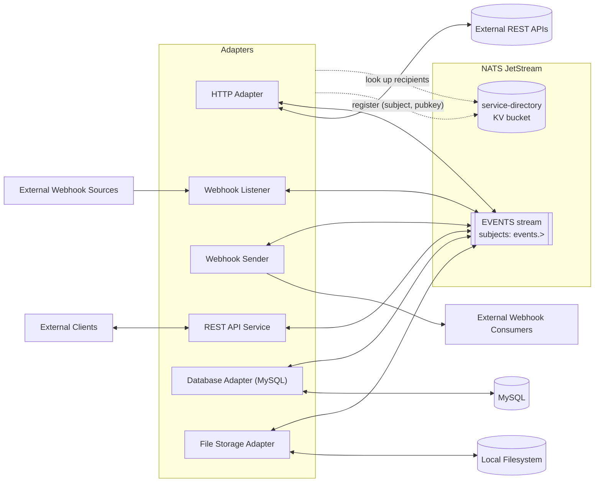
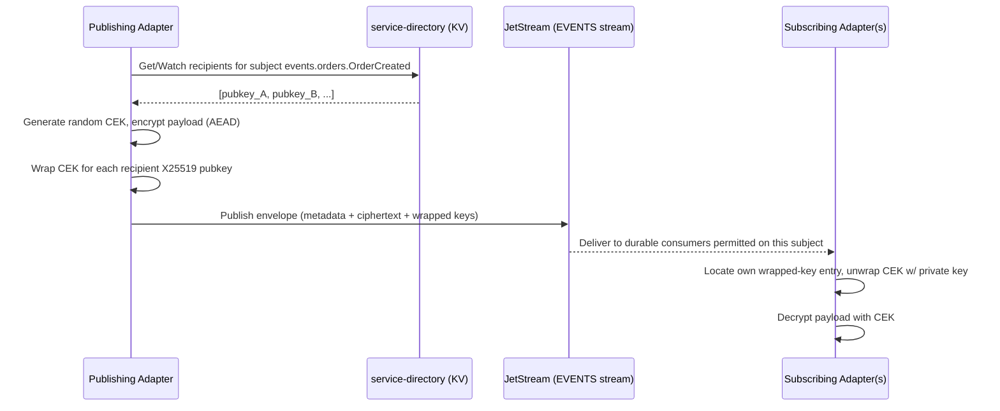
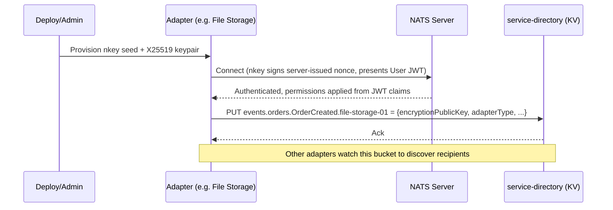

# Title: Gregor's Service Bus — Design Document

Status: Draft v0.2 — companion to [Design_Notes.md](Design_Notes.md)
Date: 2026-08-22
Scope: **Design only.** No implementation yet.

This document expands the original design notes into a concrete architecture, resolves the ambiguous points through the decisions recorded below, and proposes an implementation plan. Sections marked **Open Question** are still unresolved and need a decision before that part of the system can be built with confidence. This document also aims to satisfy [DevelopmentGuidelines.md](DevelopmentGuidelines.md)'s documentation standards as the project proceeds; per-dependency version/provenance/security-vetting detail lives in the companion [Dependencies.md](Dependencies.md) ledger rather than here.

---

## 1. Goals & Non-Goals

**Goals**
- A message bus, built on NATS JetStream, that any authorized service ("adapter") can connect to.
- Connection-level identity via public-key authentication (SSH-like).
- Payload confidentiality via public-key encryption, scoped to the specific recipients entitled to read a given event — independent of who else can technically subscribe to the subject.
- A small, well-documented set of baseline adapters that make the bus useful immediately (HTTP, webhooks, MySQL, file storage).
- A Python codebase organized like a normal, idiomatic Python project, deployable locally via `docker-compose`.

**Non-Goals (for this phase)**
- Multi-region / clustered NATS deployment.
- A UI/admin console (CLI + config files are sufficient for v1).
- Horizontal auto-scaling of adapters.
- Anything resembling a general-purpose ESB (business rules, orchestration, BPM). This is transport + adapters, not a workflow engine.

---

## 2. Key Decisions (resolved during design discussion)

| # | Question | Decision |
|---|----------|----------|
| 1 | How does the bus authenticate a service's identity? | **NATS nkeys** (built-in Ed25519 challenge/response — functionally identical to SSH pubkey auth). No custom auth service for v1. |
| 2 | Where does the "who is allowed to decrypt subject X" directory live? | **JetStream KV bucket** (`service-directory`) — reuses NATS infrastructure, no new datastore. |
| 3 | Is adapter-level "PII encryption" a separate mechanism from payload encryption? | **No — same mechanism.** Whole-payload public-key encryption covers PII; no separate field-level scheme in v1. |
| 4 | Should NATS subscribe permissions be wide open ("any connected adapter sees everything") or restricted per adapter? | **Restricted per adapter.** Each adapter gets an explicit subject allow-list. Encryption remains the confidentiality boundary regardless of what an adapter is permitted to subscribe to; permissions add defense-in-depth and reduce blast radius / noise. This is a deliberate refinement of the original notes' "open bus" framing — see §4.4. |
| 5 | Should events be signed for authenticity independent of transport? | **Yes** — the sender signs a digest of the plaintext with its nkey (Ed25519); the signature travels in the envelope (§4.1, §5). |
| 6 | Static NATS config or decentralized JWT for adapter onboarding? | **Decentralized JWT (`nsc`)** — adapters are provisioned/deprovisioned by issuing/revoking a User JWT, no server config edit or reload needed (§4.2, §4.4). |
| 7 | Registry entry lifecycle? | **TTL/heartbeat** — adapters refresh their own KV entry on a heartbeat; a dead adapter's key ages out automatically (§4.5). |
| 8 | Target Python version? | **3.12** — using the `uuid6` package for UUIDv7 (stdlib support arrives in 3.14) (§7.2). |
| 9 | `EVENTS` stream retention? | **7 days** age limit, plus a size cap as backstop (§6). |
| 10 | Database Adapter directionality? | **Bidirectional in v1** — write path (bus → MySQL) plus a CDC read path (MySQL → bus) via binlog streaming (§8). |
| 11 | File Storage Adapter shape? | **Command-driven CRUD** (list/read/write/delete triggered by bus commands), not a passive archival sink; filesystem-change → bus events deferred (§8). |
| 12 | Webhook Sender delivery guarantee? | **Best-effort** — single attempt, no retry/backoff (§8). |
| 13 | CI platform? | **GitHub Actions** (§7.4, §10). |
| 14 | Subject naming / bounded contexts? | **Placeholder pattern retained** — `events.<context>.<EventType>` with `orders` as a stand-in; real domain names to be supplied later (§5). |
| 15 | CDC approach for the Database Adapter? | **Lightweight** — `python-mysql-replication` tails the binlog in-process; no Debezium/Kafka Connect for now (§8, §9). |
| 16 | Python packaging/dependency-management tool? | **`uv`** — workspace mode handles `gsb-core` as a shared local dependency across all 6 adapter packages cleanly (§7.5). |
| 17 | Where does per-dependency version/release-date/source/security-vetting documentation live (per [DevelopmentGuidelines.md](DevelopmentGuidelines.md))? | **New [Dependencies.md](Dependencies.md) ledger** — keeps Design.md focused on architecture; the ledger is updated whenever a dependency is added, pinned, or reviewed (§7.2). |
| 18 | Is the adapter identity manifest (§11 Step A2) keyed per adapter *type* or per *instance*? | **Per instance.** The service-directory KV's `<subject>.<serviceId>` key shape (§4.5) already implies instance-level identity (e.g. `file-storage-01`), so a deployment can run multiple independent instances of the same adapter type — e.g. two HTTP Adapter instances, each wired to a different external API, each with its own NATS identity and permissions. See [infra/nats/adapter_identities.yaml](infra/nats/adapter_identities.yaml). |
| 19 | Does `FileWriteRequested` need a separate `FileCreateRequested` command, and does the File Storage Adapter watch for externally-created files? | **No separate command** — `FileWriteRequested` auto-creates a missing file. It emits `FileCreateCompleted` if the file was new, `FileWriteCompleted` if an existing file was updated. `FileCreateCompleted` is **also** published outside the command flow when the adapter notices a file created by an outside process (e.g. a shared/watched directory) — no preceding command, no `correlationId`. This is a deliberately narrow pull-forward of the folder-watch capability otherwise deferred (§8) — creation-detection only, not update-detection (§9). |

---

## 3. High-Level Architecture



All adapters share a common library (`gsb-core`, §7.1) that implements the bus client, event envelope, crypto, and registry lookups — so each adapter is a thin wrapper around its specific integration logic.

---

## 4. Security Model

### 4.1 Two separate keypairs per service

A service participating in the bus holds **two distinct keypairs**, used for two distinct purposes:

| Keypair | Algorithm | Purpose | Where it's used |
|---|---|---|---|
| **nkey** | Ed25519 (signing) | Prove identity to NATS when connecting | NATS auth handshake only |
| **encryption keypair** | X25519 (encryption) | Encrypt/decrypt event payloads | Application-level crypto, never touches NATS auth |

This mirrors "public key for access similar to SSH" (nkey) plus "payload encrypted for all public keys allowed to receive data" (encryption keypair) as two independent mechanisms — connecting to the bus and being able to *read a given message* are not the same permission.

**Decision:** Yes — every event is signed. The publisher signs a digest of the plaintext payload with its nkey before encrypting; the signature travels in `eventDetails.signature` (§5), so any recipient can verify authenticity/integrity independent of transport trust, even though the payload itself is only readable by entitled recipients.

### 4.2 Connection authentication (nkeys + decentralized JWT)

- Each adapter is provisioned an nkey seed (Ed25519 keypair) at deploy time (analogous to an SSH key pair).
- Rather than listing keys statically in `nats-server.conf`, the bus uses NATS's **decentralized JWT auth**, managed via the `nsc` CLI:
  - An **Operator** identity represents the bus itself.
  - An **Account** groups related adapters (a single `GSB` account is enough for v1 — subject permissions are still applied per-user within it).
  - Each adapter gets its own **User JWT**, signed by the account, embedding its nkey identity *and* its subject permissions (publish/subscribe allow-list, per Decision #4).
  - The NATS server is configured with a JWT **resolver** (a directory of issued JWTs, or a small resolver service) instead of a static authorization block.
- On connect, NATS sends a nonce; the adapter signs it with its private nkey and presents its User JWT; the server verifies the signature and reads permissions straight out of the JWT claims. No secret ever crosses the wire.
- Provisioning/deprovisioning an adapter is now an `nsc` operation (issue or revoke a User JWT) — **no server config edit or reload needed**, which is the point of choosing this over static config.
- Still 100% built into NATS tooling — no custom auth service to build.

### 4.3 Payload confidentiality (hybrid / envelope encryption)

Standard hybrid-encryption pattern, so we don't hand-roll multi-recipient crypto from scratch:

1. Publisher generates a random **Content Encryption Key (CEK)** per message.
2. Payload is encrypted with the CEK using an AEAD cipher (e.g. XChaCha20-Poly1305).
3. The CEK itself is encrypted ("wrapped") once per recipient, using each recipient's X25519 public key.
4. The envelope carries the ciphertext plus one wrapped-CEK entry per recipient. Any recipient with the matching private key unwraps the CEK and decrypts the payload; nobody else can.

This is exactly what the **[age](https://age-encryption.org)** format does natively (it's designed for "encrypt to multiple recipients"), so we don't need to implement the envelope construction ourselves — see §7.2.



### 4.4 Subject-level authorization (NATS permissions)

Per Decision #4, each adapter's NATS identity is granted an explicit `subscribe`/`publish` subject allow-list rather than a blanket wildcard. Two independent layers now exist:

- **Transport layer (NATS permissions):** can this adapter even receive traffic on this subject at all?
- **Application layer (encryption):** even if it receives the message, can it actually read the payload?

A message an adapter is permitted to subscribe to but not entitled to decrypt is still meaningless noise to it — metadata only. This satisfies the spirit of the original "open bus, encrypted payload" framing while adding least-privilege at the transport layer too.

**Decision:** Permission assignment happens via the decentralized JWT mechanism in §4.2 — each adapter's User JWT embeds its subject allow-list directly, so onboarding and permission changes don't require a NATS server restart or config reload.

### 4.5 Registry / recipient directory (JetStream KV)

- Bucket: `service-directory`.
- Key shape: `<subject>.<serviceId>` — e.g. `events.orders.OrderCreated.file-storage-01`.
- Value: JSON — `{ "serviceId", "adapterType", "encryptionPublicKey", "registeredAt" }`.
- **Write access:** an adapter may only `PUT` keys under its own `serviceId` namespace (enforced via NATS permission on the underlying `$KV.service-directory.*.<serviceId>` subject).
- **Read access:** all adapters can read/watch the bucket to discover current recipients for a subject.
- Publishers cache the recipient list in memory and keep it fresh via a JetStream KV **watch** (not a `GET` per publish) for performance.



**Decision:** Registry entries use JetStream KV's native per-key TTL. Each adapter refreshes its own entry on a heartbeat interval (shorter than the TTL); if the adapter stops heartbeating, its entry expires and it silently drops out of the recipient list for new messages — no manual deregistration step needed for the common "adapter died" case. Explicit deregistration via the `tools/` CLI remains available for deliberate decommissioning.

---

## 5. Event Envelope

Baseline schema (extends the shape from the design notes):

```json
{
  "event": {
    "eventDetails": {
      "eventId": "uuid7",
      "eventCreated": "2026-08-22T18:04:00Z",
      "eventType": "OrderCreated",
      "eventSchemaVersion": "1.0.0",
      "sourceServiceId": "rest-api-service-01",
      "correlationId": "uuid7 (optional, for request/reply chains)",
      "signature": "base64 — Ed25519 signature of the plaintext digest, signed with the sender's nkey (see §4.1)"
    },
    "encryption": {
      "algorithm": "age-v1 (X25519 + XChaCha20-Poly1305)",
      "recipients": [
        { "keyId": "<recipient pubkey fingerprint>", "wrappedKey": "<base64>" }
      ]
    },
    "eventPayload": "<base64 ciphertext>"
  }
}
```

Notes / assumptions baked into this:
- **`subject` = one unique subject per `eventType`** (not per message instance) — e.g. `events.orders.OrderCreated` is the permanent home for that event type, and its payload schema is documented once, referenced by that subject.
- Subject naming convention: `events.<boundedContext>.<EventType>` — kept as a **placeholder pattern** for now (`orders` is a stand-in bounded context). Real bounded-context names will replace the placeholder once they're known; nothing else in the design depends on the specific names chosen.
- Schemas for `eventPayload` (pre-encryption, logical shape) are documented as versioned JSON Schema files, one per subject, checked into `schemas/` in the repo (see §7). `eventSchemaVersion` lets consumers detect breaking changes.

---

## 6. NATS JetStream Layout

- **Stream:** single stream `EVENTS`, subject filter `events.>` (one stream is simplest to operate; can be split by bounded context later if retention/ops needs diverge).
- **Retention:** durable, limits-based retention — **7 days** age limit, plus a size cap as a backstop — not work-queue, since multiple adapters need independent delivery of the same message. Long enough to recover from adapter downtime/redeploys without replaying stale data; revisit if audit requirements later call for a longer window.
- **Consumers:** one durable, filtered consumer per adapter (`filter_subject` scoped to what that adapter is permitted/configured to handle), so each adapter tracks its own delivery cursor independently and can restart without replaying everything.
- **KV bucket:** `service-directory`, as above.

---

## 7. Python Project

### 7.1 Repository layout

```
GregorsServiceBus/
  Design.md
  Design_Notes.md
  Dependencies.md               # dependency ledger: version, release date, source, security vetting
  DevelopmentGuidelines.md
  pyproject.toml                 # uv workspace root — members: libs/*, adapters/*
  .python-version                # pins 3.12 for uv
  docker-compose.yml            # infra + all adapters (built later)
  schemas/                      # versioned JSON Schema per subject/eventType
  libs/
    gsb-core/                   # shared library used by every adapter
      pyproject.toml
      gsb_core/
        envelope.py             # EventEnvelope pydantic model, (de)serialization
        crypto.py               # encrypt_for_recipients(), decrypt(), signing helpers
        bus_client.py           # thin wrapper over nats-py + JetStream
        registry.py             # KV read/write + in-memory watch cache
        config.py               # pydantic-settings based adapter config loader
      tests/
  adapters/
    http_adapter/
    rest_api_service/
    webhook_sender/
    webhook_listener/
    db_adapter_mysql/
    file_storage_adapter/
      # each: pyproject.toml, app/, tests/, Dockerfile
  infra/
    nats/
      nats-server.conf        # JetStream + JWT resolver config (no static authorization block)
      operator/                # nsc-managed Operator/Account/User JWTs + nkeys (secrets git-ignored)
    mysql/
      init.sql
      # my.cnf snippet enabling binlog (log_bin, binlog_format=ROW, server-id) for CDC
  tools/                         # key-generation CLI, registry admin CLI
```

Each adapter is its own installable Python package with its own `Dockerfile`, depending on `gsb-core` as a local/editable dependency (or a private index later). This keeps adapters independently deployable while sharing the crypto/envelope/bus logic in one audited place.

### 7.2 Libraries (proposed)

Architectural rationale for each choice is below; **version pins, release dates, sources, and security-vetting notes live in [Dependencies.md](Dependencies.md)**, updated as each dependency is actually added via `uv add`.

| Concern | Library | Notes |
|---|---|---|
| NATS/JetStream client | `nats-py` | Official async client; supports JetStream + KV. |
| Data modeling / validation | `pydantic` v2 | Event envelope, config models, adapter-specific payload schemas. |
| Config | `pydantic-settings` | Env-var/`.env`-driven adapter configuration. |
| Payload encryption | `pyrage` (age bindings) | Native multi-recipient encryption — matches §4.3 exactly. Fallback: `PyNaCl` (libsodium) if `age` integration proves awkward, at the cost of hand-rolling the envelope. |
| Signing (nkey / Ed25519) | `nats-py`'s built-in nkey support (`nkeys` lib) | Reused for the payload signing that's part of every event (§4.1). |
| REST API Service / Webhook Listener | `fastapi` + `uvicorn` | ASGI HTTP surface for inbound adapters. |
| Outbound HTTP (HTTP Adapter, Webhook Sender) | `httpx` (async) | |
| Retry/backoff | `tenacity` | Database Adapter writes (not the Webhook Sender, which is best-effort per §8). |
| MySQL adapter (write path) | `SQLAlchemy` 2.0 (async) + `asyncmy` | |
| MySQL adapter (CDC read path) | `python-mysql-replication` | Tails the MySQL binlog directly (row-based) and turns row changes into bus events — avoids standing up a full Debezium/Kafka Connect stack for a single-adapter use case. Confirmed choice for v1 (Decision #15). |
| File storage adapter | `aiofiles` | Backs the list/read/write/delete command handlers (§8). |
| File storage adapter — external-creation detection | `watchfiles` | Watches the managed directory to detect files created by outside processes, so `FileCreateCompleted` can be emitted without a preceding command (Decision #19). Async-native, fits the existing async stack; same author/ecosystem as `pydantic`. |
| UUIDv7 | `uuid6` (PyPI) | Stdlib `uuid` doesn't have `uuid7()` until Python 3.14; project targets Python 3.12, so this stays a dependency. |
| Structured logging | `structlog` | JSON logs correlated by `eventId`/`correlationId`. |
| CLI tooling | `typer` | Key generation, registry admin, local dev utilities. |

### 7.3 Required services (for `docker-compose`, described — not written yet)

- `nats` — NATS server with JetStream + KV enabled.
- `mysql` — for the Database Adapter; configured with binlog enabled (`log_bin`, `binlog_format=ROW`, unique `server-id`) to support the CDC read path (§8).
- One container per adapter (6 total for v1).
- Optional: `adminer` (DB inspection, dev convenience).

### 7.4 Development tooling

| Purpose | Tool |
|---|---|
| Testing | `pytest`, `pytest-asyncio`, `pytest-cov` |
| Integration testing | `testcontainers-python` (spin up real NATS+JetStream and MySQL for tests) |
| Lint/format | `ruff` |
| Type checking | `mypy` |
| Security static analysis | `bandit` |
| Dependency vulnerability scanning | `pip-audit` |
| Git hook orchestration | `pre-commit` (ties the above together) |
| Containerization | `docker`, `docker-compose` |

**Decision:** GitHub Actions runs the above (lint, type-check, test, security scans) on every push/PR.

### 7.5 Development environment setup

- **Packaging/dependency management:** [`uv`](https://docs.astral.sh/uv/) (Decision #16). The repo root `pyproject.toml` declares a **uv workspace** with members `libs/*` and `adapters/*` — `gsb-core` is consumed by every adapter as an in-workspace path dependency (no publishing to an index needed), and `uv sync` at the root resolves/installs the whole project's dependency graph in one lockfile (`uv.lock`).
- **Python version:** pinned via a root `.python-version` file (3.12, Decision #8); `uv` provisions/uses that interpreter automatically.
- **Per-package env:** `uv` manages a single shared virtual environment for the workspace by default (`.venv/` at the repo root) — no per-adapter venv juggling.
- **Local paths / system paths:** nothing outside the repo tree is required beyond `uv` itself and Docker; `nsc`'s store is repo-local and git-ignored (§11, Track A parameters).

### 7.6 Environment properties (docker-compose)

Full documentation of each service's ports/volumes/env vars happens when `docker-compose.yml` is actually authored (§10 Phase 5), but the anticipated shape, per [DevelopmentGuidelines.md](DevelopmentGuidelines.md)'s "document environment properties" requirement:

| Service | Anticipated env vars | Ports | Volumes |
|---|---|---|---|
| `nats` | — (config-file driven) | `4222` (client), `8222` (monitoring) | JetStream store dir; `infra/nats/` config + resolver |
| `mysql` | `MYSQL_ROOT_PASSWORD`, `MYSQL_DATABASE`, binlog settings via `my.cnf` mount | `3306` | data dir; `infra/mysql/init.sql` |
| each adapter | `GSB_SERVICE_ID`, `GSB_NKEY_SEED_PATH`, `GSB_JWT_PATH`, `GSB_NATS_URL`, `GSB_SUBJECTS`, `GSB_LOG_LEVEL` (via `config.py`, §7.1) | adapter-specific (e.g. `8080` for REST API Service / Webhook Listener) | none by default; File Storage Adapter additionally mounts a data volume |

This table is a preview, not a commitment — it will be corrected/expanded against the real compose file once written.

---

## 8. Initial Adapters

| Adapter | Direction | Role | Assumption to confirm |
|---|---|---|---|
| **HTTP Adapter** | Bus → external, external → Bus | On event, calls a configured external REST API; may publish the response back as a correlated event. | "Emit and receive" read as: outbound call triggered by a bus event, response optionally re-published. |
| **REST API Service** | External → Bus (+ optional sync reply) | Exposes a REST API for external clients; translates calls into bus events. Can do request/reply by publishing then waiting on a correlated response subject. | This is the "front door" for external HTTP clients — confirm that's the intent vs. something else. |
| **Webhook Sender** | Bus → external | Subscribes to configured subjects; POSTs decrypted payload (or a projection) to a registered external webhook URL — **single attempt, best-effort, no retry/backoff**. | A downstream outage can silently drop a delivery at this boundary; acceptable per current requirements. If this changes later, add `tenacity`-based retry + `eventId` dedupe guidance for the receiver. |
| **Webhook Listener** | External → Bus | Exposes an HTTP endpoint for inbound third-party webhooks; verifies source, converts to the event envelope, encrypts, publishes. | Source verification mechanism (shared secret, HMAC header) is source-specific — TBD per integration. |
| **Database Adapter (MySQL)** | Bidirectional | **Write path:** subscribes to subjects and persists decrypted event data into MySQL. **Read path (CDC):** tails the MySQL binlog via `python-mysql-replication` and publishes row-level changes as bus events. Both in scope for v1. | Bidirectional scope makes this adapter meaningfully bigger than originally sketched, but the CDC mechanism itself is settled (Decision #15). **Write-path input and CDC-path output must use different subjects** (e.g. `events.orders.OrderCreated` in vs. `events.db.orders.RowChanged` out) — otherwise the adapter could subscribe to its own CDC output as a write-path trigger. Reflected in [infra/nats/adapter_identities.yaml](infra/nats/adapter_identities.yaml). |
| **File Storage Adapter (local)** | Command-driven (bus → adapter → bus), plus narrow watch → bus | Not a passive archival sink — a **file operations service** invoked via bus commands: `list`, `read`, `write`, `delete` against local files. `FileWriteRequested` auto-creates a missing file; the adapter reports `FileCreateCompleted` (new file) or `FileWriteCompleted` (existing file updated) accordingly (Decision #19). `FileCreateCompleted` is **also** emitted when the adapter notices a file created by an outside process (no preceding command). Full folder-watch (arbitrary external changes, including updates) remains **deferred**. | Exact reply/result-subject scoping (e.g. per-requester) still TBD when this adapter is built (Phase 3); externally-triggered *update* detection is an open question (§9). |

All adapters are built on `gsb-core`, so "build a new adapter" mostly means writing the integration-specific glue (HTTP call, file write, SQL write) around a shared `BusClient`.

---

## 9. Open Questions Summary

All architectural questions have been resolved and folded into §2–§8 above (Decisions #1–#15). What's left is deliberately deferred, not blocking:

1. **File Storage Adapter command/response schema** — exact subject names and payload shape for the `list`/`read`/`write`/`delete` commands are TBD, to be nailed down when that adapter is actually built (Phase 3).
2. **Subject naming** — real bounded-context names are deferred by choice; `events.<context>.<EventType>` stays a placeholder pattern (`orders` as stand-in) until real domains are known. Nothing else in the design depends on the specific names chosen.
3. **Externally-triggered file *updates*** — Decision #19 has the File Storage Adapter detect externally-created files (→ `FileCreateCompleted`), but not externally-triggered updates to existing files. Is that asymmetry intentional, or should update-detection be added too when this adapter is built?

---

## 10. Proposed Implementation Plan (high-level, no code yet)

1. **Phase 0** — Resolve remaining §9 items as they come up; finalize this document.
2. **Phase 1** — Core infra: `nsc`-issued Operator/Account/User JWTs, NATS JetStream config (JWT resolver, `EVENTS` stream, `service-directory` KV bucket); `gsb-core` library (envelope, signing, crypto, bus client, registry client) with unit tests, no adapters yet.
3. **Phase 2** — One vertical slice end-to-end to prove the pattern: **Webhook Listener → File Storage Adapter** (inbound HTTP → encrypted+signed publish of a `FileWriteRequested` command → File Storage Adapter decrypts, verifies signature, writes the file, publishes a result event). Wire into `docker-compose`.
4. **Phase 3** — Remaining adapters (HTTP Adapter, REST API Service, Webhook Sender, Database Adapter — including its CDC read path per Decision #10; nail down the File Storage Adapter's full command/response schema).
5. **Phase 4** — Hardening: GitHub Actions CI (ruff, mypy, pytest, bandit, pip-audit), populate `schemas/` for all defined event types, integration test suite via `testcontainers-python`.
6. **Phase 5** — Finalize `docker-compose.yml` as the complete local demo environment.

---

## 11. Phase 1 — Detailed Breakdown

Phase 1 (§10) splits into two tracks that can largely proceed in parallel, converging at the end for an integration proof. Nothing here is built yet — this is the step-by-step scope for when implementation starts.

**A few parameters this breakdown assumes — flag now if any should change, otherwise treated as settled for Phase 1:**

| Parameter | Proposed default | Rationale |
|---|---|---|
| `service-directory` KV entry TTL | 60s | Short enough that a dead adapter drops out quickly; long enough to tolerate a missed heartbeat or two. |
| Heartbeat interval (re-`PUT` own entry) | 20s | 3x safety margin under the TTL. |
| JWT resolver type | NATS **memory resolver** (JWTs embedded directly in `nats-server.conf`, generated by the bootstrap step) | Simplest option for a handful of adapters; swappable for a directory/`full` resolver later without touching anything else if the adapter count grows. |
| nsc store / key material | **Not committed.** `infra/nats/operator/` is git-ignored; a bootstrap step regenerates the Operator/Account/User JWTs and nkeys locally (and in CI) on demand. | Standard practice — private key material never belongs in git, and regeneration is cheap since nothing depends on the JWTs' specific content, only their claims. |

### Track A — NATS / JetStream Infrastructure

- [x] **A1. Toolchain pin** — `nats-server` 2.14.5 and `nats-box` 0.19.7-nonroot (bundles `nsc` + `nats` CLI), both Docker images only — nothing installed natively on the host; persistent `nsc` state is a volume-mapped local path. Documented in [infra/nats/README.md](infra/nats/README.md); pins also recorded in [Dependencies.md](Dependencies.md).
- [x] **A2. Adapter identity manifest** — [infra/nats/adapter_identities.yaml](infra/nats/adapter_identities.yaml): one entry per adapter *instance* (Decision #18), with `serviceId`, `adapterType`, and a publish/subscribe subject allow-list. Populated with the Phase 2 pair (`webhook-listener-01`, `file-storage-01`) plus one placeholder instance for each of the other 4 adapter types. KV read/write permissions are derived from the subscribe list by the bootstrap script (A3), not hand-authored per entry.
- [ ] **A3. Bootstrap script (auth)** — idempotent script that drives `nsc` to create the Operator, the `GSB` Account, and one User (nkey + JWT) per entry in A2's manifest, then emits the memory-resolver config block.
- [ ] **A4. `nats-server.conf`** — JetStream enabled (storage dir/mode for dev), wired to the resolver config from A3.
- [ ] **A5. Bootstrap script (JetStream objects)** — idempotent creation of the `EVENTS` stream (`events.>`, 7-day retention) and the `service-directory` KV bucket (TTL per the table above).
- [ ] **A6. `docker-compose` (infra-only)** — a first compose file with just the `nats` service plus a one-shot init container running A3+A5 on startup. No adapters yet — the goal is "infra comes up authenticated, with the stream and KV bucket present."
- [ ] **A7. Manual smoke test** — using the `nats` CLI with one issued User JWT/nkey: publish/subscribe on an allowed subject (works), attempt a disallowed subject (rejected), KV put/get against `service-directory` (works). Confirms A1–A6 before any library code depends on it.

### Track B — `gsb-core` Library

- [ ] **B1. Package scaffold** — `libs/gsb-core` `pyproject.toml` + package skeleton, wired into the repo-wide `ruff`/`mypy`/`pytest` tooling (§7.4). No NATS dependency yet.
- [ ] **B2. `envelope.py`** — pydantic models for the event envelope (§5), with (de)serialization and round-trip unit tests. Pure logic — doesn't touch NATS or crypto.
- [ ] **B3. `crypto.py`** — hybrid encryption (`pyrage`: encrypt-for-recipients / decrypt) and Ed25519 signing/verification (`nkeys`), unit tested against fixed test keys. Still no live bus needed.
- [ ] **B4. `config.py`** — `pydantic-settings` loader for adapter config (nkey seed path, JWT path, subject list, service ID).
- [ ] **B5. `registry.py`** — KV client wrapper (get/watch/put-with-TTL, heartbeat loop). First piece that needs a live NATS — build against the Track A `docker-compose` stack (A6).
- [ ] **B6. `bus_client.py`** — the `BusClient` façade tying together JetStream publish/subscribe + envelope + crypto + registry lookup. Integration-tested against the same running stack.
- [ ] **B7. End-to-end proof** — a test with two in-process fake adapters using `BusClient`: one publishes a signed+encrypted event, the other receives, verifies the signature, and decrypts it. This is the concrete "Phase 1 is done" checkpoint — everything downstream (real adapters) builds on this working.

### Suggested sequencing

B1–B4 have no infrastructure dependency and can start immediately / in parallel with Track A. B5–B7 need A6 (a running, bootstrapped NATS) to exist first. A7 and B7 both serve as the exit criteria for Phase 1 — once both pass, Phase 2's vertical slice (§10) can begin.

---

*This document is a living draft — update it as open questions are resolved and the design evolves, rather than letting decisions drift into code undocumented.*
