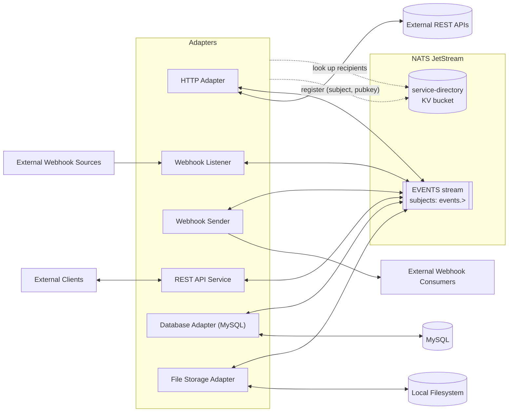
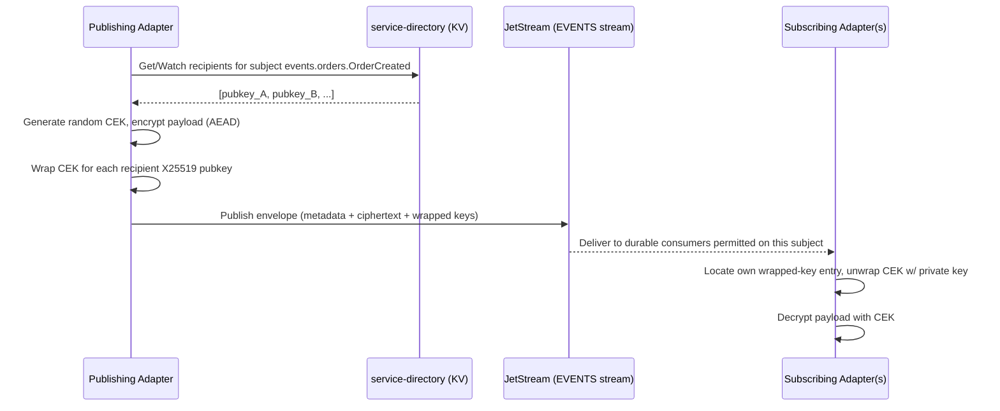
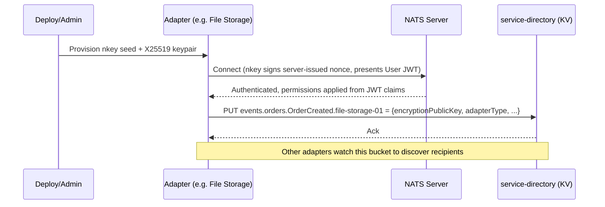

# Title: Jet Core Service Bus — Design Document

Status: Draft v0.2 — companion to [Design_Notes.md](Design_Notes.md)
Date: 2026-08-22
Scope: **Design only.** No implementation yet.

This document expands the original design notes into a concrete architecture, resolves the ambiguous points through the decisions recorded below, and proposes an implementation plan. Sections marked **Open Question** are still unresolved and need a decision before that part of the system can be built with confidence. This document also aims to satisfy [DevelopmentGuidelines.md](DevelopmentGuidelines.md)'s documentation standards as the project proceeds; per-dependency version/provenance/security-vetting detail lives in the companion [Dependencies.md](Dependencies.md) ledger rather than here.

---

## 1. Goals & Non-Goals

**Goals**
- A message bus, built on NATS JetStream, that any authorized service ("adapter") can connect to.
- Connection-level identity via public-key authentication (SSH-like).
- Payload confidentiality via public-key encryption, scoped to the specific recipients entitled to read a given event — independent of who else can technically subscribe to the subject.
- A small, well-documented set of baseline adapters that make the bus useful immediately (HTTP, webhooks, MySQL, file storage).
- A Python codebase organized like a normal, idiomatic Python project, deployable locally via `docker-compose`.

**Non-Goals (for this phase)**
- Multi-region / clustered NATS deployment.
- A UI/admin console (CLI + config files are sufficient for v1).
- Horizontal auto-scaling of adapters.
- Anything resembling a general-purpose ESB (business rules, orchestration, BPM). This is transport + adapters, not a workflow engine.

---

## 2. Key Decisions (resolved during design discussion)

| # | Question | Decision |
|---|----------|----------|
| 1 | How does the bus authenticate a service's identity? | **NATS nkeys** (built-in Ed25519 challenge/response — functionally identical to SSH pubkey auth). No custom auth service for v1. |
| 2 | Where does the "who is allowed to decrypt subject X" directory live? | **JetStream KV bucket** (`service-directory`) — reuses NATS infrastructure, no new datastore. |
| 3 | Is adapter-level "PII encryption" a separate mechanism from payload encryption? | **No — same mechanism.** Whole-payload public-key encryption covers PII; no separate field-level scheme in v1. |
| 4 | Should NATS subscribe permissions be wide open ("any connected adapter sees everything") or restricted per adapter? | **Restricted per adapter.** Each adapter gets an explicit subject allow-list. Encryption remains the confidentiality boundary regardless of what an adapter is permitted to subscribe to; permissions add defense-in-depth and reduce blast radius / noise. This is a deliberate refinement of the original notes' "open bus" framing — see §4.4. |
| 5 | Should events be signed for authenticity independent of transport? | **Yes** — the sender signs a digest of the plaintext with its nkey (Ed25519); the signature travels in the envelope (§4.1, §5). |
| 6 | Static NATS config or decentralized JWT for adapter onboarding? | **Decentralized JWT (`nsc`)** — adapters are provisioned/deprovisioned by issuing/revoking a User JWT, no server config edit or reload needed (§4.2, §4.4). |
| 7 | Registry entry lifecycle? | **TTL/heartbeat** — adapters refresh their own KV entry on a heartbeat; a dead adapter's key ages out automatically (§4.5). |
| 8 | Target Python version? | **3.12** — using the `uuid6` package for UUIDv7 (stdlib support arrives in 3.14) (§7.2). |
| 9 | `EVENTS` stream retention? | **7 days** age limit, plus a size cap as backstop (§6). |
| 10 | Database Adapter directionality? | **Bidirectional in v1** — write path (bus → MySQL) plus a CDC read path (MySQL → bus) via binlog streaming (§8). |
| 11 | File Storage Adapter shape? | **Command-driven CRUD** (list/read/write/delete triggered by bus commands), not a passive archival sink; filesystem-change → bus events deferred (§8). |
| 12 | Webhook Sender delivery guarantee? | **Best-effort** — single attempt, no retry/backoff (§8). |
| 13 | CI platform? | **GitHub Actions** (§7.4, §10). |
| 14 | Subject naming / bounded contexts? | **Placeholder pattern retained** — `events.<context>.<EventType>` with `orders` as a stand-in; real domain names to be supplied later (§5). |
| 15 | CDC approach for the Database Adapter? | **Lightweight** — `python-mysql-replication` tails the binlog in-process; no Debezium/Kafka Connect for now (§8, §9). |
| 16 | Python packaging/dependency-management tool? | **`uv`** — workspace mode handles `jetcore` as a shared local dependency across all 6 adapter packages cleanly (§7.5). |
| 17 | Where does per-dependency version/release-date/source/security-vetting documentation live (per [DevelopmentGuidelines.md](DevelopmentGuidelines.md))? | **New [Dependencies.md](Dependencies.md) ledger** — keeps Design.md focused on architecture; the ledger is updated whenever a dependency is added, pinned, or reviewed (§7.2). |
| 18 | Is the adapter identity manifest (§11 Step A2) keyed per adapter *type* or per *instance*? | **Per instance.** The service-directory KV's `<subject>.<serviceId>` key shape (§4.5) already implies instance-level identity (e.g. `file-storage-01`), so a deployment can run multiple independent instances of the same adapter type — e.g. two HTTP Adapter instances, each wired to a different external API, each with its own NATS identity and permissions. See [infra/nats/adapter_identities.yaml](infra/nats/adapter_identities.yaml). |
| 19 | Does `FileWriteRequested` need a separate `FileCreateRequested` command, and does the File Storage Adapter watch for externally-created files? | **No separate command** — `FileWriteRequested` auto-creates a missing file. It emits `FileCreateCompleted` if the file was new, `FileWriteCompleted` if an existing file was updated. `FileCreateCompleted` is **also** published outside the command flow when the adapter notices a file created by an outside process (e.g. a shared/watched directory) — no preceding command, no `correlationId`. This is a deliberately narrow pull-forward of the folder-watch capability otherwise deferred (§8) — creation-detection only, not update-detection (§9). |
| 20 | How is the sender-authentication gap found in Step B6 closed (§9 item #4)? | **New `service-identity` KV directory** (§4.6) — every adapter registers its own signing key once at connect time (not on a heartbeat, no TTL); a recipient verifies against the *trusted* looked-up key, not the message's own embedded `sourcePublicKey` claim. Accepted as a v1-scoped mechanism, not a full PKI (no revocation beyond overwrite). |
| 21 | How does the Phase 2 Webhook Listener verify an inbound request is legitimate, given no specific real external source is chosen yet (§8's "TBD per integration")? | **Shared-secret header** (`X-Webhook-Secret`, constant-time compared against a per-adapter configured secret) — a generic, source-agnostic placeholder that proves "verify before trusting the bus with it" as a real step, same spirit as Decision #14's placeholder subjects. A real integration's actual scheme (HMAC-SHA256 signature header, etc.) is source-specific and deferred until a real source is picked (§12). |
| 22 | What's the `FileWriteRequested` → HTTP mapping and command payload shape for Phase 2 (§9 item #1, write path only)? | **URL path segment → relative file `path`** (`POST /webhooks/{path:path}`, resolved and validated to stay inside `watch_dir`), **raw request body → `content`** (base64 in the payload). Deliberately generic — no real webhook source is being integrated yet, so this proves the pattern (HTTP in → verified → bus command out) rather than shaping around a specific vendor's schema. `list`/`read`/`delete` command shapes remain deferred to Phase 3 (§9). |

---

## 3. High-Level Architecture



All adapters share a common library (`jetcore`, §7.1) that implements the bus client, event envelope, crypto, and registry lookups — so each adapter is a thin wrapper around its specific integration logic.

---

## 4. Security Model

### 4.1 Two separate keypairs per service

A service participating in the bus holds **two distinct keypairs**, used for two distinct purposes:

| Keypair | Algorithm | Purpose | Where it's used |
|---|---|---|---|
| **nkey** | Ed25519 (signing) | Prove identity to NATS when connecting | NATS auth handshake only |
| **encryption keypair** | X25519 (encryption) | Encrypt/decrypt event payloads | Application-level crypto, never touches NATS auth |

This mirrors "public key for access similar to SSH" (nkey) plus "payload encrypted for all public keys allowed to receive data" (encryption keypair) as two independent mechanisms — connecting to the bus and being able to *read a given message* are not the same permission.

**Decision:** Yes — every event is signed. The publisher signs a digest of the plaintext payload with its nkey before encrypting; the signature travels in `eventDetails.signature` (§5), so any recipient can verify authenticity/integrity independent of transport trust, even though the payload itself is only readable by entitled recipients.

### 4.2 Connection authentication (nkeys + decentralized JWT)

- Each adapter is provisioned an nkey seed (Ed25519 keypair) at deploy time (analogous to an SSH key pair).
- Rather than listing keys statically in `nats-server.conf`, the bus uses NATS's **decentralized JWT auth**, managed via the `nsc` CLI:
  - An **Operator** identity represents the bus itself.
  - An **Account** groups related adapters (a single `JETCORE` account is enough for v1 — subject permissions are still applied per-user within it).
  - Each adapter gets its own **User JWT**, signed by the account, embedding its nkey identity *and* its subject permissions (publish/subscribe allow-list, per Decision #4).
  - The NATS server is configured with a JWT **resolver** (a directory of issued JWTs, or a small resolver service) instead of a static authorization block.
- On connect, NATS sends a nonce; the adapter signs it with its private nkey and presents its User JWT; the server verifies the signature and reads permissions straight out of the JWT claims. No secret ever crosses the wire.
- Provisioning/deprovisioning an adapter is now an `nsc` operation (issue or revoke a User JWT) — **no server config edit or reload needed**, which is the point of choosing this over static config.
- Still 100% built into NATS tooling — no custom auth service to build.

### 4.3 Payload confidentiality (hybrid / envelope encryption)

Standard hybrid-encryption pattern, so we don't hand-roll multi-recipient crypto from scratch:

1. Publisher generates a random **Content Encryption Key (CEK)** per message.
2. Payload is encrypted with the CEK using an AEAD cipher (e.g. XChaCha20-Poly1305).
3. The CEK itself is encrypted ("wrapped") once per recipient, using each recipient's X25519 public key.
4. The envelope carries the ciphertext plus one wrapped-CEK entry per recipient. Any recipient with the matching private key unwraps the CEK and decrypts the payload; nobody else can.

This is exactly what the **[age](https://age-encryption.org)** format does natively (it's designed for "encrypt to multiple recipients"), so we don't need to implement the envelope construction ourselves — see §7.2.



### 4.4 Subject-level authorization (NATS permissions)

Per Decision #4, each adapter's NATS identity is granted an explicit `subscribe`/`publish` subject allow-list rather than a blanket wildcard. Two independent layers now exist:

- **Transport layer (NATS permissions):** can this adapter even receive traffic on this subject at all?
- **Application layer (encryption):** even if it receives the message, can it actually read the payload?

A message an adapter is permitted to subscribe to but not entitled to decrypt is still meaningless noise to it — metadata only. This satisfies the spirit of the original "open bus, encrypted payload" framing while adding least-privilege at the transport layer too.

**Decision:** Permission assignment happens via the decentralized JWT mechanism in §4.2 — each adapter's User JWT embeds its subject allow-list directly, so onboarding and permission changes don't require a NATS server restart or config reload.

### 4.5 Registry / recipient directory (JetStream KV)

- Bucket: `service-directory`.
- Key shape: `<subject>.<serviceId>` — e.g. `events.orders.OrderCreated.file-storage-01`.
- Value: JSON — `{ "serviceId", "adapterType", "encryptionPublicKey", "registeredAt" }`.
- **Write access:** an adapter may only `PUT` keys under its own `serviceId` namespace (enforced via NATS permission on the underlying `$KV.service-directory.*.<serviceId>` subject).
- **Read access:** all adapters can read/watch the bucket to discover current recipients for a subject.
- Publishers cache the recipient list in memory and keep it fresh via a JetStream KV **watch** (not a `GET` per publish) for performance.



**Decision:** Registry entries use JetStream KV's native per-key TTL. Each adapter refreshes its own entry on a heartbeat interval (shorter than the TTL); if the adapter stops heartbeating, its entry expires and it silently drops out of the recipient list for new messages — no manual deregistration step needed for the common "adapter died" case. Explicit deregistration via the `tools/` CLI remains available for deliberate decommissioning.

### 4.6 Identity / sender-authentication directory (JetStream KV) — Decision #20

Added after Step B6's integration testing surfaced a real gap: `EventDetails.sourcePublicKey` (§4.1, §5) proves a signature is *self-consistent* with the key embedded in the message — it does **not** prove that key genuinely belongs to the claimed `sourceServiceId`. A message can embed any self-consistent (key, signature) pair and claim to be from anyone; nothing independently bound a serviceId to its authorized signing key. Confirmed by writing a test that (correctly) *passed* verification while impersonating a real adapter, before the mistake in the test itself — not in the code — pointed at the real hole underneath.

- **Bucket:** `service-identity`, separate from `service-directory` — a genuinely different concept. `service-directory` answers "who currently wants to receive subject X" (liveness-scoped, 60s TTL, keyed by `<subject>.<serviceId>`). `service-identity` answers "what is serviceId X's real signing key" (a much more durable fact, not tied to any one subject) — keyed by `<serviceId>` alone, **no TTL**. A decommissioned adapter's stale identity entry is harmless (an attacker would still need that old service's real private key to exploit it); a *missing* entry for a still-live service would wrongly reject legitimate messages, which is the failure mode to avoid.
- **Value shape:** `{ "serviceId", "adapterType", "signingPublicKey", "registeredAt" }` — parallel to `service-directory`'s value shape, but for the trust directory.
- **Registration:** every adapter — publisher or subscriber — registers its own entry **once, at connect time**, not on a repeating heartbeat. This matters: a pure publisher (e.g. Webhook Listener, which never subscribes to anything) never touches `service-directory` under the existing model, but it still needs an identity entry so recipients can verify messages it sends. Registration isn't scoped to "subjects subscribed to" the way recipient registration is.
- **Verification:** a recipient looks up the *trusted* key for `sourceServiceId` from this directory and verifies against **that** — not against the message's own embedded `sourcePublicKey`. The embedded field is still carried (useful for offline/audit tooling without live directory access) and cross-checked against the trusted lookup as a secondary, non-fatal signal (a mismatch is logged — it means the message's own claim disagrees with the directory, worth knowing even though the trusted-key check is what actually decides accept/reject). A `sourceServiceId` with no registered identity is rejected as unverifiable, not accepted by default.
- **Permissions:** every adapter gets broad `$KV.service-identity.>` read (needed to verify *any* claimed sender) and write scoped to its own `$KV.service-identity.<own-serviceId>` namespace only (Step A3) — the same read-broad/write-narrow shape as `service-directory`.

This closes the gap for the common case (verifying against a service that has connected and registered at least once) but is still a **v1-scoped mechanism**, not a full PKI: it trusts whatever registered first for a given serviceId, with no revocation beyond overwriting the entry, and no protection against a compromised identity re-registering a new key. Noted as an accepted v1 limitation, not a currently-open question — see §9 for what's still genuinely unresolved.

---

## 5. Event Envelope

Baseline schema (extends the shape from the design notes):

```json
{
  "event": {
    "eventDetails": {
      "eventId": "uuid7",
      "eventCreated": "2026-08-22T18:04:00Z",
      "eventType": "OrderCreated",
      "eventSchemaVersion": "1.0.0",
      "sourceServiceId": "rest-api-service-01",
      "correlationId": "uuid7 (optional, for request/reply chains)",
      "signature": "base64 — Ed25519 signature of the plaintext digest, signed with the sender's nkey (see §4.1)",
      "sourcePublicKey": "the sender's nkey public key — a recipient needs this to verify `signature`; added in Step B6 once end-to-end verification actually needed a way to find it. Not secret, so carrying it in the envelope is simplest — no separate serviceId-to-key directory needed."
    },
    "encryption": {
      "algorithm": "age-v1 (X25519 + XChaCha20-Poly1305)",
      "recipients": ["<recipient age public key, e.g. age1...>"]
    },
    "eventPayload": "<base64 ciphertext>"
  }
}
```

Notes / assumptions baked into this:
- **`subject` = one unique subject per `eventType`** (not per message instance) — e.g. `events.orders.OrderCreated` is the permanent home for that event type, and its payload schema is documented once, referenced by that subject.
- Subject naming convention: `events.<boundedContext>.<EventType>` — kept as a **placeholder pattern** for now (`orders` is a stand-in bounded context). Real bounded-context names will replace the placeholder once they're known; nothing else in the design depends on the specific names chosen.
- Schemas for `eventPayload` (pre-encryption, logical shape) are documented as versioned JSON Schema files, one per subject, checked into `schemas/` in the repo (see §7). `eventSchemaVersion` lets consumers detect breaking changes.
- `encryption.recipients` is a flat list of recipient public-key strings, not `{keyId, wrappedKey}` pairs — corrected during Step B3 once real `pyrage`/age encryption was implemented and confirmed to bundle per-recipient key-wrapping inside its single ciphertext, with nothing separable to expose per recipient at the application level. See §11 Step B3 for the full finding.

---

## 6. NATS JetStream Layout

- **Stream:** single stream `EVENTS`, subject filter `events.>` (one stream is simplest to operate; can be split by bounded context later if retention/ops needs diverge).
- **Retention:** durable, limits-based retention — **7 days** age limit, plus a size cap as a backstop — not work-queue, since multiple adapters need independent delivery of the same message. Long enough to recover from adapter downtime/redeploys without replaying stale data; revisit if audit requirements later call for a longer window.
- **Consumers:** one durable, filtered consumer per adapter (`filter_subject` scoped to what that adapter is permitted/configured to handle), so each adapter tracks its own delivery cursor independently and can restart without replaying everything.
- **KV buckets:** `service-directory` (§4.5, 60s TTL) and `service-identity` (§4.6, no TTL).

---

## 7. Python Project

### 7.1 Repository layout

```
JetCoreServiceBus/
  Design.md
  Design_Notes.md
  Dependencies.md               # dependency ledger: version, release date, source, security vetting
  DevelopmentGuidelines.md
  pyproject.toml                 # uv workspace root — members: libs/*, adapters/*
  .python-version                # pins 3.12 for uv
  docker-compose.yml            # infra + all adapters (built later)
  schemas/                      # versioned JSON Schema per subject/eventType
  libs/
    jetcore/                   # shared library used by every adapter
      pyproject.toml
      jetcore/
        envelope.py             # EventEnvelope pydantic model, (de)serialization
        crypto.py               # encrypt_for_recipients(), decrypt(), signing helpers
        bus_client.py           # thin wrapper over nats-py + JetStream
        registry.py             # KV read/write + in-memory watch cache
        config.py               # pydantic-settings based adapter config loader
      tests/
  adapters/
    http_adapter/
    rest_api_service/
    webhook_sender/
    webhook_listener/
      pyproject.toml
      webhook_listener/       # importable package — see §12 note below
      tests/
      Dockerfile
    db_adapter_mysql/
    file_storage_adapter/
      pyproject.toml
      file_storage_adapter/   # importable package
      tests/
      Dockerfile
  infra/
    nats/
      nats-server.conf        # JetStream + JWT resolver config (no static authorization block)
      operator/                # nsc-managed Operator/Account/User JWTs + nkeys (secrets git-ignored)
    mysql/
      init.sql
      # my.cnf snippet enabling binlog (log_bin, binlog_format=ROW, server-id) for CDC
  tools/                         # key-generation CLI, registry admin CLI
```

Each adapter is its own installable Python package with its own `Dockerfile`, depending on `jetcore` as a local/editable dependency (or a private index later). This keeps adapters independently deployable while sharing the crypto/envelope/bus logic in one audited place.

**Correction (found during Phase 2 scoping, §12):** the tree above originally sketched a generic `app/` package per adapter. That doesn't work under `uv`'s single shared workspace venv (§7.5) — two adapters both installing a top-level `app` module would collide in one `site-packages`. Each adapter's importable package is named after the adapter itself instead (`webhook_listener`, `file_storage_adapter`, ...), matching the `jetcore` convention already in place. Caught by reasoning about the workspace model before building, not by hitting the collision — worth recording anyway since it contradicts what was written here originally.

### 7.2 Libraries (proposed)

Architectural rationale for each choice is below; **version pins, release dates, sources, and security-vetting notes live in [Dependencies.md](Dependencies.md)**, updated as each dependency is actually added via `uv add`.

| Concern | Library | Notes |
|---|---|---|
| NATS/JetStream client | `nats-py` | Official async client; supports JetStream + KV. |
| Data modeling / validation | `pydantic` v2 | Event envelope, config models, adapter-specific payload schemas. |
| Config | `pydantic-settings` | Env-var/`.env`-driven adapter configuration. |
| Payload encryption | `pyrage` (age bindings) | Native multi-recipient encryption — matches §4.3 exactly. Fallback: `PyNaCl` (libsodium) if `age` integration proves awkward, at the cost of hand-rolling the envelope. |
| Signing (nkey / Ed25519) | `nats-py`'s built-in nkey support (`nkeys` lib) | Reused for the payload signing that's part of every event (§4.1). |
| REST API Service / Webhook Listener | `fastapi` + `uvicorn` | ASGI HTTP surface for inbound adapters. |
| Outbound HTTP (HTTP Adapter, Webhook Sender) | `httpx` (async) | |
| Retry/backoff | `tenacity` | Database Adapter writes (not the Webhook Sender, which is best-effort per §8). |
| MySQL adapter (write path) | `SQLAlchemy` 2.0 (async) + `asyncmy` | |
| MySQL adapter (CDC read path) | `python-mysql-replication` | Tails the MySQL binlog directly (row-based) and turns row changes into bus events — avoids standing up a full Debezium/Kafka Connect stack for a single-adapter use case. Confirmed choice for v1 (Decision #15). |
| File storage adapter | `aiofiles` | Backs the list/read/write/delete command handlers (§8). |
| File storage adapter — external-creation detection | `watchfiles` | Watches the managed directory to detect files created by outside processes, so `FileCreateCompleted` can be emitted without a preceding command (Decision #19). Async-native, fits the existing async stack; same author/ecosystem as `pydantic`. |
| UUIDv7 | `uuid6` (PyPI) | Stdlib `uuid` doesn't have `uuid7()` until Python 3.14; project targets Python 3.12, so this stays a dependency. |
| Structured logging | `structlog` | JSON logs correlated by `eventId`/`correlationId`. |
| CLI tooling | `typer` | Key generation, registry admin, local dev utilities. |

### 7.3 Required services (for `docker-compose`, described — not written yet)

- `nats` — NATS server with JetStream + KV enabled.
- `mysql` — for the Database Adapter; configured with binlog enabled (`log_bin`, `binlog_format=ROW`, unique `server-id`) to support the CDC read path (§8).
- One container per adapter (6 total for v1).
- Optional: `adminer` (DB inspection, dev convenience).

### 7.4 Development tooling

| Purpose | Tool |
|---|---|
| Testing | `pytest`, `pytest-asyncio`, `pytest-cov` |
| Integration testing | `testcontainers-python` (spin up real NATS+JetStream and MySQL for tests) |
| Lint/format | `ruff` |
| Type checking | `mypy` |
| Security static analysis | `bandit` |
| Dependency vulnerability scanning | `pip-audit` |
| Git hook orchestration | `pre-commit` (ties the above together) |
| Containerization | `docker`, `docker-compose` |

**Decision:** GitHub Actions runs the above (lint, type-check, test, security scans) on every push/PR.

### 7.5 Development environment setup

- **Packaging/dependency management:** [`uv`](https://docs.astral.sh/uv/) (Decision #16). The repo root `pyproject.toml` declares a **uv workspace** with members `libs/*` and `adapters/*` — `jetcore` is consumed by every adapter as an in-workspace path dependency (no publishing to an index needed), and `uv sync` at the root resolves/installs the whole project's dependency graph in one lockfile (`uv.lock`).
- **Python version:** pinned via a root `.python-version` file (3.12, Decision #8); `uv` provisions/uses that interpreter automatically.
- **Per-package env:** `uv` manages a single shared virtual environment for the workspace by default (`.venv/` at the repo root) — no per-adapter venv juggling.
- **Local paths / system paths:** nothing outside the repo tree is required beyond `uv` itself and Docker; `nsc`'s store is repo-local and git-ignored (§11, Track A parameters).

### 7.6 Environment properties (docker-compose)

Full documentation of each service's ports/volumes/env vars happens when `docker-compose.yml` is actually authored (§10 Phase 5), but the anticipated shape, per [DevelopmentGuidelines.md](DevelopmentGuidelines.md)'s "document environment properties" requirement:

| Service | Anticipated env vars | Ports | Volumes |
|---|---|---|---|
| `nats` | — (config-file driven) | `4222` (client), `8222` (monitoring) | JetStream store dir; `infra/nats/` config + resolver |
| `mysql` | `MYSQL_ROOT_PASSWORD`, `MYSQL_DATABASE`, binlog settings via `my.cnf` mount | `3306` | data dir; `infra/mysql/init.sql` |
| each adapter | `JETCORE_SERVICE_ID`, `JETCORE_NATS_CREDS_PATH`, `JETCORE_NATS_URL`, `JETCORE_SUBJECTS`, `JETCORE_LOG_LEVEL` (via `config.py`, §7.1) | adapter-specific (e.g. `8080` for REST API Service / Webhook Listener) | none by default; File Storage Adapter additionally mounts a data volume |

This table is a preview, not a commitment — it will be corrected/expanded against the real compose file once written.

---

## 8. Initial Adapters

| Adapter | Direction | Role | Assumption to confirm |
|---|---|---|---|
| **HTTP Adapter** | Bus → external, external → Bus | On event, calls a configured external REST API; may publish the response back as a correlated event. | "Emit and receive" read as: outbound call triggered by a bus event, response optionally re-published. |
| **REST API Service** | External → Bus (+ optional sync reply) | Exposes a REST API for external clients; translates calls into bus events. Can do request/reply by publishing then waiting on a correlated response subject. | This is the "front door" for external HTTP clients — confirm that's the intent vs. something else. |
| **Webhook Sender** | Bus → external | Subscribes to configured subjects; POSTs decrypted payload (or a projection) to a registered external webhook URL — **single attempt, best-effort, no retry/backoff**. | A downstream outage can silently drop a delivery at this boundary; acceptable per current requirements. If this changes later, add `tenacity`-based retry + `eventId` dedupe guidance for the receiver. |
| **Webhook Listener** | External → Bus | Exposes an HTTP endpoint for inbound third-party webhooks; verifies source, converts to the event envelope, encrypts, publishes. | Source verification mechanism (shared secret, HMAC header) is source-specific — TBD per integration. |
| **Database Adapter (MySQL)** | Bidirectional | **Write path:** subscribes to subjects and persists decrypted event data into MySQL. **Read path (CDC):** tails the MySQL binlog via `python-mysql-replication` and publishes row-level changes as bus events. Both in scope for v1. | Bidirectional scope makes this adapter meaningfully bigger than originally sketched, but the CDC mechanism itself is settled (Decision #15). **Write-path input and CDC-path output must use different subjects** (e.g. `events.orders.OrderCreated` in vs. `events.db.orders.RowChanged` out) — otherwise the adapter could subscribe to its own CDC output as a write-path trigger. Reflected in [infra/nats/adapter_identities.yaml](infra/nats/adapter_identities.yaml). |
| **File Storage Adapter (local)** | Command-driven (bus → adapter → bus), plus narrow watch → bus | Not a passive archival sink — a **file operations service** invoked via bus commands: `list`, `read`, `write`, `delete` against local files. `FileWriteRequested` auto-creates a missing file; the adapter reports `FileCreateCompleted` (new file) or `FileWriteCompleted` (existing file updated) accordingly (Decision #19). `FileCreateCompleted` is **also** emitted when the adapter notices a file created by an outside process (no preceding command). Full folder-watch (arbitrary external changes, including updates) remains **deferred**. | Exact reply/result-subject scoping (e.g. per-requester) still TBD when this adapter is built (Phase 3); externally-triggered *update* detection is an open question (§9). |

All adapters are built on `jetcore`, so "build a new adapter" mostly means writing the integration-specific glue (HTTP call, file write, SQL write) around a shared `BusClient`.

---

## 9. Open Questions Summary

Architectural questions have been resolved and folded into §2–§8 above (Decisions #1–#20). What's left is deliberately deferred, not blocking:

1. **File Storage Adapter command/response schema** — exact subject names and payload shape for the `list`/`read`/`write`/`delete` commands are TBD. **Partially resolved for Phase 2**: the write path (`FileWriteRequested` → `FileCreateCompleted`/`FileWriteCompleted`) is fully specified in §12 (Decision #22), since Phase 2 needs it to build the vertical slice. `list`/`read`/`delete` remain deferred to Phase 3, unchanged.
2. **Subject naming** — real bounded-context names are deferred by choice; `events.<context>.<EventType>` stays a placeholder pattern (`orders` as stand-in) until real domains are known. Nothing else in the design depends on the specific names chosen. Reconfirmed still deferred, not blocking.
3. **Externally-triggered file *updates*** — Decision #19 has the File Storage Adapter detect externally-created files (→ `FileCreateCompleted`), but not externally-triggered updates to existing files. Reconfirmed as deferred to Phase 3, when the real usage pattern (how chatty the watched directory actually is) will be clearer.

Item #4 (the sender-authentication gap found in Step B6) is **resolved** — see Decision #20 and §4.6. It's noted there as a v1-scoped mechanism (trusts whoever registers first for a serviceId, no revocation beyond overwrite), not a fully solved problem for all time, but it's no longer an open design question — it's a documented, implemented, tested decision.

---

## 10. Proposed Implementation Plan (high-level, no code yet)

1. **Phase 0** — Resolve remaining §9 items as they come up; finalize this document.
2. **Phase 1** — Core infra: `nsc`-issued Operator/Account/User JWTs, NATS JetStream config (JWT resolver, `EVENTS` stream, `service-directory` KV bucket); `jetcore` library (envelope, signing, crypto, bus client, registry client) with unit tests, no adapters yet.
3. **Phase 2** — One vertical slice end-to-end to prove the pattern: **Webhook Listener → File Storage Adapter** (inbound HTTP → encrypted+signed publish of a `FileWriteRequested` command → File Storage Adapter decrypts, verifies signature, writes the file, publishes a result event). Wire into `docker-compose`.
4. **Phase 3** — Remaining adapters (HTTP Adapter, REST API Service, Webhook Sender, Database Adapter — including its CDC read path per Decision #10; nail down the File Storage Adapter's full command/response schema).
5. **Phase 4** — Hardening: GitHub Actions CI (ruff, mypy, pytest, bandit, pip-audit), populate `schemas/` for all defined event types, integration test suite via `testcontainers-python`.
6. **Phase 5** — Finalize `docker-compose.yml` as the complete local demo environment.

---

## 11. Phase 1 — Detailed Breakdown

Phase 1 (§10) splits into two tracks that can largely proceed in parallel, converging at the end for an integration proof. Nothing here is built yet — this is the step-by-step scope for when implementation starts.

**A few parameters this breakdown assumes — flag now if any should change, otherwise treated as settled for Phase 1:**

| Parameter | Proposed default | Rationale |
|---|---|---|
| `service-directory` KV entry TTL | 60s | Short enough that a dead adapter drops out quickly; long enough to tolerate a missed heartbeat or two. |
| Heartbeat interval (re-`PUT` own entry) | 20s | 3x safety margin under the TTL. |
| JWT resolver type | NATS **memory resolver** (JWTs embedded directly in `nats-server.conf`, generated by the bootstrap step) | Simplest option for a handful of adapters; swappable for a directory/`full` resolver later without touching anything else if the adapter count grows. |
| nsc store / key material | **Not committed.** `infra/nats/operator/` is git-ignored; a bootstrap step regenerates the Operator/Account/User JWTs and nkeys locally (and in CI) on demand. | Standard practice — private key material never belongs in git, and regeneration is cheap since nothing depends on the JWTs' specific content, only their claims. |

### Track A — NATS / JetStream Infrastructure

- [x] **A1. Toolchain pin** — `nats-server` 2.14.5 and `nats-box` 0.19.7-nonroot (bundles `nsc` + `nats` CLI), both Docker images only — nothing installed natively on the host; persistent `nsc` state is a volume-mapped local path. Documented in [infra/nats/README.md](infra/nats/README.md); pins also recorded in [Dependencies.md](Dependencies.md).
- [x] **A2. Adapter identity manifest** — [infra/nats/adapter_identities.yaml](infra/nats/adapter_identities.yaml): one entry per adapter *instance* (Decision #18), with `serviceId`, `adapterType`, and a publish/subscribe subject allow-list. Populated with the Phase 2 pair (`webhook-listener-01`, `file-storage-01`) plus one placeholder instance for each of the other 4 adapter types. KV read/write permissions are derived from the subscribe list by the bootstrap script (A3), not hand-authored per entry.
- [x] **A3. Bootstrap script (auth)** — [infra/nats/bootstrap_auth.sh](infra/nats/bootstrap_auth.sh): idempotent, containerized (`nsc` via `natsio/nats-box`, manifest parsed via `mikefarah/yq`), creates the Operator, `JETCORE` Account, and one User per A2 manifest entry, applies its permissions plus a derived KV-write grant and a v1 baseline (`$JS.API.>`, `_INBOX.>`, KV-read-all — not scoped down further in v1, a candidate for later tightening), generates a `.creds` file per adapter, and emits the memory-resolver config block. **Executed and verified end-to-end** (Docker access resolved — host user added to the `docker` group) across 3 consecutive runs, confirming true idempotency (no duplicate permission entries on repeat `edit user` calls). Four real bugs surfaced only by running it, not by reading docs — worth remembering: (1) `nsc list ... --json` writes to **stderr**, not stdout — a `2>/dev/null` silently broke every existence check; (2) `nsc`'s table output carries ANSI color codes even without a TTY, breaking `grep -w` matching — switched existence checks to `--json` throughout; (3) `jq` wasn't actually present on the host despite being assumed — dropped entirely in favor of `yq` alone; (4) JetStream refuses to start under decentralized JWT auth without a **System Account** — only surfaced when Step A4 actually started the server, fixed by adding `--sys` to the operator-creation call, after which `nsc generate config --mem-resolver` emits the needed `system_account:` directive automatically; (5) **JetStream is separately disabled per-account by default**, independent of both the system-account fix and the server's global `jetstream{}` block — surfaced while testing Step A5, fixed by adding `nsc edit account --js-mem-storage 256M --js-disk-storage 2G` (kept in step with `nats-server.conf`'s own caps). Also added a dedicated **`jetcore-admin`** identity (`$JS.API.>` + `$KV.service-directory.>` + `_INBOX.>`, full pub+sub) — provisioning shared JetStream infrastructure isn't any particular adapter's job, so Step A5 uses this rather than repurposing one adapter's creds. Also settled: client connection uses a single `.creds` file (JWT+nkey bundled, `nsc generate creds`), not separate nkey-seed/JWT paths — §7.6 and B4 updated accordingly. **Updated post-B6** to grant every identity `$KV.service-identity.>` (broad read + own-namespace write) alongside the existing `service-directory` grant, resolving Decision #20/§4.6 — re-applied idempotently against the live stack with no server restart needed (permission changes live in each User's own JWT, not the server's static config).
- [x] **A5. Bootstrap script (JetStream objects)** — [infra/nats/bootstrap_jetstream.sh](infra/nats/bootstrap_jetstream.sh): idempotent, containerized, using the `jetcore-admin` identity from A3. Creates the `EVENTS` stream (`events.>`, file storage, limits retention, discard-old, 7-day max-age, 1G max-bytes backstop) and the `service-directory` KV bucket (file storage, 60s max-age applied uniformly per key's last-write time — see terminology note below). **Executed and verified end-to-end**: both objects created successfully against the live A4 server; then empirically verified the actual TTL/heartbeat *mechanism* itself (not just that the bucket was created with some TTL value) by writing two keys, refreshing only one at t=30s, and checking both at t=65s — the refreshed key was still present (revision 3), the unrefreshed one had genuinely expired (`key not found`). This is the concrete behavior Decision #7's heartbeat/TTL design depends on, now confirmed rather than assumed. **Terminology note**: NATS's `nats kv add --ttl` sets a bucket-wide max-age applied per key's last-write timestamp — not the same mechanism as NATS's separate opt-in "Per-Key TTL" feature (`--marker-ttl`, for *different* TTL values per key). Since every registry entry uses the *same* fixed TTL in our design, the simpler bucket-wide setting is sufficient and was used; "per-key TTL" language elsewhere in this doc (§4.5) refers to the functional behavior (each key's own expiry clock resets on its own writes), not literally NATS's `--marker-ttl` feature. **Updated post-B6** to also create the `service-identity` bucket (§4.6, Decision #20) — no `--ttl` flag this time, deliberately (see §4.6 for why identity entries shouldn't expire the way liveness entries do).
- [x] **A4. `nats-server.conf`** — [infra/nats/nats-server.conf](infra/nats/nats-server.conf): client listener (`0.0.0.0:4222`), monitoring (`8222`), `jetstream {}` block (dev-sized: 256M mem / 2G file, store dir matching Step A6's planned volume mount), and `include resolver.conf` for auth. **Executed and verified**: started the pinned `nats:2.14.5` image against this config — clean startup ("Server is ready", JetStream initialized, no warnings) after the A3 system-account fix. Further confirmed with real traffic: published successfully using `webhook-listener-01`'s `.creds` on its allowed subject, and confirmed `webhook-sender-01` is hard-rejected ("Permissions Violation for Publish") publishing outside its allow-list — the per-adapter subject restriction from Decision #4 is genuinely enforced by the server, not just declared.
- [x] **A6. `docker-compose` (infra-only)** — [docker-compose.yml](docker-compose.yml): just the `nats` service (adapters come in Phase 3). **Deviated from the original "one-shot init container" framing**, and flagging it rather than letting it slide: the two bootstrap scripts already shell out to `docker run` themselves (Design.md's "no native install" decision), so running them *as Compose services too* would mean Docker-outside-of-Docker — mounting the host's `docker.sock` into a container just to spawn sibling containers — for scripts that already work well as host-level tooling. Used [infra/nats/up.sh](infra/nats/up.sh) instead: a host-level wrapper sequencing A3 (must run *before* `nats` starts — `nats-server.conf` `include`s the resolver.conf it generates) → `docker compose up -d nats` → an external readiness check (the `nats:2.14.5` image has **no shell at all**, confirmed by testing — `sh` isn't found — so a Compose-native `HEALTHCHECK` wasn't viable) → A5 (needs the live server). Also fixed a real dependency gap this surfaced: `bootstrap_jetstream.sh`'s default `nats://nats:4222` only resolves inside the Compose network, so it now accepts a `DOCKER_NETWORK` override, which `up.sh` sets to the project's fixed network name (`jetcore_default`, pinned via `name: jetcore` in the compose file so it doesn't depend on the checkout directory's name). **Executed and verified end-to-end, twice**, from a fully clean state (no operator/account/users/stream/bucket/containers): full run succeeds (auth → server up → stream/KV created), and a second full run correctly no-ops everything that already exists while still confirming server readiness — genuine idempotency of the *entire* Phase 1 Track A pipeline, not just individual scripts in isolation.
- [x] **A7. Manual smoke test** — ran the full sequence against the live A6 stack: (1) published as `webhook-listener-01` to `events.files.FileWriteRequested`, confirmed it landed in the `EVENTS` stream; (2) created a **durable pull consumer** as `file-storage-01` (`--filter events.files.FileWriteRequested --ack explicit`) — the actual mechanism adapters use per §6, not yet exercised by any earlier step — and pulled the message through it, payload intact, acknowledged; (3) confirmed `webhook-sender-01` still hard-denied publishing outside its allow-list; (4) confirmed `file-storage-01` can KV-write its own registration key but is denied writing another adapter's; (5) confirmed the denial in (4) is real permissions enforcement, not a syntax slip, by successfully writing the identical key as `jetcore-admin`. **New finding from this step**: KV write permission violations manifest as a **timeout** (`context deadline exceeded`), not an explicit rejection message the way plain pub/sub denials are — worth remembering when `jetcore`'s `registry.py` (Track B, B5) handles KV writes, since a hang there is more likely a permissions problem than a network issue. All test messages/consumers/keys cleaned up afterward (stream purged back to 0 messages, test KV keys deleted) — the running stack itself was left up. **Track A (A1–A7) is now fully complete and empirically verified**, not just written.

### Track B — `jetcore` Library

- [x] **B1. Package scaffold** — root [pyproject.toml](pyproject.toml) (virtual `uv` workspace, `members = ["libs/*", "adapters/*"]`, shared dev dependency group, ruff/mypy/pytest config), [.python-version](.python-version) (3.12), [libs/jetcore/pyproject.toml](libs/jetcore/pyproject.toml) + minimal `jetcore` package + a scaffold test, [.pre-commit-config.yaml](.pre-commit-config.yaml), and a root [README.md](README.md) covering dev setup. **Executed and verified**: `uv sync`, `pytest`, `ruff check`/`format`, `mypy`, `bandit`, `pip-audit`, and `pre-commit run --all-files` all actually run clean against the scaffold — not just configured. `uv` itself installed and pinned (0.12.5) via its official no-sudo user-space installer. Two real gaps found only by running this, both documented in [README.md](README.md) and [Dependencies.md](Dependencies.md): (1) plain `uv sync` in a virtual-root workspace **silently installs nothing** from `libs/`/`adapters/` when nothing depends on them — no error, just a misleadingly successful-looking resolve of the dev group alone; `--all-packages` is required, now the documented standard command. (2) `mypy` hard-errors on a missing path argument (unlike `pytest`, which tolerates an absent `testpaths` entry) — broke the pre-commit config until `adapters/` (which doesn't exist until Phase 3) was dropped from its invocation. No NATS/pydantic/crypto dependencies added yet, as scoped — those arrive with B2 onward.
- [x] **B2. `envelope.py`** — [libs/jetcore/jetcore/envelope.py](libs/jetcore/jetcore/envelope.py): pydantic v2 models matching §5's wire schema exactly (`Event` → `EventEnvelope` → `EventDetails`/`EncryptionMetadata`/`RecipientKey`), frozen, with `to_wire()`/`from_wire()` (de)serialization and a `new_event_id()` (UUIDv7) + `utc_now()` default-factory pair so a caller doesn't have to remember to fill in `eventId`/`eventCreated` by hand. No NATS/crypto dependency — `signature` is `Optional[str]` on purpose, since B3 is what actually signs. **Executed and verified**: 10 tests (round-trip, exact wire-shape assertion against §5's key names, UUIDv7 defaulting/ordering, frozen-model immutability, `populate_by_name` construction) all pass, plus clean `ruff`/`mypy`/`bandit`/`pip-audit`/`pre-commit`. Two real findings, not just guesses: (1) empirically confirmed pydantic serializes an aware UTC `datetime` with a `Z` suffix (`2026-08-24T22:09:17.515177Z`), matching §5's example format rather than diverging into `+00:00`; (2) pydantic's mypy plugin **does not understand `populate_by_name=True`** — it still expects camelCase aliases in the synthesized `__init__`, a known plugin limitation confirmed by actually enabling the plugin and watching it still fail, not assumed — documented with a `type: ignore[call-arg]` at the one call site that exercises snake_case construction, rather than silently suppressing it project-wide.
- [x] **B3. `crypto.py`** — [libs/jetcore/jetcore/crypto.py](libs/jetcore/jetcore/crypto.py): encryption via `pyrage` (`encrypt_for_recipients`/`decrypt`, plus a `generate_encryption_keypair` test/tooling helper) and Ed25519 signing via `nkeys` (`sign`/`verify`, `generate_signing_keypair`), both digest-based per Decision #5 (`_digest()` = SHA-256 of the plaintext, centralized so signing and verification can never disagree about what "the digest" means). **Executed and verified**: 20 tests total (10 new), all passing, plus clean `ruff`/`mypy`/`bandit`/`pip-audit`/`pre-commit`. Two significant findings, both from actually running the libraries against each other, not from their docs:
  1. **Corrected the B2 envelope schema.** `age` (via `pyrage`) bundles all per-recipient key-wrapping *inside* its single ciphertext blob — confirmed by encrypting for two recipients and inspecting the output, there's no separate "wrapped key" exposed per recipient the way `EncryptionMetadata.recipients: list[{keyId, wrappedKey}]` assumed. Changed to `recipients: list[str]` (just the recipient key strings, informational metadata for registry-matching) — `envelope.py` and its tests updated accordingly. This is exactly the kind of mismatch pure schema design (B2) can't catch on its own; it only surfaced once real encryption (B3) had to conform to the schema.
  2. **Found and worked around a real bug in `nkeys.py` 0.2.1.** `KeyPair.verify()` only works if you already hold the *private* signing key (it internally derives `verify_key` from `self._keys`, a `SigningKey` — confirmed by reading the library's source, not guessing) — there's no working way to verify a signature using just someone else's public key, which is the entire point of asymmetric signatures and exactly the scenario Decision #5 depends on (a recipient verifying a sender they never held private key material for). Worked around with a small, tested, from-scratch decode of nkey's public-key encoding (base32 + 1-byte prefix + 2-byte CRC16, mirroring `KeyPair.public_key`'s encode logic in reverse, confirmed byte-for-byte against real generated keys) feeding a `nacl.signing.VerifyKey` directly, bypassing the broken method. A dedicated test (`test_verify_works_with_only_the_public_key_no_private_material`) keeps only the public key in scope, deliberately separate from the round-trip test, so a regression here can't hide behind a test that still happens to have the seed available.
- [x] **B4. `config.py`** — [libs/jetcore/jetcore/config.py](libs/jetcore/jetcore/config.py): `AdapterSettings(BaseSettings)`, `JETCORE_`-prefixed env vars matching §7.6 exactly (`JETCORE_SERVICE_ID`, `JETCORE_NATS_URL`, `JETCORE_NATS_CREDS_PATH`, `JETCORE_SUBJECTS`, `JETCORE_LOG_LEVEL`), meant to be subclassed per adapter for adapter-specific settings. `nats_creds_path` uses pydantic's `FilePath` type — fails fast at config-load time if the `.creds` file (Step A3's output) doesn't exist, rather than surfacing as a confusing connection error later (B6). **Clarified `JETCORE_SUBJECTS`'s meaning**, since §7.6 only sketched the env var name: it's the subjects this instance *subscribes to* / registers itself as a recipient for (§4.5) — not publish subjects, which stay inherent to an adapter's own code (what it publishes in reply to what isn't really a runtime knob you'd change without also changing logic). **Executed and verified**: 9 new tests (29 total), clean `ruff`/`mypy`/`bandit`/`pip-audit`/`pre-commit`. One real finding from actually running it: **`pydantic-settings` attempts its own JSON-decode of list-typed fields at the settings-source layer, before any `field_validator` ever runs** — a plain comma-separated `JETCORE_SUBJECTS` value failed with a low-level `SettingsError` despite a `mode="before"` validator specifically written to handle it, because that validator never got the chance to run. Fixed with `Annotated[list[str], NoDecode]`, which defers entirely to the validator instead — confirmed by testing both comma-separated and JSON-array input afterward. (Comma-separated is supported deliberately: far more natural to hand-write in a `docker-compose.yml` `environment:` block or `.env` file than JSON, which needs careful shell-quoting to avoid breaking on special characters.)
- [x] **B5. `registry.py`** — [libs/jetcore/jetcore/registry.py](libs/jetcore/jetcore/registry.py): `RegistryClient` (register/heartbeat/deregister own entries, one-shot `lookup_recipients`) and `RecipientCache` (a live watch-updated view — Design.md §4.5's "a JetStream KV watch, not a GET per publish"). First Track B module needing a live NATS — built and tested against the real A6 stack, not a mock. **Executed and verified**: 11 new tests (40 total), clean `ruff`/`mypy`/`bandit`/`pip-audit`/`pre-commit`. `mypy` needed `asyncio_mode = "auto"` added to `pyproject.toml` (async tests are now the norm going forward, not worth annotating every one individually) and a narrowly-scoped `type: ignore[no-untyped-call]` for `nats-py`'s partially-typed `KeyWatcher.updates` (it ships a `py.typed` marker — unlike `nkeys`/`pyrage`, which have none at all — but that specific method itself lacks annotations, a distinct situation from a blanket missing-stubs case).
  Several confirmed-by-testing findings, none of them guessable from the API alone:
  1. **`KeyValue.keys(filters=...)` is not a NATS wildcard filter, despite its name and despite accepting subject-shaped strings.** Reading nats-py's source shows it's a plain Python substring check (`any(f in key.key for f in filters)`) applied client-side, after an unfiltered `>` watch fetches *everything*. A literal `*`/`>` there can never match anything, since real keys never contain those characters — confirmed by watching every wildcard variant fail with `NoKeysError` while a literal prefix string (e.g. `"events.files.Foo."`) worked correctly, precisely because it's a genuine substring of the matching keys.
  2. **`KeyValue.watch(keys=...)`, by contrast, uses its argument as a real NATS subject** (`f"{self._pre}{keys}"`, driving an actual consumer filter) — confirmed correct by watching a wildcard pattern and verifying a concurrent put to an unrelated key never arrived at the watcher.
  3. **A watch's first delivered item — and every subsequent "caught up to live data" point — is `None`**, not a real entry; nats-py's own `keys()` implementation relies on this same signal internally.
  4. **`KeyWatcher.updates(timeout=...)` raises `nats.errors.TimeoutError` on an idle timeout** rather than returning `None` (that's reserved for the caught-up marker above) — the background consume loop needed to catch and continue on this, not treat it as fatal.
  5. **TTL-based expiry (the 60s bucket TTL from A5) arrives at a watcher as `operation == KV_PURGE`** (nats-server 2.11+'s `Nats-Marker-Reason: MaxAge`), distinct from an explicit `KV_DEL` from `deregister()` — both had to be handled as "remove from cache" for `RecipientCache` to self-heal when an adapter stops heartbeating, exactly the behavior Decision #7 depends on. Verified directly: registered a recipient, confirmed the cache picked it up, deregistered it, confirmed the cache emptied out again via the watch (not a re-poll).
- [x] **B6. `bus_client.py`** — [libs/jetcore/jetcore/bus_client.py](libs/jetcore/jetcore/bus_client.py): `BusClient.publish()` (look up recipients via a cached `RecipientCache` → encrypt → sign → build envelope → JetStream publish) and `.subscribe()`/`.fetch()` (register + heartbeat as a recipient → durable filtered pull consumer → decrypt → verify → hand back a `ReceivedEvent` for explicit ack/nak). Ties together B2/B3/B5 into the first fully end-to-end capstone of Track B. **Executed and verified**: 5 integration tests against the real Phase 2 pair (`webhook-listener-01` → `file-storage-01`) on their real subject, run twice for stability (45 tests total), clean `ruff`/`mypy`/`bandit`/`pip-audit`/`pre-commit`.

  **Follow-up, same step's scope in spirit:** the sender-authentication gap this step found (below) was closed immediately after, not left as a dangling TODO — `BusClient.connect()` now registers this adapter's identity once via the new `service-identity` directory (§4.6, Decision #20), and `_process()`'s verification looks up the *trusted* key for `sourceServiceId` instead of trusting the message's own embedded `sourcePublicKey`. Three new tests prove this concretely: `test_impersonation_with_self_consistent_key_is_rejected` reproduces the *exact* scenario that exposed the gap and confirms it's now rejected; `test_message_from_unregistered_sender_is_rejected` covers the "never registered" case; `test_signature_not_matching_claimed_key_is_rejected`'s docstring was updated to explain what changed. registry.py gained `register_identity`/`lookup_signing_key` plus 3 new tests; A3/A5 (bootstrap scripts) updated to provision the new bucket and permissions, re-applied against the live stack with no server restart needed. 50 tests total, all passing, run three times for stability; full toolchain clean.

  This step surfaced the most significant findings of Track B so far — one design gap, one real security-property clarification, and one test-isolation bug, none of them visible until the pieces actually had to work together:

  1. **Fixed a real gap in the envelope (B2) that only appeared once verification had to actually work end-to-end**: a recipient verifying `signature` needs the sender's Ed25519 *public* key, and nothing carried it — `sourceServiceId` is just an opaque string, and no directory maps it to a signing key. Added `EventDetails.sourcePublicKey` (not secret, so carrying it directly in the envelope is the simplest fix) — see envelope.py's docstring and §5's updated example.
  2. **A genuine, currently-unaddressed trust gap, found by writing a "forged signature" test that turned out to be wrong, not the code**: an attempt to simulate "an impostor claims to be webhook-listener-01" by signing with a different keypair and embedding *that same* keypair's public key **correctly passed verification** — because it's self-consistent (the embedded key genuinely produced the signature). This proved `verify()`/`sourcePublicKey` only guarantee **tamper-evidence** (the signature and the embedded key are consistent with each other) — not **sender authentication** (that the embedded key legitimately belongs to the claimed `sourceServiceId`). Nothing today independently binds a serviceId to its authorized signing key. **This is a real, open item — see §9** — not something to quietly work around; the test was rewritten to check the property that's actually guaranteed (a signature that doesn't match its own claimed key is rejected), and the misleading version's failure is documented in the surviving test so no one re-introduces it as "proof" of something it doesn't prove.
  3. **A test-isolation bug that looked like a `caplog`/asyncio quirk and wasn't.** `test_publish_with_no_recipients_does_not_crash` failed intermittently depending on what ran before it — traced (with an isolated probe, not a guess) to `subscribe()` in an earlier test starting a real heartbeat that `close()` cancels but never deregisters, leaving a live service-directory KV entry until its 60s TTL naturally expires. The cleanup fixture purged the *stream* between tests but never touched the *registry* — a "no recipients" test genuinely had one, left over from a prior test. Fixed at the root (clean both), not by working around a symptom that was never really about logging.

- [x] **B7. End-to-end proof** — [libs/jetcore/tests/test_end_to_end.py](libs/jetcore/tests/test_end_to_end.py): `FakePublisherAdapter`/`FakeConsumerAdapter`, small classes modeling the actual shape real adapters will take (connect once at startup, then run an ongoing loop) rather than a linear script calling `BusClient` methods directly. Two tests: one event end-to-end, and a sequence of three. As anticipated, B6's own integration tests already proved correctness (round-trip, tampering, signature verification, impersonation, unregistered senders) — B7's distinct contribution is proving the pieces hold together when structured as two independent, **concurrently running** (`asyncio.gather`, not sequential awaits) adapter-shaped objects, the pattern Phase 2's real adapters will follow. Refactored `test_bus_client.py`'s shared setup into `_helpers.py` (plain support module) + `conftest.py` (fixtures) along the way, so both test files draw from one source of truth instead of duplicating it.

  **One more real finding, caught building the multi-event test**: an early version used three separate `FakePublisherAdapter("webhook-listener-01")` instances running concurrently, each connecting independently — 2 of 3 messages failed signature verification. Not a bug: the test helper's `connect()` generates a fresh *random* signing key every call for convenience, and since service-identity registration is last-writer-wins per `serviceId` (§4.6), three concurrent connections sharing one `serviceId` kept invalidating each other's registered key. A real adapter never does this — one `serviceId` means one persistent nkey loaded from one `.creds` file (Step A3), not a fresh key per connection — and the design's actual answer to horizontal scaling is giving each replica its own distinct `serviceId` (Decision #18), not sharing one. Fixed by having the test use one publisher connection for the whole sequence (also the more realistic shape anyway) — documented in `run_many()`'s docstring so the reasoning isn't lost.

  **Verified end-to-end, including the full pipeline from true scratch**: complete teardown (`docker compose down -v`, wiped all generated auth state) and rebuild via `up.sh`, then the entire test suite — 52 tests across all of Track A and B — run against the genuinely fresh infra, all passing. That's Phase 1's actual completion checkpoint: not just "the last step passed," but the whole thing rebuilt from nothing and verified end to end.

**Phase 1 (Design.md §11) is complete** — Track A (A1–A7: toolchain, auth, server config, JetStream objects, `docker-compose`, smoke test) and Track B (B1–B7: package scaffold, envelope, crypto, config, registry, bus client, end-to-end proof) both done and empirically verified, not just written. Every step in both tracks was tested against real infrastructure — real Docker, real NATS, real encryption/signing — and several genuine bugs and design gaps were found and fixed along the way (see the per-step notes above), not glossed over. Next: §10 Phase 2 — the Webhook Listener → File Storage Adapter vertical slice, the first real adapters built on this foundation.

### Suggested sequencing

B1–B4 have no infrastructure dependency and can start immediately / in parallel with Track A. B5–B7 need A6 (a running, bootstrapped NATS) to exist first. A7 and B7 both serve as the exit criteria for Phase 1 — once both pass, Phase 2's vertical slice (§10) can begin.

---

## 12. Phase 2 — Detailed Breakdown

Phase 2 (§10) builds the first real adapters on top of Phase 1's foundation: **Webhook Listener → File Storage Adapter**, the write-only vertical slice already scoped in §8 and §9/Decision #19, and already provisioned in the identity manifest ([infra/nats/adapter_identities.yaml](infra/nats/adapter_identities.yaml)). Nothing here is built yet — this is the step-by-step scope for when implementation starts, same spirit as §11.

Unlike Phase 1's two independent tracks, Phase 2 is one slice with a natural dependency order: the File Storage Adapter (the consumer/writer) needs to exist and work before there's anything meaningful for the Webhook Listener (the producer) to prove end-to-end against — so Track C is built and verified first, Track D second, and Track E wires them together.

**Parameters this breakdown settles — flag now if any should change, otherwise treated as settled for Phase 2:**

| Parameter | Decision | Rationale |
|---|---|---|
| Adapter package naming | `webhook_listener`, `file_storage_adapter` (not the `app/` placeholder originally sketched in §7.1) | Both packages install into one shared workspace venv (§7.5) — a literal `app` module name would collide between them. Matches the `jetcore` convention. |
| `FileWriteRequested` payload shape | `{"path": "<relative path>", "content": "<base64>"}` | Minimal, generic — a file's identity (path) and bytes (content), nothing source-specific baked in. |
| Completion event payload shape (`FileCreateCompleted`/`FileWriteCompleted`) | `{"path": "...", "sizeBytes": N, "occurredAt": "<ISO8601>"}` | `correlationId` (if the request carried one) already lives in `eventDetails` (§5) — not duplicated in the payload. |
| Path handling | `path` is resolved against the adapter's `watch_dir` and **must stay inside it** — reject anything that resolves outside (`..` traversal, absolute paths, symlink escape) | A command-driven adapter that writes wherever a message tells it to is a real path-traversal risk; the trust boundary is `watch_dir`, not "wherever the OS lets us write." |
| Webhook → command mapping (Decision #22) | `POST /webhooks/{path:path}` — the URL path segment becomes the relative file `path`; the raw request body becomes `content` | No real external webhook source is being integrated yet (§8) — stays deliberately generic, proving "HTTP in → verified → bus command out," not a specific vendor's payload shape. |
| Webhook source verification (Decision #21) | Shared-secret header (`X-Webhook-Secret`), constant-time compared against a configured per-adapter secret (`JETCORE_WEBHOOK_SECRET`, via a subclassed `AdapterSettings` — the exact pattern Step B4's `test_subclassing_adds_adapter_specific_settings` already proved) | Generic placeholder, same spirit as Decision #14's placeholder subjects — a real integration would swap in that source's actual scheme (HMAC header, etc.) without touching anything downstream of "request accepted." |
| File Storage Adapter data volume | `watch_dir` bind-mounted into the container (`infra/files/` on the host, git-ignored) | Needs to actually persist/be inspectable on the host for smoke testing, same reasoning as `nats-data` in §7.6. |
| Webhook Listener HTTP port | `8080`, published in `docker-compose.yml` (§7.6's anticipated shape) | No conflict with `4222`/`8222` (NATS) or `3306` (MySQL, unused this phase). |

### Track C — File Storage Adapter

- [ ] **C1. Package scaffold** — `adapters/file_storage_adapter/pyproject.toml` (depends on `jetcore` as an in-workspace path dependency, plus `aiofiles`/`watchfiles` per §7.2), `file_storage_adapter/` package dir, `tests/`, `Dockerfile`. Same shape as Step B1's scaffold, one workspace member further.
- [ ] **C2. `settings.py`** — `FileStorageSettings(AdapterSettings)` adding `watch_dir: Path` (`JETCORE_WATCH_DIR`), the pattern Step B4 already proved viable. Validates `watch_dir` exists and is a directory at load time, same fail-fast spirit as `nats_creds_path`'s `FilePath`.
- [ ] **C3. `schemas/` files** — JSON Schema for `events.files.FileWriteRequested`, `events.files.FileCreateCompleted`, `events.files.FileWriteCompleted` (v1), per §7.1/§5 and this section's payload-shape parameters. Written before the handler code that has to conform to them, the order Phase 1 mostly followed (schema/model first, implementation second).
- [ ] **C4. Command handler — write path** — subscribe to `events.files.FileWriteRequested` via `BusClient`, resolve+validate `path` against `watch_dir` (reject traversal), check existence *before* writing to determine create-vs-update, write via `aiofiles`, publish `FileCreateCompleted` or `FileWriteCompleted` accordingly (Decision #19), ack. Modeled directly on `FakeConsumerAdapter`'s shape from Step B7 — this is that pattern's first real use.
- [ ] **C5. External-creation watch** — `watchfiles` watching `watch_dir` for files that appear with no preceding command; publishes `FileCreateCompleted` with no `correlationId` (Decision #19's narrow pull-forward). Runs concurrently with C4's consume loop (`asyncio.gather`, the same concurrency shape B7 proved). Debounce/settle behavior (a file mid-write shouldn't fire before it's stable) is flagged as something to verify empirically against real `watchfiles` behavior, not assume.
- [ ] **C6. Entrypoint + graceful shutdown** — `__main__.py` wiring settings → `BusClient.connect()` → C4+C5 concurrently, `SIGTERM`/`SIGINT` handling so `docker compose stop`/`down` exits cleanly rather than being killed after Compose's default grace period.
- [ ] **C7. Tests + verification** — integration tests against the real Phase 1 stack (same fixture style as `libs/jetcore/tests`, not mocked): round-trip write, create-vs-update detection, path-traversal rejection, external-creation detection. `ruff`/`mypy`/`bandit`/`pip-audit`/`pre-commit` clean. This is Track C's exit criteria — the adapter must work standing alone (driven by test code publishing `FileWriteRequested` directly) before Track D gives it a real producer.

### Track D — Webhook Listener

- [ ] **D1. Package scaffold** — `adapters/webhook_listener/pyproject.toml` (`jetcore` + `fastapi` + `uvicorn` per §7.2), package dir, `tests/`, `Dockerfile`.
- [ ] **D2. `settings.py`** — `WebhookListenerSettings(AdapterSettings)` adding the shared-secret config (Decision #21) and the HTTP bind port.
- [ ] **D3. HTTP endpoint** — `POST /webhooks/{path:path}` (Decision #22): verify `X-Webhook-Secret`, reject with `401` on mismatch/missing before touching the bus at all, read the raw body, base64-encode into `{"path": ..., "content": ...}`, publish `events.files.FileWriteRequested` via `BusClient` (fire-and-forget per the manifest's own description — respond `202 Accepted` once published, not once processed). A `GET /healthz` for Compose/manual liveness checks, since — per A6/A7's finding — not every image in this stack ships a usable shell/HTTP client for that; a Python-native ASGI app can trivially serve its own.
- [ ] **D4. Entrypoint** — `uvicorn` app factory wired to settings/`BusClient` lifecycle (connect on startup, close on shutdown — FastAPI lifespan, not a global).
- [ ] **D5. Tests + verification** — `httpx`-based tests against the running app (FastAPI's ASGI test transport) for the HTTP-facing behavior (secret rejected/accepted, body→payload mapping, `202`/`401` codes), plus one live-bus integration test confirming a real `POST` results in a real `FileWriteRequested` landing on the stream. `ruff`/`mypy`/`bandit`/`pip-audit`/`pre-commit` clean.

### Track E — Integration

- [ ] **E1. `docker-compose.yml` wiring** — add `webhook-listener` and `file-storage-adapter` services: build from each adapter's `Dockerfile`, mount the relevant `.creds` file (Step A3's output) and `watch_dir` (File Storage Adapter only), set the `JETCORE_*` env vars per §7.6, publish `8080` for the Webhook Listener. `depends_on: nats` for ordering only — per A6's finding, `nats:2.14.5` has no shell for a Compose-native healthcheck, so both adapters must retry their own NATS connection on startup rather than assume Compose ordering means "ready."
- [ ] **E2. Adapter `Dockerfile`s** — multi-stage, `uv`-based build (install just that adapter + `jetcore` via `uv sync --package`, not the whole dev workspace) on a `python:3.12-slim` base. First real Dockerfiles in the repo — worth verifying image size and that the editable local `jetcore` dependency actually resolves correctly in a container build context, a real risk with workspace path-dependencies, not guaranteed to just work.
- [ ] **E3. Manual end-to-end smoke test** — same spirit as Step A7, this time through the real HTTP surface: `curl -X POST` a file's content to the running Webhook Listener with the correct secret, confirm the file lands under the File Storage Adapter's `watch_dir` on the host (bind mount makes this directly checkable), confirm the correct completion event (`FileCreateCompleted` first call, `FileWriteCompleted` on a repeat call to the same path) via a raw `nats` subscribe, confirm a wrong/missing secret is rejected with no bus traffic at all, confirm a `..`-traversal `path` is rejected without writing outside `watch_dir`.
- [ ] **E4. Automated end-to-end test** — a `test_webhook_to_file_storage_end_to_end.py`-style test (naming echoes Step B7's `test_end_to_end.py`) that starts both adapters against the real Phase 1 stack and drives the whole path via a real HTTP `POST`, asserting the file's real on-disk content and the completion event — closing the loop the same way B7 did for the library alone.

**Exit criteria:** Track C passes standing alone, then Track D passes standing alone, then E3+E4 both pass against the fully wired `docker-compose` stack — mirroring Phase 1's "both tracks converge, then prove it end-to-end from a clean rebuild" pattern (§11's B7 checkpoint).

### Suggested sequencing

C1–C7 first (Track E's dependency note above explains why). D1–D5 follow, reusing C's schema/settings patterns. E1–E4 only make sense once both tracks pass independently.

---

*This document is a living draft — update it as open questions are resolved and the design evolves, rather than letting decisions drift into code undocumented.*
